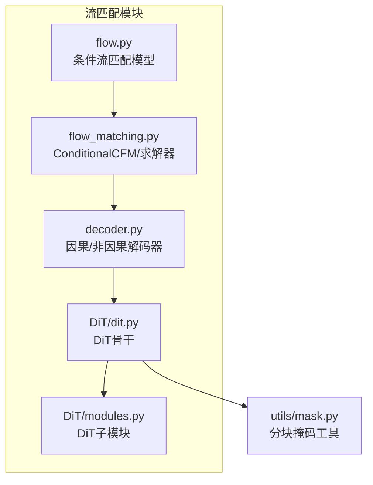
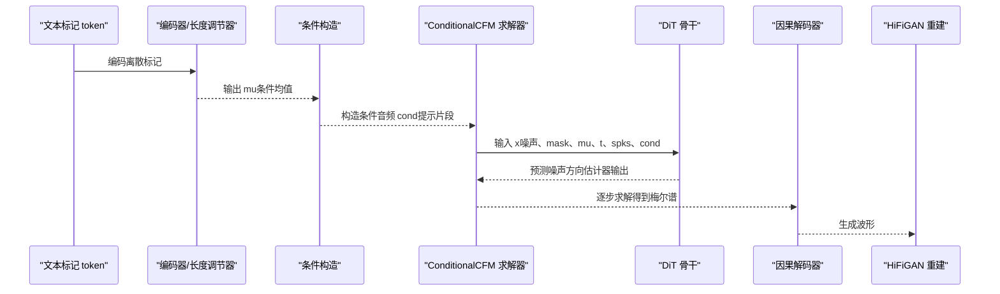
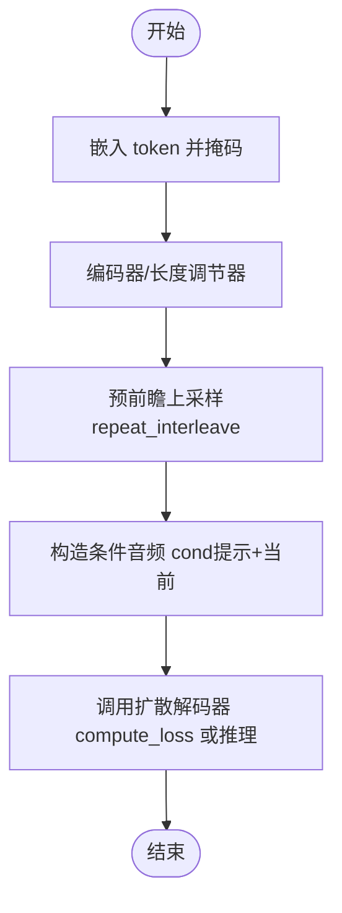
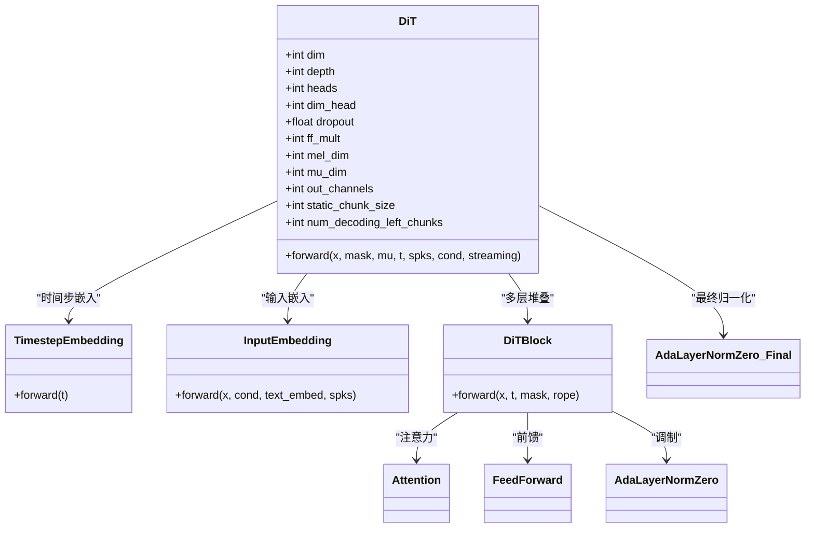
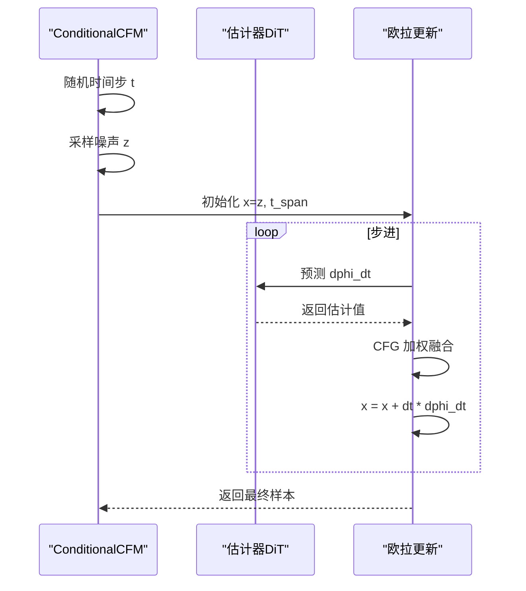
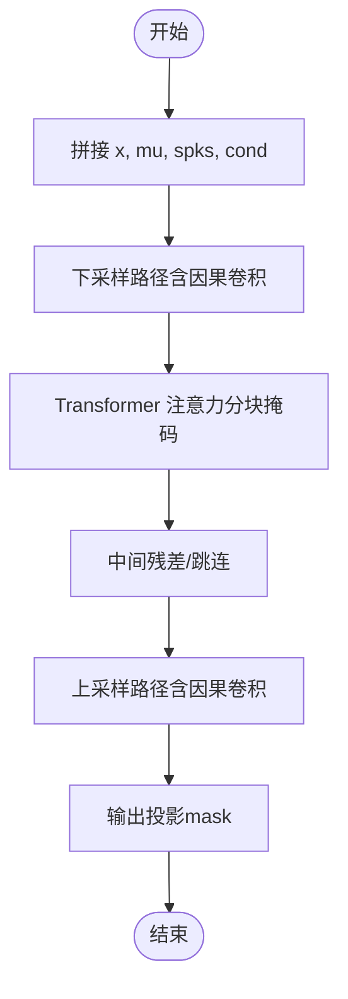
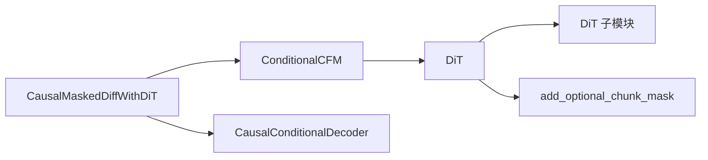

# 流匹配模型（Flow）

<cite>
**本文引用的文件列表**
- [flow.py](file://cosyvoice/flow/flow.py)
- [flow_matching.py](file://cosyvoice/flow/flow_matching.py)
- [decoder.py](file://cosyvoice/flow/decoder.py)
- [dit.py](file://cosyvoice/flow/DiT/dit.py)
- [modules.py](file://cosyvoice/flow/DiT/modules.py)
- [cosyvoice3.yaml](file://pretrained_models/Fun-CosyVoice3-0.5B/cosyvoice3.yaml)
- [mask.py](file://cosyvoice/utils/mask.py)
</cite>

## 目录
1. [简介](#简介)
2. [项目结构](#项目结构)
3. [核心组件](#核心组件)
4. [架构总览](#架构总览)
5. [详细组件分析](#详细组件分析)
6. [依赖关系分析](#依赖关系分析)
7. [性能与流式特性](#性能与流式特性)
8. [故障排查指南](#故障排查指南)
9. [结论](#结论)

## 简介
本文件系统性解析 CosyVoice 的流匹配模型（Flow）架构，重点阐述其作为扩散模型（Conditional Flow Matching）的核心原理。文档围绕以下目标展开：
- 解释 CausalMaskedDiffWithXvec 类如何实现条件流匹配，将离散的语音标记序列转换为连续的梅尔频谱图；
- 深入分析 DiT（Diffusion Transformer）模块的实现，包括 TimestepEmbedding、InputEmbedding、RotaryEmbedding 以及 DiTBlock 的结构，解释其如何利用 Transformer 架构处理扩散过程中的噪声预测；
- 结合 forward 方法，描述时间步 t、条件音频 cond、说话人嵌入 spks 等输入的融合方式；
- 解释 static_chunk_size 和 num_decoding_left_chunks 参数对流式合成的影响；
- 提供模型推理的时序图，帮助读者理解端到端流程。

## 项目结构
CosyVoice 的流匹配模块位于 cosyvoice/flow 目录下，包含：
- flow.py：定义多种条件流匹配模型（如 CausalMaskedDiffWithXvec、CausalMaskedDiffWithDiT），负责编码文本标记、拼接提示、构造条件并调用扩散解码器；
- flow_matching.py：实现 ConditionalCFM（条件流匹配）求解器，包含欧拉求解器、CFG 推理、损失计算；
- decoder.py：提供因果解码器（CausalConditionalDecoder）与非因果解码器（ConditionalDecoder），支持流式注意力掩码；
- DiT/dit.py 与 DiT/modules.py：实现 Diffusion Transformer（DiT）骨干网络及其子模块（时间步嵌入、输入嵌入、旋转位置编码、注意力块等）。

图表来源
- [flow.py](file://cosyvoice/flow/flow.py#L148-L404)
- [flow_matching.py](file://cosyvoice/flow/flow_matching.py#L21-L194)
- [decoder.py](file://cosyvoice/flow/decoder.py#L294-L495)
- [dit.py](file://cosyvoice/flow/DiT/dit.py#L104-L177)
- [modules.py](file://cosyvoice/flow/DiT/modules.py#L497-L617)
- [mask.py](file://cosyvoice/utils/mask.py#L161-L223)

章节来源
- [flow.py](file://cosyvoice/flow/flow.py#L148-L404)
- [flow_matching.py](file://cosyvoice/flow/flow_matching.py#L21-L194)
- [decoder.py](file://cosyvoice/flow/decoder.py#L294-L495)
- [dit.py](file://cosyvoice/flow/DiT/dit.py#L104-L177)
- [modules.py](file://cosyvoice/flow/DiT/modules.py#L497-L617)
- [mask.py](file://cosyvoice/utils/mask.py#L161-L223)

## 核心组件
- 条件流匹配模型（CausalMaskedDiffWithDiT）：将离散语音标记 token 转换为梅尔频谱图，通过扩散解码器进行采样生成；在推理阶段支持流式增量生成与预前瞻（pre-lookahead）策略。
- 扩散求解器（ConditionalCFM/CausalConditionalCFM）：基于欧拉法求解 ODE，实现从高斯噪声到目标梅尔的逆向扩散过程；支持 CFG（Classifier-Free Guidance）提升音质与稳定性。
- DiT 骨干网络（DiT）：以 Transformer 为基础，引入时间步嵌入、旋转位置编码、条件融合与自回归因果掩码，实现对扩散噪声的预测。
- 因果解码器（CausalConditionalDecoder）：在 UNet1D 基础上采用因果卷积与流式注意力掩码，支持静态分块大小与左邻上下文控制，满足实时流式合成需求。

章节来源
- [flow.py](file://cosyvoice/flow/flow.py#L278-L404)
- [flow_matching.py](file://cosyvoice/flow/flow_matching.py#L21-L194)
- [decoder.py](file://cosyvoice/flow/decoder.py#L294-L495)
- [dit.py](file://cosyvoice/flow/DiT/dit.py#L104-L177)

## 架构总览
下面的架构图展示了从文本标记到梅尔频谱图的端到端流程，以及扩散求解与 DiT 预测的关系。

图表来源
- [flow.py](file://cosyvoice/flow/flow.py#L358-L403)
- [flow_matching.py](file://cosyvoice/flow/flow_matching.py#L36-L124)
- [decoder.py](file://cosyvoice/flow/decoder.py#L405-L495)
- [dit.py](file://cosyvoice/flow/DiT/dit.py#L145-L176)

## 详细组件分析

### CausalMaskedDiffWithDiT：条件流匹配与流式合成
- 功能概述
  - 将离散语音标记 token 通过嵌入与编码器映射为条件均值 mu；
  - 使用预前瞻层将 token 上采样为与梅尔帧对齐的特征；
  - 构造条件音频 cond（提示片段），并调用扩散解码器 compute_loss 或推理接口；
  - 支持 finalize 标志与预前瞻上下文，实现流式增量生成。
- 关键点
  - 预前瞻层（pre_lookahead_layer）用于提前感知未来 token，减少流式合成的延迟；
  - token_mel_ratio 控制 token 与梅尔帧的对齐比例；
  - streaming 参数控制是否启用流式注意力掩码；
  - inference 中通过 prompt_len 截断并返回后续片段，实现增量输出。

图表来源
- [flow.py](file://cosyvoice/flow/flow.py#L358-L403)

章节来源
- [flow.py](file://cosyvoice/flow/flow.py#L278-L404)

### DiT（Diffusion Transformer）模块详解
- DiT 骨干
  - 时间步嵌入（TimestepEmbedding）：将标量时间步 t 映射到与特征维度一致的时间向量；
  - 输入嵌入（InputEmbedding）：将 noised input x、条件 cond、文本嵌入 text_embed、说话人嵌入 spks 拼接并投影，同时加入因果卷积位置编码；
  - 旋转位置编码（RotaryEmbedding）：为注意力提供旋转位置信息；
  - Transformer 块（DiTBlock）：采用 AdaLayerNormZero 进行预归一化与条件调制，注意力后接前馈网络；
  - 输出归一化与投影：AdaLayerNormZero_Final + 线性层输出到梅尔维数。
- 关键实现要点
  - forward 中对 x、mu、cond、spks 做转置与对齐，确保通道维与序列维一致；
  - 根据 streaming 决定注意力掩码类型：静态分块掩码或全掩码；
  - 长跳跃连接（可选）：将残差与变换结果拼接再线性映射，增强稳定性。

图表来源
- [dit.py](file://cosyvoice/flow/DiT/dit.py#L104-L177)
- [modules.py](file://cosyvoice/flow/DiT/modules.py#L497-L617)

章节来源
- [dit.py](file://cosyvoice/flow/DiT/dit.py#L104-L177)
- [modules.py](file://cosyvoice/flow/DiT/modules.py#L497-L617)

### ConditionalCFM（扩散求解器）与欧拉求解
- 核心思想
  - 从高斯噪声 z 开始，按时间步 t 递增，使用估计器（DiT）预测噪声方向 dphi_dt；
  - 支持 CFG（Classifier-Free Guidance）：将带条件与无条件估计结果加权融合；
  - 训练时 compute_loss 通过随机时间步与噪声构造目标 u，最小化预测与目标的均方误差。
- 流式推理
  - CausalConditionalCFM 使用固定随机噪声 rand_noise，便于流式一致性；
  - forward_estimator 支持直接调用 torch.nn.Module 或 TensorRT 引擎执行。

图表来源
- [flow_matching.py](file://cosyvoice/flow/flow_matching.py#L36-L124)
- [flow_matching.py](file://cosyvoice/flow/flow_matching.py#L126-L194)

章节来源
- [flow_matching.py](file://cosyvoice/flow/flow_matching.py#L21-L194)

### 因果解码器（CausalConditionalDecoder）与流式掩码
- 设计要点
  - 下采样/上采样路径中使用因果卷积，保证自回归因果性；
  - 在 Transformer 层中应用 add_optional_chunk_mask 生成分块注意力掩码；
  - static_chunk_size 与 num_decoding_left_chunks 控制流式解码窗口大小与左邻上下文数量。
- 流式推理
  - streaming=True 时，注意力掩码仅允许访问当前块与指定左邻块；
  - streaming=False 时，注意力掩码扩展为全序列掩码，适合离线推理。

图表来源
- [decoder.py](file://cosyvoice/flow/decoder.py#L405-L495)
- [mask.py](file://cosyvoice/utils/mask.py#L161-L223)

章节来源
- [decoder.py](file://cosyvoice/flow/decoder.py#L294-L495)
- [mask.py](file://cosyvoice/utils/mask.py#L161-L223)

## 依赖关系分析
- 组件耦合
  - CausalMaskedDiffWithDiT 依赖编码器（文本标记编码）、预前瞻层（token->mel 对齐）、扩散解码器（ConditionalCFM）；
  - ConditionalCFM 依赖估计器（DiT），DiT 依赖模块化子组件（时间步嵌入、输入嵌入、注意力块、旋转位置编码）；
  - 因果解码器（CausalConditionalDecoder）依赖分块掩码工具 add_optional_chunk_mask 实现流式注意力。
- 外部依赖
  - x_transformers 提供旋转位置编码；
  - matcha 库提供基础解码器与掩码工具。

图表来源
- [flow.py](file://cosyvoice/flow/flow.py#L278-L404)
- [flow_matching.py](file://cosyvoice/flow/flow_matching.py#L21-L194)
- [dit.py](file://cosyvoice/flow/DiT/dit.py#L104-L177)
- [modules.py](file://cosyvoice/flow/DiT/modules.py#L497-L617)
- [decoder.py](file://cosyvoice/flow/decoder.py#L294-L495)
- [mask.py](file://cosyvoice/utils/mask.py#L161-L223)

章节来源
- [flow.py](file://cosyvoice/flow/flow.py#L278-L404)
- [flow_matching.py](file://cosyvoice/flow/flow_matching.py#L21-L194)
- [dit.py](file://cosyvoice/flow/DiT/dit.py#L104-L177)
- [modules.py](file://cosyvoice/flow/DiT/modules.py#L497-L617)
- [decoder.py](file://cosyvoice/flow/decoder.py#L294-L495)
- [mask.py](file://cosyvoice/utils/mask.py#L161-L223)

## 性能与流式特性
- static_chunk_size 与 num_decoding_left_chunks
  - static_chunk_size：静态分块大小，决定每次流式解码的窗口长度；
  - num_decoding_left_chunks：左邻上下文块数量，影响当前块可见的历史范围；
  - 在 DiT.forward 与 CausalConditionalDecoder.forward 中分别根据 streaming 切换掩码类型，从而控制注意力范围。
- token_mel_ratio 与预前瞻
  - token_mel_ratio 控制 token 与梅尔帧的对齐比例，影响上采样后的序列长度；
  - pre_lookahead_len 与 pre_lookahead_layer 提前感知未来 token，减少流式合成的等待与抖动。
- 配置示例
  - 在配置文件中，chunk_size 与 token_mel_ratio 共同决定 static_chunk_size；
  - num_decoding_left_chunks 控制左邻上下文数量，-1 表示使用全部左邻块。

章节来源
- [cosyvoice3.yaml](file://pretrained_models/Fun-CosyVoice3-0.5B/cosyvoice3.yaml#L16-L18)
- [cosyvoice3.yaml](file://pretrained_models/Fun-CosyVoice3-0.5B/cosyvoice3.yaml#L74-L75)
- [flow.py](file://cosyvoice/flow/flow.py#L380-L403)
- [decoder.py](file://cosyvoice/flow/decoder.py#L405-L495)
- [dit.py](file://cosyvoice/flow/DiT/dit.py#L145-L176)
- [mask.py](file://cosyvoice/utils/mask.py#L161-L223)

## 故障排查指南
- 形状不匹配
  - 确保 x、mu、cond、spks 在进入 DiT.forward 前已做转置与对齐；
  - 检查 mask 的布尔形状与注意力掩码广播维度。
- 流式掩码异常
  - streaming=True 时，确认 static_chunk_size 与 num_decoding_left_chunks 设置合理；
  - 若出现跨块信息泄露，检查 add_optional_chunk_mask 的调用与掩码广播。
- CFG 推理不稳定
  - 检查 inference_cfg_rate 是否过大导致音色失真；
  - 确认 forward_estimator 的输入张量形状与数据指针设置正确。
- ONNX/TensorRT 导出问题
  - 注意 dtype 与内存布局，避免 concat 导致格式变化；
  - 在 TRT 引擎中同步流并正确设置输入形状与地址。

章节来源
- [flow_matching.py](file://cosyvoice/flow/flow_matching.py#L90-L154)
- [decoder.py](file://cosyvoice/flow/decoder.py#L405-L495)
- [dit.py](file://cosyvoice/flow/DiT/dit.py#L145-L176)
- [mask.py](file://cosyvoice/utils/mask.py#L161-L223)

## 结论
CosyVoice 的流匹配模型以 Conditional Flow Matching 为核心，结合 DiT 骨干与因果解码器，实现了从离散语音标记到连续梅尔频谱图的高效生成。通过预前瞻、token-mel 对齐、静态分块掩码与左邻上下文控制，系统在保证质量的同时显著提升了流式合成的实时性与稳定性。DiT 的时间步嵌入、旋转位置编码与 AdaLayerNormZero 调制机制，使其能够有效融合时间步、条件与说话人信息，完成扩散过程中的噪声预测。配合 ConditionalCFM 的欧拉求解与 CFG，模型在推理阶段具备良好的可控性与鲁棒性。