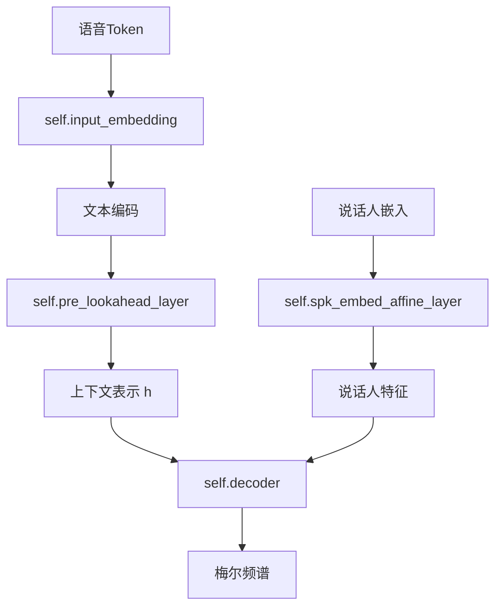

# CausalMaskedDiffWithDiT类初始化详解

<cite>
**本文档引用的文件**   
- [flow.py](file://cosyvoice/flow/flow.py#L277-L311)
- [dit.py](file://cosyvoice/flow/DiT/dit.py#L104-L145)
- [modules.py](file://cosyvoice/flow/DiT/modules.py#L1-L617)
- [decoder.py](file://cosyvoice/flow/decoder.py#L294-L495)
</cite>

## 目录
1. [引言](#引言)
2. [核心参数详解](#核心参数详解)
3. [核心组件构建](#核心组件构建)
4. [流式推理机制](#流式推理机制)
5. [最佳实践与参数影响](#最佳实践与参数影响)
6. [结论](#结论)

## 引言
CausalMaskedDiffWithDiT类是CosyVoice语音合成系统中实现流式推理的核心组件。该类通过结合DiT（Diffusion Transformer）架构与因果掩码机制，实现了高质量的实时语音合成。其`__init__`方法的参数设计对模型的流式行为和生成质量有着决定性影响。本文将深入解析该方法的实现细节，重点阐述各参数的含义、作用及其对系统性能的影响。

**Section sources**
- [flow.py](file://cosyvoice/flow/flow.py#L277-L311)

## 核心参数详解
`__init__`方法中的参数共同定义了模型的结构、输入输出特性以及流式推理的行为模式。

### 输入与输出维度
- **input_size (输入维度)**: 定义了输入语音token的嵌入维度，决定了模型处理离散语音token的表示能力。该参数与语音tokenizer的输出维度相匹配。
- **output_size (输出维度)**: 定义了模型最终输出的声学特征（如梅尔频谱）的维度，通常与声码器（HiFi-GAN）的输入要求保持一致。

### 说话人与词汇
- **spk_embed_dim (说话人嵌入维度)**: 指定说话人嵌入向量的维度。该向量用于控制合成语音的音色，通过`spk_embed_affine_layer`线性层投影到`output_size`维度，融入声学特征生成过程。
- **vocab_size (词表大小)**: 定义了语音token词表的大小，用于初始化`input_embedding`层，将离散的语音token映射到高维向量空间。

### 流式推理关键参数
- **token_mel_ratio (标记与梅尔频谱的比率)**: 该参数是流式推理的核心，定义了输入的语音token数量与输出的梅尔频谱帧数之间的比例关系。在`inference`方法中，通过`h.repeat_interleave(self.token_mel_ratio, dim=1)`实现上采样，将文本编码的序列长度扩展为声学特征的长度。
- **pre_lookahead_len (前瞻长度)**: 指定在流式推理时，模型可以“预览”的未来token数量。该参数直接影响模型的延迟和生成质量。较小的值降低延迟，但可能影响上下文连贯性；较大的值提高质量，但增加延迟。
- **pre_lookahead_layer (前向注意力层模块)**: 这是一个关键的`torch.nn.Module`参数，通常是一个Transformer或DiT编码器。它负责处理输入的文本序列。在流式推理中，当`finalize=False`时，该层会接收`token[:, :-self.pre_lookahead_len]`作为当前上下文，并将`token[:, -self.pre_lookahead_len:]`作为未来信息（context）进行处理，从而实现对未来的有限“前瞻”。

**Section sources**
- [flow.py](file://cosyvoice/flow/flow.py#L280-L311)

## 核心组件构建
`__init__`方法在初始化过程中构建了模型的核心数据流组件。

### 输入嵌入与说话人处理
- **self.input_embedding**: 一个`nn.Embedding`层，将离散的语音token（索引）转换为`input_size`维度的稠密向量。这是模型处理离散输入的第一步。
- **self.spk_embed_affine_layer**: 一个`torch.nn.Linear`层，将`spk_embed_dim`维度的说话人嵌入向量线性变换到`output_size`维度，使其能够与声学特征进行融合。

### 解码器与流式控制
- **self.decoder**: 一个`torch.nn.Module`，具体实现为`CausalConditionalDecoder`。它是声学特征生成的核心，采用扩散模型（CFM）框架，结合DiT架构，将文本编码`mu`和说话人信息`spks`作为条件，逐步去噪生成梅尔频谱。
- **self.pre_lookahead_layer**: 该组件直接由参数传入，是实现流式推理的关键。它通常是一个`DiT`实例，负责将输入的文本序列编码为上下文感知的表示`h`。

**Diagram sources**
- [flow.py](file://cosyvoice/flow/flow.py#L304-L308)
- [dit.py](file://cosyvoice/flow/DiT/dit.py#L104-L145)
- [decoder.py](file://cosyvoice/flow/decoder.py#L294-L495)

## 流式推理机制
`CausalMaskedDiffWithDiT`类通过`inference`方法实现流式推理，其行为由`streaming`和`finalize`参数控制。

### 数据流分析
1.  **输入拼接**: 将提示语音token（prompt_token）与待合成的语音token（token）拼接，形成完整的输入序列。
2.  **文本编码**: 核心步骤在于`self.pre_lookahead_layer`的调用。当`finalize=False`时，模型仅处理当前及之前的token（`token[:, :-self.pre_lookahead_len]`），并将未来的`pre_lookahead_len`个token作为`context`传入，允许模型在一定程度上利用未来信息进行更连贯的预测，同时保持因果性。
3.  **上采样**: 利用`token_mel_ratio`将文本编码`h`的序列长度上采样至与梅尔频谱匹配。
4.  **声学生成**: 将上采样后的`h`和说话人特征`embedding`送入`self.decoder`，生成最终的梅尔频谱。

此机制允许系统在接收到部分输入时就开始生成语音，实现了低延迟的流式合成。

**Section sources**
- [flow.py](file://cosyvoice/flow/flow.py#L359-L403)

## 最佳实践与参数影响
合理配置`__init__`参数对平衡延迟、内存和语音质量至关重要。

### 参数配置建议
- **pre_lookahead_len**: 建议设置为3-5。值为0时完全因果，延迟最低但质量可能下降；值过大（如>10）会显著增加延迟，收益递减。
- **token_mel_ratio**: 应根据训练数据的统计特性（如平均音素时长）精确设置。错误的比率会导致生成的语音语速异常。
- **input_size/output_size**: 需与上游的LLM和下游的HiFi-GAN模型保持一致，确保数据流畅通。

### 参数影响分析
- **延迟**: `pre_lookahead_len`是影响延迟的主要因素。值越大，系统需要等待更多未来token才能开始生成，延迟越高。
- **内存占用**: `pre_lookahead_len`和`token_mel_ratio`共同影响中间特征的大小。较大的`token_mel_ratio`会生成更长的`h`序列，增加`decoder`的计算和内存开销。
- **语音自然度**: `pre_lookahead_len`直接关联自然度。适当的前瞻允许模型更好地处理韵律和上下文依赖，生成更流畅、自然的语音。`pre_lookahead_layer`的复杂度（如DiT的深度和宽度）也决定了模型的表达能力。

**Section sources**
- [flow.py](file://cosyvoice/flow/flow.py#L288-L289)
- [flow.py](file://cosyvoice/flow/flow.py#L310)

## 结论
CausalMaskedDiffWithDiT类的`__init__`方法通过精心设计的参数，构建了一个高效且可控的流式语音合成系统。`input_size`、`output_size`等参数定义了模型的接口，`spk_embed_dim`和`vocab_size`支持多说话人和大词汇量合成，而`token_mel_ratio`、`pre_lookahead_len`和`pre_lookahead_layer`这三个参数则共同实现了低延迟与高质量之间的精妙平衡。理解这些参数的协同作用，对于优化模型性能和部署流式TTS服务具有重要意义。