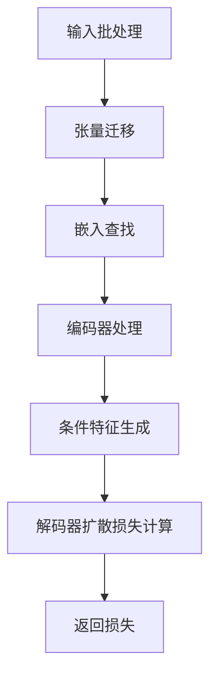
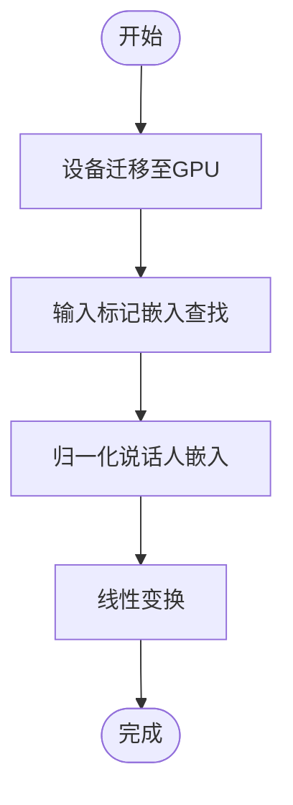
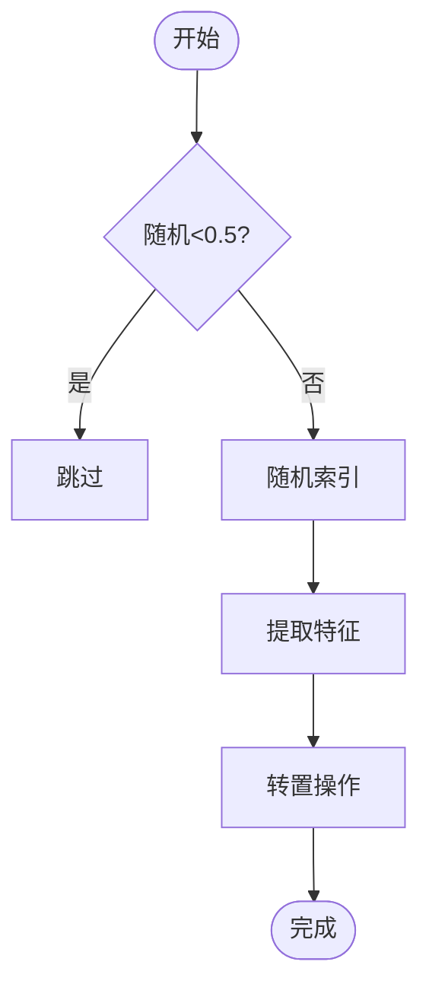
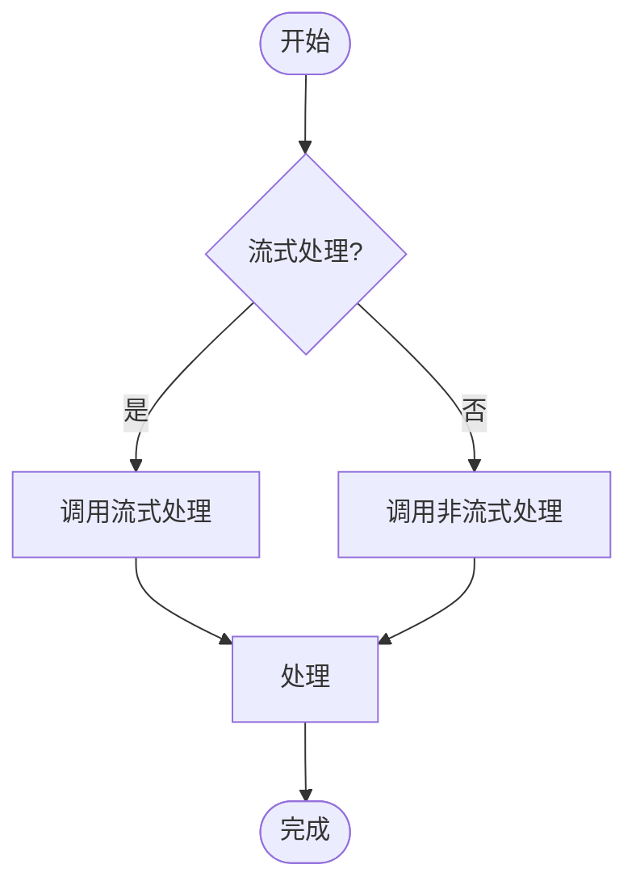
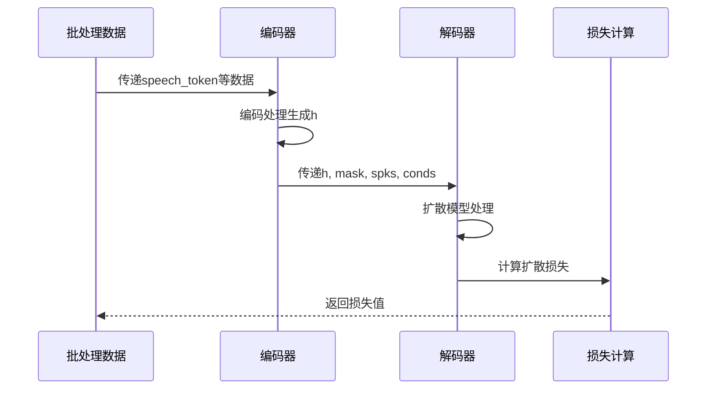
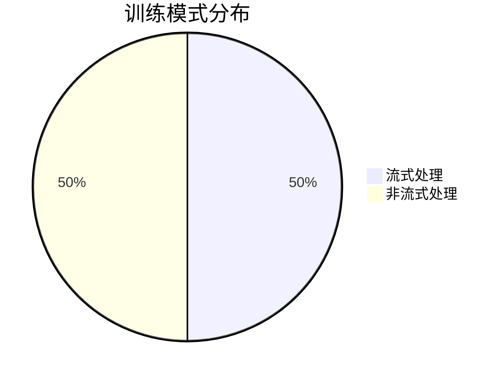

# CausalMaskedDiffWithDiT类前向传播机制

<cite>
**本文档中引用的文件**  
- [flow.py](file://cosyvoice/flow/flow.py#L277-L404)
- [decoder.py](file://cosyvoice/flow/decoder.py#L294-L495)
- [encoder.py](file://cosyvoice/transformer/encoder.py#L37-L475)
- [dit.py](file://cosyvoice/flow/DiT/dit.py#L104-L177)
- [mask.py](file://cosyvoice/utils/mask.py#L161-L236)
- [dataset.py](file://cosyvoice/dataset/dataset.py#L125-L152)
</cite>

## 目录
1. [简介](#简介)
2. [核心组件分析](#核心组件分析)
3. [前向传播流程详解](#前向传播流程详解)
4. [流式处理机制](#流式处理机制)
5. [数据形状变化与关键操作](#数据形状变化与关键操作)
6. [混合训练平衡策略](#混合训练平衡策略)
7. [结论](#结论)

## 简介
CausalMaskedDiffWithDiT类是CosyVoice语音合成系统中的核心组件，负责实现基于扩散模型的语音生成。该类通过DiT（Diffusion Transformer）架构，结合流式处理技术，在训练阶段实现了高效的语音合成。本文档将深入解析其forward方法的实现原理，重点分析流式处理机制、数据流变化以及训练策略。

## 核心组件分析

**Section sources**
- [flow.py](file://cosyvoice/flow/flow.py#L277-L404)
- [decoder.py](file://cosyvoice/flow/decoder.py#L294-L495)
- [encoder.py](file://cosyvoice/transformer/encoder.py#L37-L475)

### 架构概览
CausalMaskedDiffWithDiT类采用编码器-解码器架构，其中编码器负责处理文本输入，解码器基于扩散模型生成语音特征。该架构支持流式和非流式两种处理模式，通过统一训练策略实现两种模式的无缝切换。



**Diagram sources**
- [flow.py](file://cosyvoice/flow/flow.py#L313-L356)

## 前向传播流程详解

**Section sources**
- [flow.py](file://cosyvoice/flow/flow.py#L313-L356)
- [mask.py](file://cosyvoice/utils/mask.py#L239-L266)

### 输入处理
forward方法首先接收包含speech_token、speech_feat和embedding的批处理字典，并将其迁移到GPU设备上：



**Diagram sources**
- [flow.py](file://cosyvoice/flow/flow.py#L317-L332)

### 条件特征生成
系统采用随机截取策略生成条件特征（conds），通过随机概率决定是否截取部分语音特征作为条件：



**Diagram sources**
- [flow.py](file://cosyvoice/flow/flow.py#L339-L345)

## 流式处理机制

**Section sources**
- [flow.py](file://cosyvoice/flow/flow.py#L323-L324)
- [encoder.py](file://cosyvoice/transformer/encoder.py#L111-L163)
- [decoder.py](file://cosyvoice/flow/decoder.py#L405-L494)

### 流式标志位生成
系统通过随机生成streaming标志位来实现统一训练模式：

```python
streaming = True if random.random() < 0.5 else False
```

该机制确保在训练过程中50%的概率采用流式处理，50%的概率采用非流式处理，从而实现两种模式的均衡训练。

### 编码器处理
pre_lookahead_layer编码器根据streaming标志位调用相应的处理逻辑：



**Diagram sources**
- [flow.py](file://cosyvoice/flow/flow.py#L380-L383)

## 数据形状变化与关键操作

**Section sources**
- [flow.py](file://cosyvoice/flow/flow.py#L347-L351)
- [decoder.py](file://cosyvoice/flow/decoder.py#L425-L494)

### 张量形状转换
系统在处理过程中涉及多次张量形状转换，主要包括：

1. **转置操作**：在编码器和解码器之间进行维度调整
2. **掩码应用**：确保填充部分不影响模型训练
3. **重复操作**：将说话人嵌入扩展到适当维度

### 损失计算流程
解码器基于编码后的隐藏状态h、掩码mask、说话人信息spks和条件特征conds计算扩散损失：



**Diagram sources**
- [flow.py](file://cosyvoice/flow/flow.py#L348-L355)

## 混合训练平衡策略

**Section sources**
- [flow.py](file://cosyvoice/flow/flow.py#L323-L324)
- [mask.py](file://cosyvoice/utils/mask.py#L161-L236)

### 统一训练模式
系统通过随机生成streaming标志位，在训练阶段动态切换流式和非流式处理模式：



**Diagram sources**
- [flow.py](file://cosyvoice/flow/flow.py#L323-L324)

### 平衡策略优势
1. **模式均衡**：确保模型在两种处理模式下都能得到充分训练
2. **泛化能力**：提高模型在不同应用场景下的适应性
3. **性能优化**：在保持流式处理低延迟优势的同时，利用非流式处理的高质量特性

## 结论
CausalMaskedDiffWithDiT类的forward方法通过精心设计的流式处理机制和统一训练策略，实现了高效且灵活的语音合成。该方法不仅支持实时流式语音生成，还能在非流式模式下提供高质量的语音输出。通过随机切换训练模式，系统能够在保持低延迟的同时，确保语音质量的稳定性，为实际应用提供了可靠的解决方案。