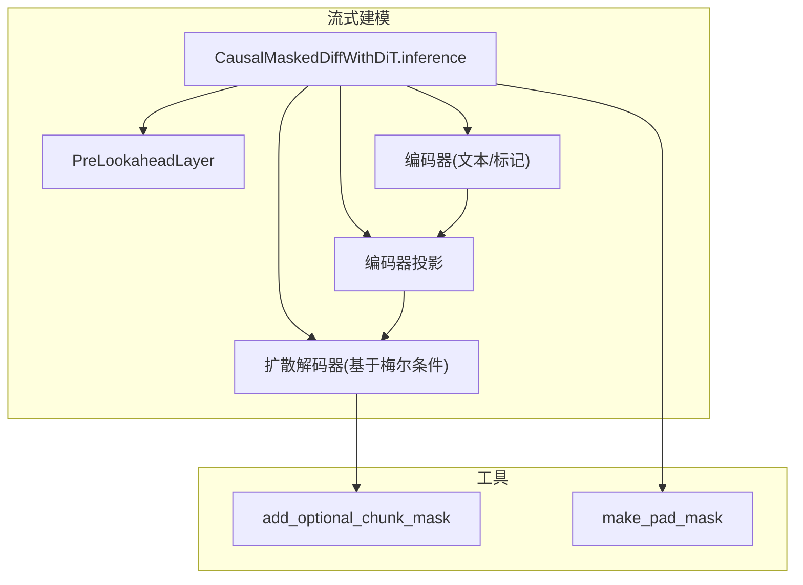
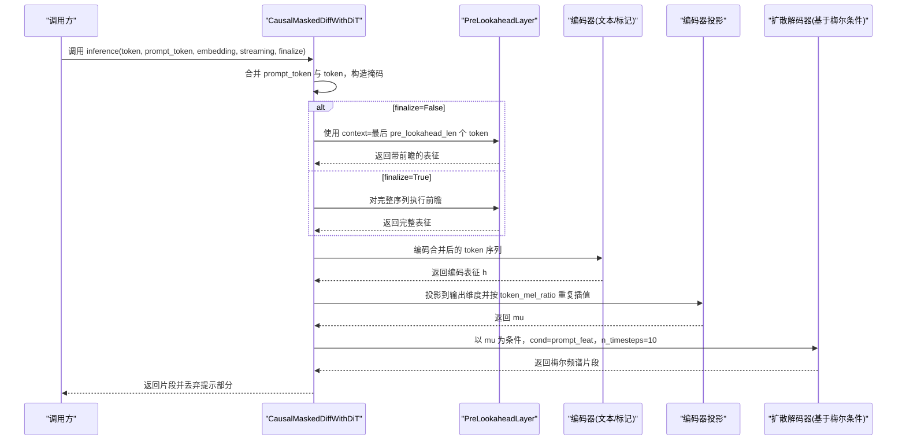
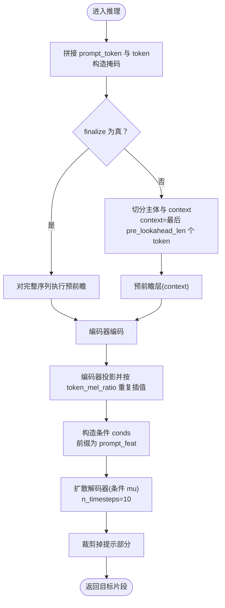
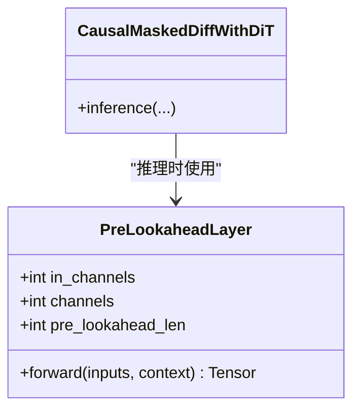
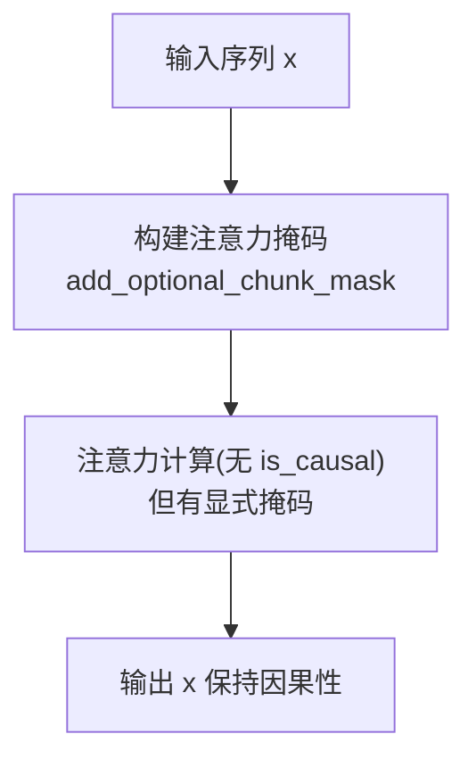
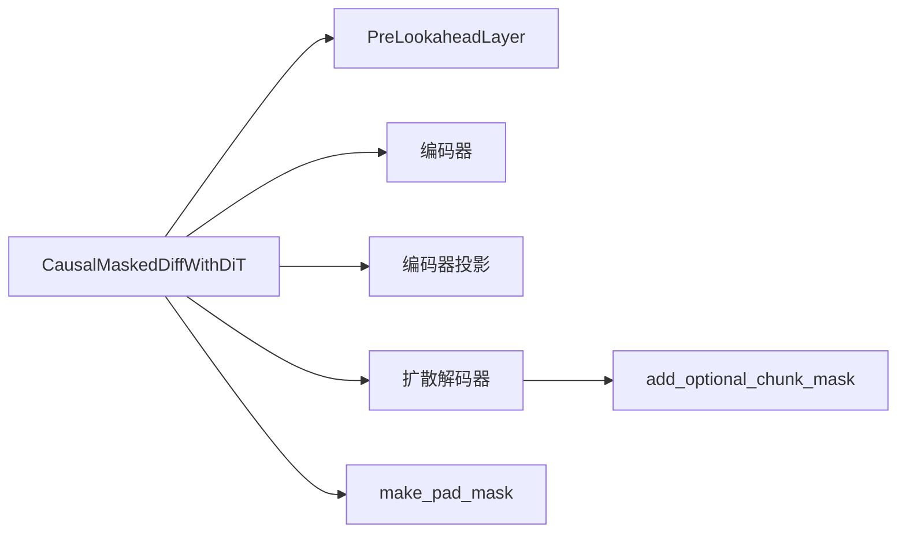

# CausalMaskedDiffWithDiT类推理流程解析

<cite>
**本文引用的文件列表**
- [flow.py](file://cosyvoice/flow/flow.py)
- [modules.py](file://cosyvoice/flow/DiT/modules.py)
- [dit.py](file://cosyvoice/flow/DiT/dit.py)
- [mask.py](file://cosyvoice/utils/mask.py)
- [upsample_encoder.py](file://cosyvoice/transformer/upsample_encoder.py)
</cite>

## 目录
1. [引言](#引言)
2. [项目结构与定位](#项目结构与定位)
3. [核心组件总览](#核心组件总览)
4. [架构总览](#架构总览)
5. [详细组件分析](#详细组件分析)
6. [依赖关系分析](#依赖关系分析)
7. [性能与实时性考量](#性能与实时性考量)
8. [故障排查指南](#故障排查指南)
9. [结论](#结论)

## 引言
本文件围绕 CausalMaskedDiffWithDiT 类的推理方法展开，系统解析其在流式语音合成中的因果推理机制。重点阐释以下要点：
- 方法参数：token（目标语音标记）、prompt_token（提示语音标记）、streaming（是否启用流式模式）、finalize（是否为最终块）的协同作用；
- 当 finalize=False 时，如何将输入序列拆分为主体部分与 context（上下文），并通过预前瞻层 pre_lookahead_layer 的 context 参数实现有限前瞻，从而在保持低延迟的同时提升生成连贯性；
- 对比 finalize=True 时对完整序列的处理方式；
- token_mel_ratio 在时间维度上的重复插值作用；
- decoder 如何基于编码后的梅尔频谱条件生成高质量音频特征；
- 实际推理时的调用顺序与数据流图示；
- 流式块大小、前瞻长度对实时性与语音质量的影响。

## 项目结构与定位
- CausalMaskedDiffWithDiT 推理逻辑位于流式建模框架中，负责将离散语音标记 token 与提示序列 prompt_token 融合，经由预前瞻层与编码器投影到梅尔域，再由扩散解码器生成高质量音频特征。
- 关键依赖包括：
  - 预前瞻层 PreLookaheadLayer：在推理阶段对输入 token 进行有限前瞻，增强局部上下文感知；
  - DiT 编码器与注意力掩码工具：支持静态块流式注意力，保证因果性与低延迟；
  - 梅尔条件构造与掩码工具：确保序列对齐与注意力的有效性。

**图表来源**
- [flow.py](file://cosyvoice/flow/flow.py#L358-L403)
- [mask.py](file://cosyvoice/utils/mask.py#L161-L236)
- [upsample_encoder.py](file://cosyvoice/transformer/upsample_encoder.py#L66-L103)

**章节来源**
- [flow.py](file://cosyvoice/flow/flow.py#L358-L403)

## 核心组件总览
- CausalMaskedDiffWithDiT.inference
  - 输入：token、token_len、prompt_token、prompt_token_len、prompt_feat、prompt_feat_len、embedding、streaming、finalize
  - 输出：生成的梅尔频谱片段、缓存（本实现返回空）
- PreLookaheadLayer
  - 在推理时接收 context，对当前块进行有限前瞻，提升局部连贯性
- DiT 编码器与注意力掩码
  - 支持静态块流式注意力，避免未来信息泄露，保证因果性
- 扩散解码器
  - 基于编码后的梅尔条件，逐步去噪生成高质量音频特征

**章节来源**
- [flow.py](file://cosyvoice/flow/flow.py#L358-L403)
- [upsample_encoder.py](file://cosyvoice/transformer/upsample_encoder.py#L66-L103)
- [mask.py](file://cosyvoice/utils/mask.py#L161-L236)

## 架构总览
下图展示从 token 到梅尔频谱的端到端推理流程，突出因果约束与流式块处理的关键节点。

**图表来源**
- [flow.py](file://cosyvoice/flow/flow.py#L358-L403)
- [upsample_encoder.py](file://cosyvoice/transformer/upsample_encoder.py#L66-L103)

## 详细组件分析

### CausalMaskedDiffWithDiT.inference 推理流程详解
- 输入拼接与掩码
  - 将 prompt_token 与 token 拼接，计算合并后的长度与掩码，用于后续注意力与投影。
- 预前瞻层与上下文切分
  - finalize=False：将输入切分为主体 token 与尾部 context（长度为 pre_lookahead_len）。预前瞻层在推理时接收 context 参数，对当前块进行有限前瞻，从而在不暴露未来信息的前提下提升局部连贯性。
  - finalize=True：直接对完整序列执行预前瞻，适用于最终块或非流式场景。
- 编码器投影与时间插值
  - 将预前瞻后的表征经编码器投影得到 mu，并按 token_mel_ratio 在时间维进行重复插值，使离散 token 的时间分辨率与梅尔频谱对齐。
- 条件构造与解码
  - 构造条件 conds，前缀为 prompt_feat，随后为待生成片段的条件。解码器以 mu 为条件，逐步去噪生成梅尔频谱。
- 结果裁剪
  - 丢弃提示部分，仅保留目标片段。

**图表来源**
- [flow.py](file://cosyvoice/flow/flow.py#L358-L403)
- [upsample_encoder.py](file://cosyvoice/transformer/upsample_encoder.py#L66-L103)

**章节来源**
- [flow.py](file://cosyvoice/flow/flow.py#L358-L403)

### 预前瞻层 PreLookaheadLayer 的作用与实现
- 有限前瞻机制
  - 在推理时，若传入 context，则断言处于推理模式且 context 长度等于预设的 pre_lookahead_len；否则对输入进行零填充以模拟前瞻窗口。
  - 通过卷积核大小为 pre_lookahead_len+1 的卷积进行前瞻融合，随后经双层卷积与残差连接，增强局部上下文感知。
- 与因果性的关系
  - 卷积采用左到右的因果填充策略，确保当前时刻仅依赖历史信息，满足流式合成的因果约束。

**图表来源**
- [upsample_encoder.py](file://cosyvoice/transformer/upsample_encoder.py#L66-L103)

**章节来源**
- [upsample_encoder.py](file://cosyvoice/transformer/upsample_encoder.py#L66-L103)

### DiT 编码器与注意力掩码的流式因果设计
- 注意力掩码
  - 在流式模式下，使用 add_optional_chunk_mask 生成静态块掩码，限制注意力仅关注当前块及左侧若干块，避免未来信息泄露。
- 因果性保障
  - DiT 的注意力处理器在计算注意力时不使用 is_causal 标志，但通过显式掩码确保因果性；同时在推理时通过 context 参数与有限前瞻进一步提升连贯性。

**图表来源**
- [mask.py](file://cosyvoice/utils/mask.py#L161-L236)
- [dit.py](file://cosyvoice/flow/DiT/dit.py#L145-L176)
- [modules.py](file://cosyvoice/flow/DiT/modules.py#L349-L407)

**章节来源**
- [mask.py](file://cosyvoice/utils/mask.py#L161-L236)
- [dit.py](file://cosyvoice/flow/DiT/dit.py#L145-L176)
- [modules.py](file://cosyvoice/flow/DiT/modules.py#L349-L407)

### token_mel_ratio 的时间重复插值
- 作用
  - 将离散 token 的时间分辨率按 token_mel_ratio 进行重复插值，使 token 与梅尔频谱在时间轴上对齐，便于后续解码器以条件形式进行建模。
- 影响
  - 插值倍率越大，时间分辨率越高，解码器可利用更细粒度的时间信息，但会增加计算量与内存占用；较小倍率则降低开销但可能牺牲细节。

**章节来源**
- [flow.py](file://cosyvoice/flow/flow.py#L384-L384)

### 解码器如何基于编码后的梅尔条件生成音频特征
- 条件构造
  - 将 prompt_feat 作为前缀条件，随后为待生成片段的条件张量，形成连续的梅尔条件序列。
- 解码过程
  - 解码器以编码后的 mu 为条件，逐步去噪生成梅尔频谱；在流式模式下，结合静态块掩码与有限前瞻，平衡实时性与质量。
- 结果裁剪
  - 丢弃提示部分，仅返回目标片段，便于后续拼接与播放。

**章节来源**
- [flow.py](file://cosyvoice/flow/flow.py#L388-L402)

## 依赖关系分析
- 组件耦合
  - CausalMaskedDiffWithDiT 依赖预前瞻层与编码器投影，二者共同决定时间分辨率与上下文感知能力。
  - 解码器依赖注意力掩码工具以实现流式因果约束。
- 外部接口
  - streaming 与 finalize 参数贯穿推理流程，分别控制注意力掩码与预前瞻行为，影响实时性与连贯性。
- 可能的循环依赖
  - 本模块未见循环导入；各模块职责清晰，接口稳定。

**图表来源**
- [flow.py](file://cosyvoice/flow/flow.py#L358-L403)
- [mask.py](file://cosyvoice/utils/mask.py#L161-L236)

**章节来源**
- [flow.py](file://cosyvoice/flow/flow.py#L358-L403)
- [mask.py](file://cosyvoice/utils/mask.py#L161-L236)

## 性能与实时性考量
- 流式块大小
  - 较小块可降低延迟，但需更频繁地进行掩码与解码；较大块提升吞吐但增加等待时间。建议根据端到端延迟目标选择合适块大小。
- 前瞻长度 pre_lookahead_len
  - 更长的前瞻能提升局部连贯性，但增加额外卷积计算；较短前瞻更轻量，但可能牺牲连贯性。通常在 2–5 之间折中。
- token_mel_ratio
  - 倍率越大，时间分辨率越高，解码器更易捕捉细节，但计算成本上升。可根据目标采样率与硬件能力调整。
- 注意力掩码
  - 静态块掩码在推理时减少无效注意力计算，提高效率；动态掩码在训练时更灵活，但在推理中可能引入不确定性。

[本节为通用性能讨论，无需具体文件来源]

## 故障排查指南
- finalize=False 时 context 为空
  - 现象：推理报错或结果不连贯
  - 排查：确认推理时传入了正确的 context（长度应等于 pre_lookahead_len），并在推理模式下调用
- 预前瞻层断言失败
  - 现象：断言错误
  - 排查：检查是否在训练模式下调用了带 context 的预前瞻层；确保 context 长度与配置一致
- 注意力掩码异常
  - 现象：生成不稳定或出现伪影
  - 排查：确认 streaming 与 static_chunk_size 配置正确；检查掩码是否被正确广播与应用
- 时间对齐问题
  - 现象：生成片段与提示边界处不连续
  - 排查：核对 token_mel_ratio 与采样率设置；确保裁剪提示部分后的时间对齐

**章节来源**
- [upsample_encoder.py](file://cosyvoice/transformer/upsample_encoder.py#L82-L103)
- [mask.py](file://cosyvoice/utils/mask.py#L161-L236)
- [flow.py](file://cosyvoice/flow/flow.py#L358-L403)

## 结论
CausalMaskedDiffWithDiT 的推理流程通过“有限前瞻 + 静态块掩码”的组合，在流式语音合成中实现了低延迟与高连贯性的平衡。参数 finalize 控制是否对完整序列执行预前瞻，streaming 控制注意力掩码的块大小，而 token_mel_ratio 则在时间维度上将离散 token 与梅尔条件对齐。合理设置这些参数，可在不同硬件与实时性需求下取得最佳的语音质量与延迟表现。