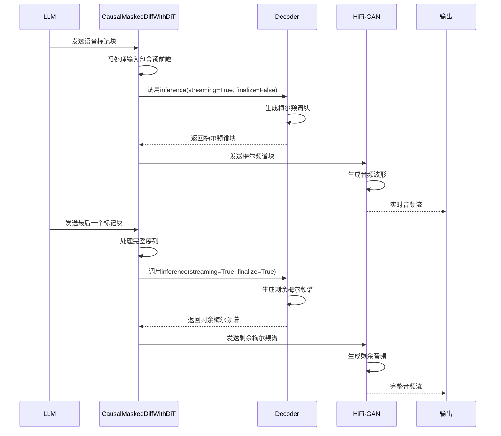

# CausalMaskedDiffWithDiT类详解

<cite>
**本文档中引用的文件**   
- [flow.py](file://cosyvoice/flow/flow.py#L277-L404)
- [dit.py](file://cosyvoice/flow/DiT/dit.py)
- [encoder.py](file://cosyvoice/transformer/encoder.py)
- [flow_matching.py](file://cosyvoice/flow/flow_matching.py)
- [token2wav_dit.py](file://runtime/triton_trtllm/token2wav_dit.py)
</cite>

## 目录
1. [引言](#引言)
2. [类初始化与参数解析](#类初始化与参数解析)
3. [推理模式控制机制](#推理模式控制机制)
4. [预前瞻层实现分析](#预前瞻层实现分析)
5. [流式推理时序图](#流式推理时序图)
6. [组件协同工作机制](#组件协同工作机制)

## 引言
CausalMaskedDiffWithDiT类是CosyVoice语音合成系统中的核心组件，负责实现流式语音合成中的因果推理机制。该类通过结合扩散模型与DiT（Diffusion in Time）架构，在保证生成语音质量的同时实现了低延迟的流式处理能力。其核心设计在于通过预前瞻机制在编码阶段引入有限的未来信息，从而在保持因果性的同时提升生成质量。

**Section sources**
- [flow.py](file://cosyvoice/flow/flow.py#L277-L404)

## 类初始化与参数解析
CausalMaskedDiffWithDiT类的初始化方法定义了多个关键参数，这些参数共同决定了模型的行为和性能特征：

- **input_size**: 输入嵌入维度，决定语音标记的嵌入空间大小
- **output_size**: 输出维度，通常对应梅尔频谱的特征维度（如80）
- **spk_embed_dim**: 说话人嵌入维度，用于编码说话人身份信息
- **token_mel_ratio**: 语音标记与梅尔频谱的时间比例，控制时间尺度转换
- **pre_lookahead_len**: 预前瞻长度，指定在流式处理中可访问的未来标记数量
- **pre_lookahead_layer**: 预前瞻处理层，实现前瞻信息的编码
- **decoder**: 解码器模块，负责从潜在表示生成梅尔频谱

这些参数的合理配置对于平衡生成质量与处理延迟至关重要。例如，较大的pre_lookahead_len可以提升生成质量，但会增加初始延迟。

**Section sources**
- [flow.py](file://cosyvoice/flow/flow.py#L277-L311)

## 推理模式控制机制
CausalMaskedDiffWithDiT类的inference方法通过streaming和finalize两个参数精确控制因果推理模式：

当**finalize=False**（非最终块）时，系统采用流式处理模式。此时，输入序列被分割为多个块进行处理，每个块包含当前上下文和预前瞻部分。模型通过pre_lookahead_layer的context参数接收未来信息，实现有限的前瞻处理。这种模式下，系统能够逐步生成语音，满足实时性要求。

当**finalize=True**（最终块）时，系统处理完整序列。此时，模型接收完整的输入序列，无需考虑流式分割。这种模式通常用于处理最后一个数据块或非流式推理场景，确保生成结果的完整性和一致性。

streaming参数则控制底层解码器是否启用流式模式，与finalize参数协同工作，实现端到端的流式语音合成。

**Section sources**
- [flow.py](file://cosyvoice/flow/flow.py#L358-L404)
- [flow_matching.py](file://cosyvoice/flow/flow_matching.py#L126-L154)

## 预前瞻层实现分析
pre_lookahead_layer模块是实现高质量流式合成的关键组件。该模块在编码阶段巧妙地引入未来信息，同时保持整体的因果性。具体实现中，当finalize=False时，输入序列被分为两部分：主体部分（token[:, :-pre_lookahead_len]）和前瞻部分（token[:, -pre_lookahead_len:]）。主体部分用于生成当前输出，而前瞻部分作为context提供给编码器，帮助模型更好地理解上下文。

这种设计允许模型在生成当前音频块时参考少量未来语音标记，从而提升生成质量。同时，通过限制pre_lookahead_len的大小，确保了系统的低延迟特性。预前瞻层通常基于Transformer架构实现，能够有效捕捉长距离依赖关系。

**Section sources**
- [flow.py](file://cosyvoice/flow/flow.py#L380-L384)
- [dit.py](file://cosyvoice/flow/DiT/dit.py)

## 流式推理时序图

**Diagram sources **
- [flow.py](file://cosyvoice/flow/flow.py#L358-L404)
- [flow_matching.py](file://cosyvoice/flow/flow_matching.py#L204-L229)

## 组件协同工作机制
CausalMaskedDiffWithDiT类与LLM和HiFi-GAN组件形成紧密的协同工作机制。LLM负责生成语音标记序列，并将其分块发送给CausalMaskedDiffWithDiT。后者作为中间桥梁，将离散的语音标记转换为连续的梅尔频谱。最后，HiFi-GAN将梅尔频谱转换为高质量的音频波形。

在整个流程中，CausalMaskedDiffWithDiT通过其流式推理能力，实现了与LLM的实时对接。当LLM生成新的语音标记时，CausalMaskedDiffWithDiT立即开始处理，无需等待完整序列。这种流水线式的工作模式大大降低了端到端的延迟，使得实时语音合成成为可能。

**Section sources**
- [flow.py](file://cosyvoice/flow/flow.py#L277-L404)
- [token2wav_dit.py](file://runtime/triton_trtllm/token2wav_dit.py)