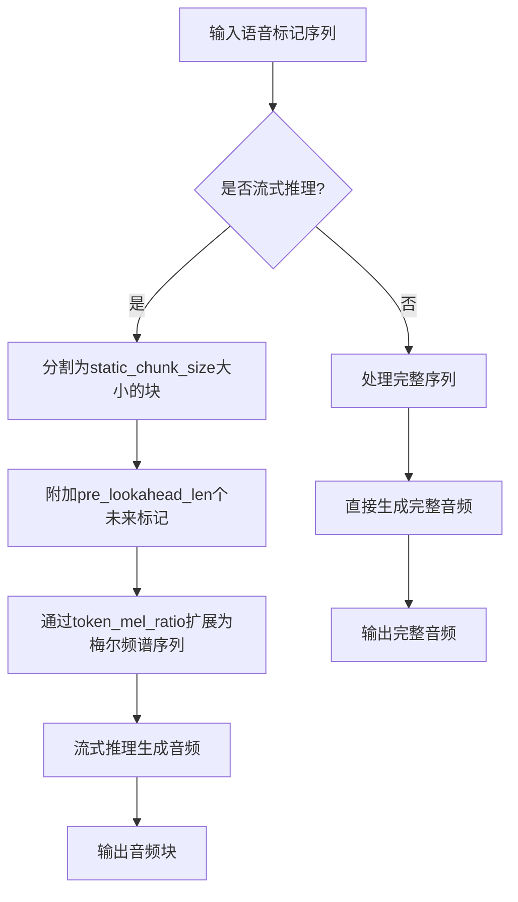

# 流式推理关键参数

<cite>
**本文档引用的文件**  
- [flow.py](file://cosyvoice/flow/flow.py#L156-L180)
- [token2wav_dit.py](file://runtime/triton_trtllm/token2wav_dit.py#L115-L131)
- [streaming_inference.py](file://runtime/triton_trtllm/streaming_inference.py#L83-L97)
- [model.py](file://cosyvoice/cli/model.py#L590-L611)
- [dit.py](file://cosyvoice/flow/DiT/dit.py#L118-L141)
- [decoder.py](file://cosyvoice/flow/decoder.py#L305-L323)
- [mask.py](file://cosyvoice/utils/mask.py#L127-L190)
</cite>

## 目录
1. [引言](#引言)
2. [核心参数详解](#核心参数详解)
3. [参数协同工作机制](#参数协同工作机制)
4. [应用场景与调优建议](#应用场景与调优建议)
5. [结论](#结论)

## 引言
在流式语音合成系统中，关键参数的配置直接影响音频生成的实时性、连贯性和音质。本文档系统性地解释CosyVoice项目中流式推理涉及的关键参数，包括token_mel_ratio、pre_lookahead_len和static_chunk_size，详细阐述它们在端到端流式合成系统中的作用机制和协同工作方式。

## 核心参数详解

### token_mel_ratio 参数
token_mel_ratio参数定义了语音标记（token）与梅尔频谱帧（mel frame）之间的转换关系。该参数在CausalMaskedDiffWithDiT类的初始化中被设置，默认值为2，表示每个语音标记对应2个梅尔频谱帧。在推理过程中，文本编码器输出的隐藏状态会通过repeat_interleave操作，沿时间维度重复token_mel_ratio次，从而将标记序列扩展为梅尔频谱序列。此参数直接影响音频生成的时序对齐精度，确保文本内容与生成的语音在时间上保持一致。

**Section sources**
- [flow.py](file://cosyvoice/flow/flow.py#L156-L180)
- [flow.py](file://cosyvoice/flow/flow.py#L384)

### pre_lookahead_len 参数
pre_lookahead_len参数控制在当前处理块中保留多少个未来标记作为上下文信息。该参数在流式推理中起到关键作用，通过在当前输入块末尾附加pre_lookahead_len个未来标记，为模型提供前瞻上下文，从而平衡生成语音的连贯性与延迟。在推理结束时（finalize=True），模型会处理完整的输入序列，不再需要前瞻上下文。此参数的设置需要在语音自然度和系统响应延迟之间进行权衡。

**Section sources**
- [flow.py](file://cosyvoice/flow/flow.py#L156-L180)
- [flow.py](file://cosyvoice/flow/flow.py#L253)
- [streaming_inference.py](file://runtime/triton_trtllm/streaming_inference.py#L83-L97)

### static_chunk_size 参数
static_chunk_size参数决定了每次推理处理的标记块大小，直接影响内存占用和实时性能。该参数在DiT和Decoder模块中被初始化，默认值为50。在流式推理过程中，输入序列被分割为多个大小为static_chunk_size的块进行处理。较大的块大小可以提高处理效率，但会增加内存消耗和延迟；较小的块大小则有利于降低延迟，但可能影响生成质量。该参数在训练和推理阶段必须保持一致，以确保模型行为的稳定性。

**Section sources**
- [dit.py](file://cosyvoice/flow/DiT/dit.py#L118-L141)
- [decoder.py](file://cosyvoice/flow/decoder.py#L305-L323)
- [mask.py](file://cosyvoice/utils/mask.py#L127-L190)

## 参数协同工作机制

**Diagram sources**
- [flow.py](file://cosyvoice/flow/flow.py#L156-L180)
- [token2wav_dit.py](file://runtime/triton_trtllm/token2wav_dit.py#L115-L131)
- [streaming_inference.py](file://runtime/triton_trtllm/streaming_inference.py#L83-L97)

在端到端流式合成系统中，这三个参数协同工作以实现高效的实时语音生成。首先，输入的语音标记序列根据static_chunk_size参数被分割为多个处理块。然后，每个处理块在末尾附加pre_lookahead_len个未来标记作为上下文。最后，通过token_mel_ratio参数将标记序列扩展为梅尔频谱序列，供声码器生成音频。这种协同机制确保了在保持低延迟的同时，生成高质量的连贯语音。

**Section sources**
- [flow.py](file://cosyvoice/flow/flow.py#L156-L180)
- [token2wav_dit.py](file://runtime/triton_trtllm/token2wav_dit.py#L115-L131)
- [streaming_inference.py](file://runtime/triton_trtllm/streaming_inference.py#L83-L97)

## 应用场景与调优建议

### 实时语音助手
对于实时语音助手等低延迟要求的应用，建议将static_chunk_size设置为较小值（如25），以降低处理延迟。同时，适当增加pre_lookahead_len（如5）以保证语音连贯性。token_mel_ratio保持默认值2，以确保时序对齐精度。

### 高质量音频生成
对于追求高质量音频生成的应用，可以适当增加static_chunk_size（如75）以提高处理效率和生成质量。pre_lookahead_len可设置为3-4，以平衡前瞻上下文和延迟。token_mel_ratio可根据具体需求微调，以优化音质。

### 资源受限环境
在资源受限的设备上运行时，应优先考虑内存占用和计算效率。建议将static_chunk_size设置为中等值（如50），pre_lookahead_len设置为2-3，以在性能和质量之间取得平衡。同时，可考虑使用量化技术进一步降低资源消耗。

**Section sources**
- [model.py](file://cosyvoice/cli/model.py#L590-L611)
- [flow.py](file://cosyvoice/flow/flow.py#L156-L180)
- [streaming_inference.py](file://runtime/triton_trtllm/streaming_inference.py#L52-L54)

## 结论
token_mel_ratio、pre_lookahead_len和static_chunk_size是流式语音合成系统中的关键参数，它们共同决定了系统的实时性、连贯性和音质。通过合理配置这些参数，可以在不同应用场景下实现最佳的性能和质量平衡。在实际应用中，应根据具体需求和硬件条件进行参数调优，以达到最优的用户体验。