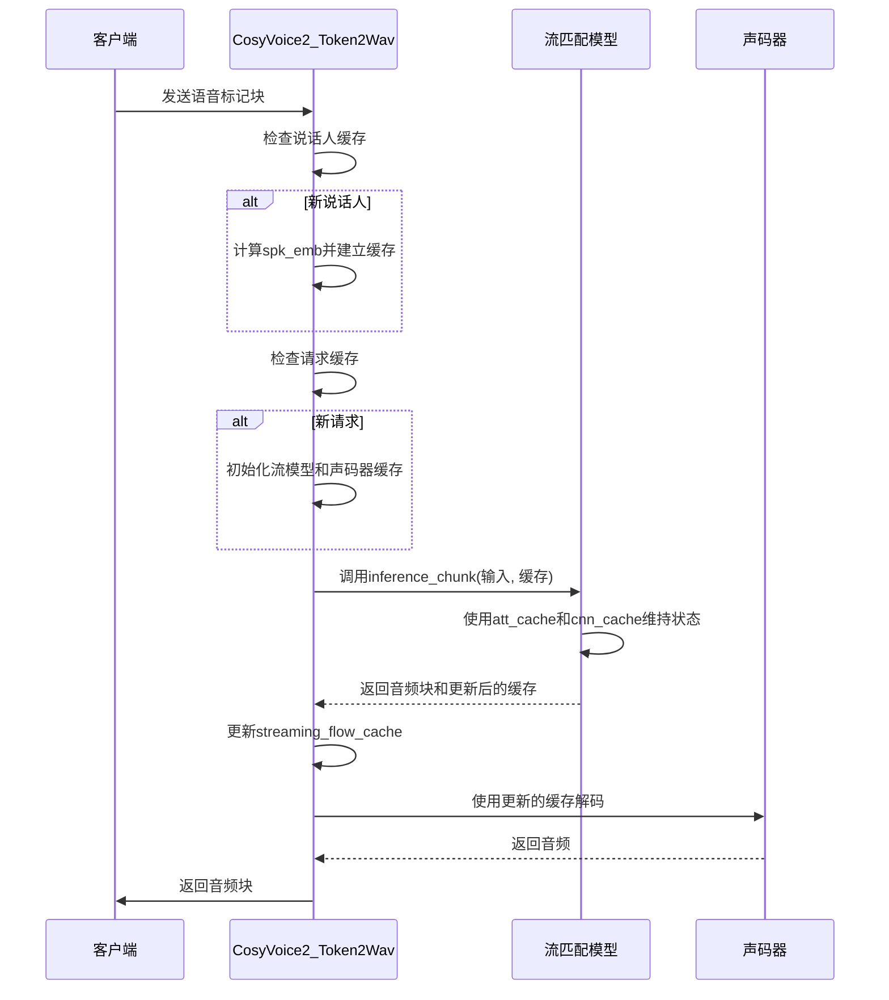
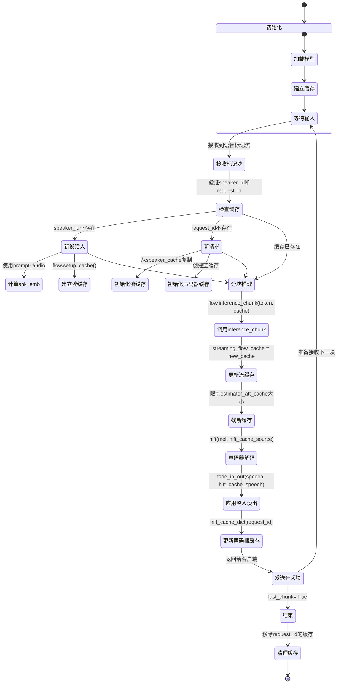
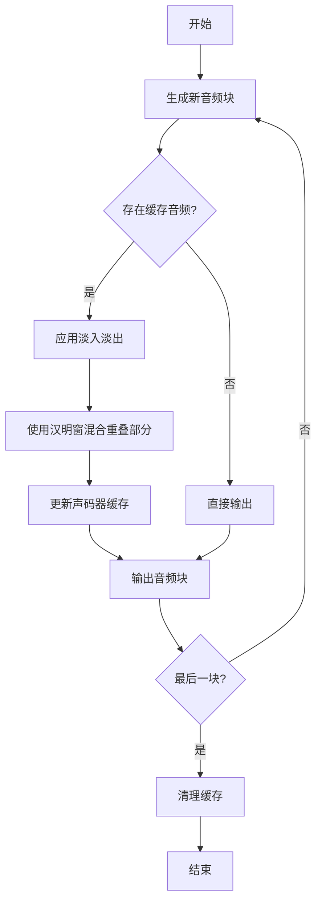

# 流式推理工作流程

<cite>
**本文档引用的文件**   
- [token2wav_dit.py](file://runtime/triton_trtllm/token2wav_dit.py)
- [flow.py](file://cosyvoice/flow/flow.py)
- [decoder.py](file://cosyvoice/flow/decoder.py)
- [flow_matching.py](file://cosyvoice/flow/flow_matching.py)
- [generator.py](file://cosyvoice/hifigan/generator.py)
- [mask.py](file://cosyvoice/utils/mask.py)
</cite>

## 目录
1. [系统初始化与缓存管理](#系统初始化与缓存管理)
2. [流式推理执行逻辑](#流式推理执行逻辑)
3. [数据流与状态转换时序图](#数据流与状态转换时序图)
4. [音频块平滑连接机制](#音频块平滑连接机制)

## 系统初始化与缓存管理

`CosyVoice2_Token2Wav` 类在初始化时，会加载流匹配模型（flow model）和声码器（HiFi-GAN）的权重，并根据配置决定是否使用 TensorRT 进行加速。系统为每个说话人（speaker）和请求（request）建立独立的缓存机制，以维持跨块推理的隐藏状态一致性。

在 `__init__` 方法中，系统初始化了多个缓存字典：
- `self.streaming_flow_cache`：用于存储流匹配模型的推理缓存
- `self.speaker_cache`：用于存储说话人相关的音频特征和模型缓存
- `self.hift_cache_dict`：用于存储声码器的中间状态缓存

当为新说话人建立缓存时，系统会调用 `get_prompt_audio_cache_for_streaming_tts` 方法，该方法通过 `flow.setup_cache` 为流匹配模型预计算并存储初始缓存状态，包括 `estimator_att_cache` 和 `estimator_cnn_cache` 等关键组件。

**Section sources**
- [token2wav_dit.py](file://runtime/triton_trtllm/token2wav_dit.py#L115-L174)

## 流式推理执行逻辑

`forward_streaming` 方法是流式推理的核心，它实现了从语音标记流到音频输出的端到端处理。该方法的执行逻辑如下：

1. **说话人缓存管理**：如果 `speaker_id` 不在 `speaker_cache` 中，系统会使用提供的 `prompt_audio` 计算并存储该说话人的嵌入向量（spk_emb）和流模型缓存。
2. **请求缓存初始化**：如果 `request_id` 不在 `streaming_flow_cache` 中，系统会从 `speaker_cache` 复制初始缓存状态，并为声码器初始化空缓存。
3. **分块推理**：系统将输入的语音标记流分块，调用 `flow.inference_chunk` 方法进行流匹配模型的推理。该方法利用 `estimator_att_cache` 和 `estimator_cnn_cache` 维持跨块的隐藏状态一致性。
4. **缓存更新与管理**：每次推理后，系统会更新 `streaming_flow_cache`。为防止缓存无限增长，系统会定期截断 `estimator_att_cache`，保留与提示音频长度相当的部分和最近的100帧。

**Diagram sources**
- [token2wav_dit.py](file://runtime/triton_trtllm/token2wav_dit.py#L390-L462)
- [flow.py](file://cosyvoice/flow/flow.py)

## 数据流与状态转换时序图

下图展示了数据在各个组件间的流动过程以及关键状态的转换。

**Diagram sources**
- [token2wav_dit.py](file://runtime/triton_trtllm/token2wav_dit.py)
- [decoder.py](file://cosyvoice/flow/decoder.py)
- [flow_matching.py](file://cosyvoice/flow/flow_matching.py)

## 音频块平滑连接机制

为了消除流式解码中音频块之间的连接处可能出现的突变或不连续，系统采用了淡入淡出（fade-in-out）技术。该机制通过一个汉明窗（Hamming window）对相邻音频块的重叠部分进行加权混合。

具体实现如下：
1. 系统在初始化时创建一个长度为 `2 * source_cache_len` 的汉明窗。
2. 在每次生成新的音频块后，系统检查是否存在先前的音频缓存。
3. 如果存在，则使用 `fade_in_out` 函数将新生成的音频块与缓存中的上一块音频进行平滑过渡。
4. 过渡完成后，系统更新声码器缓存，保留最新的音频片段用于下一次过渡。

**Diagram sources**
- [token2wav_dit.py](file://runtime/triton_trtllm/token2wav_dit.py#L38-L46)
- [generator.py](file://cosyvoice/hifigan/generator.py)