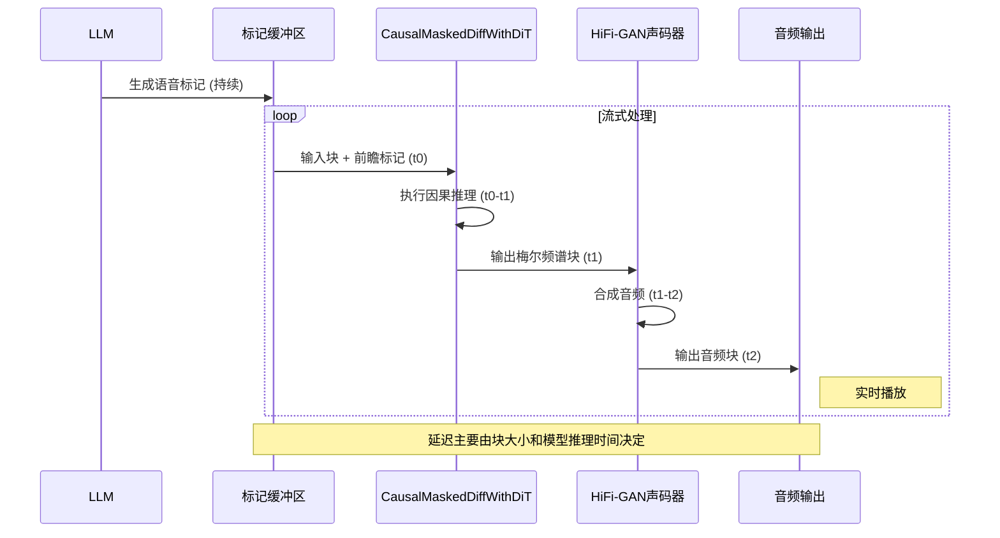

# 流式推理机制

<cite>
**本文档中引用的文件**  
- [flow_matching.py](file://cosyvoice/flow/flow_matching.py)
- [token2wav_dit.py](file://runtime/triton_trtllm/token2wav_dit.py)
- [streaming_inference.py](file://runtime/triton_trtllm/streaming_inference.py)
- [dit.py](file://cosyvoice/flow/DiT/dit.py)
- [flow.py](file://cosyvoice/flow/flow.py)
- [mask.py](file://cosyvoice/utils/mask.py)
- [modules.py](file://cosyvoice/flow/DiT/modules.py)
</cite>

## 目录
1. [引言](#引言)
2. [核心组件分析](#核心组件分析)
3. [流式推理流程](#流式推理流程)
4. [因果推理模式与finalize控制](#因果推理模式与finalize控制)
5. [前瞻处理机制](#前瞻处理机制)
6. [流式合成参数](#流式合成参数)
7. [缓存机制](#缓存机制)
8. [流式推理时序图](#流式推理时序图)
9. [实时通信应用](#实时通信应用)

## 引言
CosyVoice模型通过流匹配机制实现高质量的实时语音合成。该系统结合了大型语言模型（LLM）生成的语音标记序列与流式匹配模型，能够在保证生成质量的同时实现低延迟的流式输出。本文档详细解析其流式推理机制，重点阐述`CausalMaskedDiffWithDiT`类如何实现因果推理，以及系统如何通过参数配置和缓存机制平衡实时性与生成质量。

## 核心组件分析
CosyVoice的流式推理机制主要由`CausalMaskedDiffWithDiT`类驱动，该类位于`cosyvoice/flow/flow.py`文件中，是流匹配模型的核心实现。该类继承自PyTorch的`nn.Module`，负责将LLM生成的语音标记序列转换为梅尔频谱图。

**流式推理的核心组件**  
- **`CausalMaskedDiffWithDiT`**: 主要的流匹配模型类，处理流式推理逻辑。
- **`DiT` (Diffusion Transformer)**: 位于`cosyvoice/flow/DiT/dit.py`，作为流匹配模型的解码器，使用Transformer架构进行扩散过程。
- **`ConditionalCFM`**: 位于`cosyvoice/flow/flow_matching.py`，实现条件流匹配（Conditional Flow Matching）算法，是生成梅尔频谱的核心。
- **`CosyVoice2_Token2Wav`**: 位于`runtime/triton_trtllm/token2wav_dit.py`，是流式推理的顶层封装，协调流匹配模型和声码器（HiFi-GAN）。

**Section sources**
- [flow.py](file://cosyvoice/flow/flow.py#L278-L403)
- [dit.py](file://cosyvoice/flow/DiT/dit.py#L104-L177)
- [flow_matching.py](file://cosyvoice/flow/flow_matching.py#L21-L229)

## 流式推理流程
流式推理流程始于LLM生成的语音标记序列，该序列被分块输入到`CausalMaskedDiffWithDiT`模型中。整个流程在`token2wav_dit.py`的`CosyVoice2_Token2Wav`类中被组织。

1.  **输入准备**: LLM生成的完整语音标记序列被缓存。系统根据`static_chunk_size`参数决定每次处理的标记数量。
2.  **分块处理**: `streaming_inference.py`脚本负责将标记序列按块处理。它使用`forward_streaming`方法，每次传入一个标记块。
3.  **模型推理**: `CausalMaskedDiffWithDiT.inference`方法接收一个标记块，并结合`streaming=True`参数触发因果推理模式。
4.  **声码器合成**: 生成的梅尔频谱块被送入HiFi-GAN声码器（`HiFTGenerator`），实时转换为音频波形。
5.  **音频拼接**: 系统使用重叠-相加（Overlap-Add）技术，通过`fade_in_out`函数平滑地拼接连续的音频块，消除边界处的不连续性。

```mermaid
flowchart TD
A[LLM生成语音标记] --> B[标记序列缓存]
B --> C{是否为最后一块?}
C --> |否| D[提取当前块 + 前瞻标记]
C --> |是| E[提取剩余所有标记]
D --> F[CausalMaskedDiffWithDiT<br/>inference(streaming=True)]
E --> G[CausalMaskedDiffWithDiT<br/>inference(streaming=True, finalize=True)]
F --> H[生成梅尔频谱块]
G --> I[生成最终梅尔频谱块]
H --> J[HiFi-GAN声码器]
I --> J
J --> K[音频波形块]
K --> L[重叠-相加拼接]
L --> M[实时输出音频]
```

**Diagram sources**
- [token2wav_dit.py](file://runtime/triton_trtllm/token2wav_dit.py#L390-L462)
- [streaming_inference.py](file://runtime/triton_trtllm/streaming_inference.py#L77-L103)
- [flow.py](file://cosyvoice/flow/flow.py#L359-L403)

## 因果推理模式与finalize控制
`CausalMaskedDiffWithDiT`类的`inference`方法通过`streaming`和`finalize`两个参数精确控制流式推理的行为。

- **`streaming` 参数**: 当`streaming=True`时，模型进入因果推理模式。这会触发两个关键机制：
    1.  **因果注意力掩码**: 在`DiT`解码器中，`add_optional_chunk_mask`函数会生成一个因果掩码，确保当前块的计算只能依赖于其左侧（过去）的信息，而不能看到未来的数据，从而保证了推理的实时性。
    2.  **前向传播路径**: 模型会跳过某些在非流式模式下用于全局优化的计算，专注于当前块的局部生成。

- **`finalize` 参数**: 此参数用于控制推理的最终阶段。
    - 当`finalize=False`时，表示还有后续的标记块。模型会使用`pre_lookahead_len`参数保留一部分未来的标记作为前瞻信息，但不会处理它们。
    - 当`finalize=True`时，表示这是最后一个标记块。模型会处理所有剩余的标记，并执行完整的推理过程，确保生成的音频在结尾处自然结束，没有截断感。

**Section sources**
- [flow.py](file://cosyvoice/flow/flow.py#L359-L403)
- [dit.py](file://cosyvoice/flow/DiT/dit.py#L145-L177)
- [mask.py](file://cosyvoice/utils/mask.py#L161-L236)

## 前瞻处理机制
为了在流式推理中保持生成质量，CosyVoice引入了前瞻（Lookahead）机制，由`pre_lookahead_layer`和`pre_lookahead_len`参数实现。

- **`pre_lookahead_len`**: 该参数定义了模型在处理当前块时，可以“看到”的未来标记的数量。例如，`pre_lookahead_len=3`意味着模型在生成第N个标记时，可以参考第N+1, N+2, N+3个标记的信息。这有助于模型做出更连贯的预测，避免因信息不足而导致的发音突变。
- **`pre_lookahead_layer`**: 这是一个`PreLookaheadLayer`模块，通常是一个卷积层。它负责将当前块和前瞻块的标记嵌入进行融合。在`inference`方法中，当`finalize=False`时，代码会将输入`token`分为两部分：`token[:, :-self.pre_lookahead_len]`作为当前处理的主体，`token[:, -self.pre_lookahead_len:]`作为上下文（context），传递给`pre_lookahead_layer`进行处理。

这种机制在`streaming_inference.py`中得到了应用，其中`buffer`包含了当前块和前瞻块的标记，然后通过`forward_streaming`方法传入模型。

**Section sources**
- [flow.py](file://cosyvoice/flow/flow.py#L288-L290)
- [flow.py](file://cosyvoice/flow/flow.py#L380-L383)
- [streaming_inference.py](file://runtime/triton_trtllm/streaming_inference.py#L83-L86)

## 流式合成参数
流式合成的性能和质量由几个关键参数共同决定：

- **`static_chunk_size`**: 定义了每次推理处理的语音标记数量。较小的值可以降低延迟，实现更“流式”的体验，但会增加计算开销。较大的值则能提高吞吐量，但延迟更高。该参数在`DiT`类的初始化中定义，并在`add_optional_chunk_mask`中用于生成分块掩码。
- **`token_mel_ratio`**: 表示一个语音标记对应多少个梅尔频谱帧。该参数用于在`inference`方法中，将文本编码器输出的序列长度扩展到与目标梅尔频谱长度相匹配。例如，`token_mel_ratio=2`意味着一个标记生成两个梅尔帧。

**Section sources**
- [dit.py](file://cosyvoice/flow/DiT/dit.py#L119-L120)
- [flow.py](file://cosyvoice/flow/flow.py#L306-L311)
- [flow.py](file://cosyvoice/flow/flow.py#L384)

## 缓存机制
为了维持跨块生成的一致性，系统使用了多级缓存机制：

- **`flow_cache`**: 在`CausalMaskedDiffWithDiT`的早期版本中，`flow_cache`用于在块之间传递流匹配模型的内部状态（如扩散过程的噪声和均值）。在当前的`CausalMaskedDiffWithDiT`实现中，由于采用了更高效的因果推理设计，`inference`方法返回的`flow_cache`为`None`，表明状态管理已内置于模型或通过其他方式处理。
- **`estimator_att_cache` 和 `estimator_cnn_cache`**: 在`token2wav_dit.py`的`forward_streaming`方法中，`self.streaming_flow_cache`字典显式地管理着解码器的注意力缓存（`estimator_att_cache`）和CNN缓存（`estimator_cnn_cache`）。这些缓存存储了先前块的隐藏状态，使得模型在处理新块时能够“记住”上下文，从而保证了语音的连贯性。代码中还包含了对缓存大小的管理，防止其无限增长。

**Section sources**
- [flow.py](file://cosyvoice/flow/flow.py#L239)
- [token2wav_dit.py](file://runtime/triton_trtllm/token2wav_dit.py#L409-L435)
- [flow_matching.py](file://cosyvoice/flow/flow_matching.py#L71-L125)

## 流式推理时序图
下图展示了流式推理过程中，标记输入、模型推理和音频输出之间的时间关系。



**Diagram sources**
- [streaming_inference.py](file://runtime/triton_trtllm/streaming_inference.py#L77-L103)
- [token2wav_dit.py](file://runtime/triton_trtllm/token2wav_dit.py#L421-L456)

## 实时通信应用
CosyVoice的流式推理机制特别适用于WebRTC等实时通信场景。其低延迟的特性使得用户可以在说话的同时就听到合成的语音，极大地提升了交互的自然性和实时性。通过调整`static_chunk_size`和`pre_lookahead_len`，可以在延迟和语音质量之间找到最佳平衡点，满足不同应用场景的需求。例如，在语音助手或实时翻译中，可以设置较小的`static_chunk_size`以获得即时响应；而在需要高质量语音的场景中，则可以适当增加`pre_lookahead_len`来提升生成的流畅度。