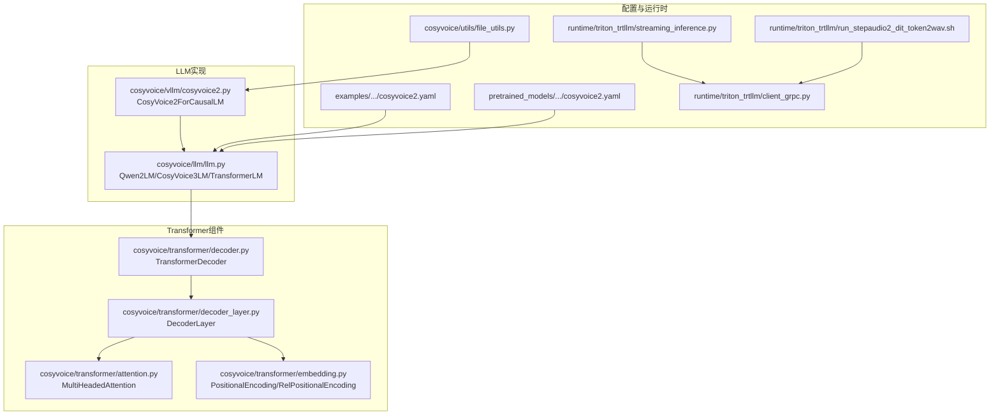
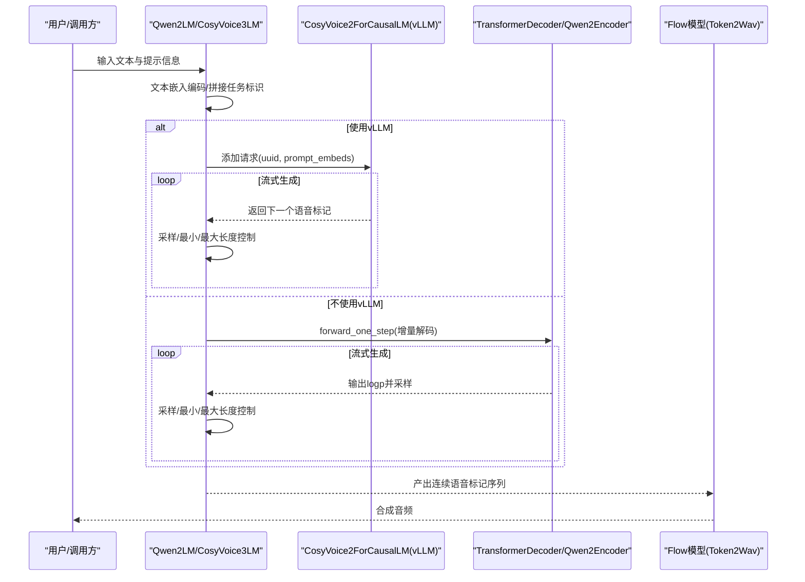
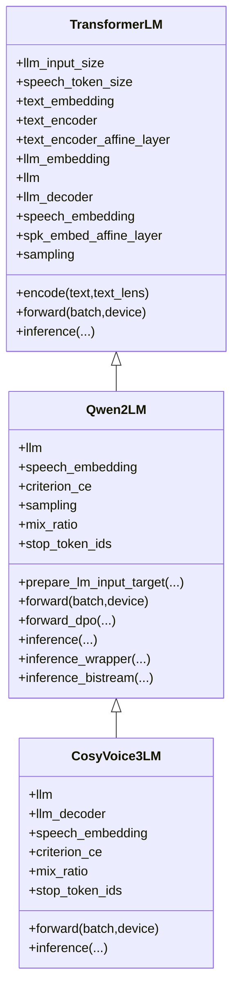
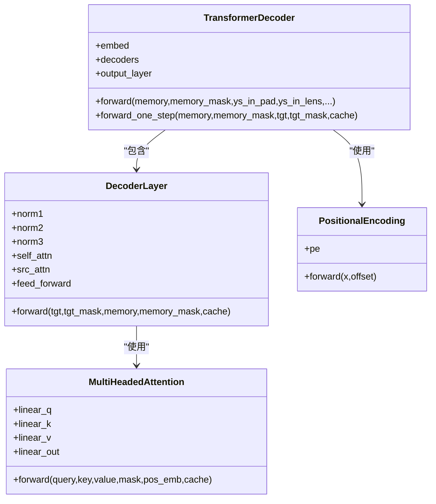
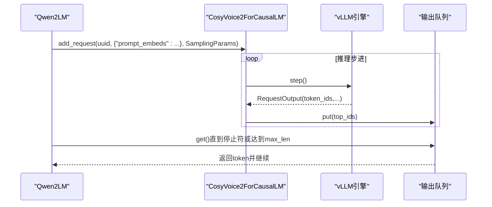
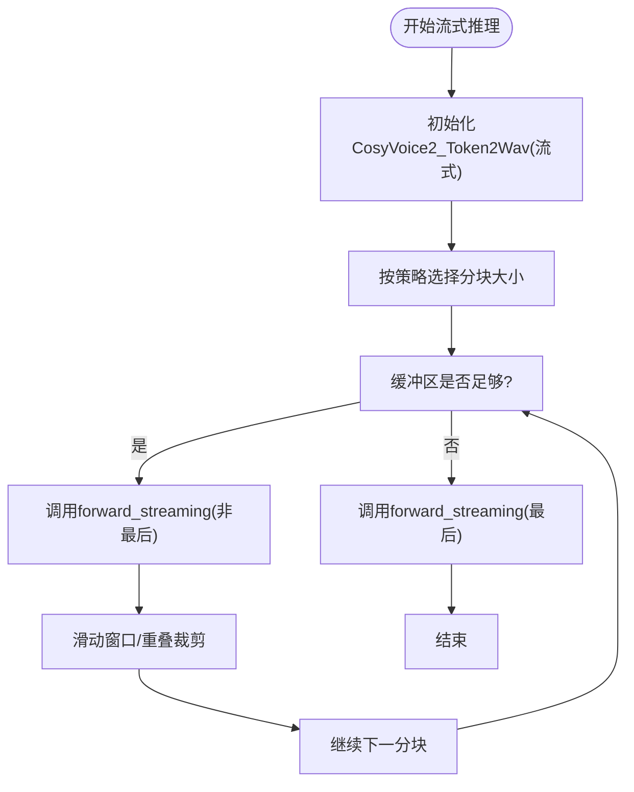
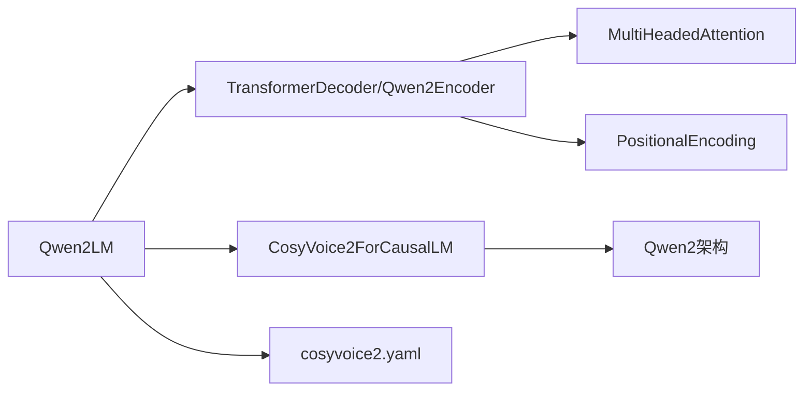

# 语言模型（LLM）

<cite>
**本文引用的文件**
- [cosyvoice/llm/llm.py](file://cosyvoice/llm/llm.py)
- [cosyvoice/vllm/cosyvoice2.py](file://cosyvoice/vllm/cosyvoice2.py)
- [cosyvoice/transformer/decoder.py](file://cosyvoice/transformer/decoder.py)
- [cosyvoice/transformer/decoder_layer.py](file://cosyvoice/transformer/decoder_layer.py)
- [cosyvoice/transformer/attention.py](file://cosyvoice/transformer/attention.py)
- [cosyvoice/transformer/embedding.py](file://cosyvoice/transformer/embedding.py)
- [examples/libritts/cosyvoice2/conf/cosyvoice2.yaml](file://examples/libritts/cosyvoice2/conf/cosyvoice2.yaml)
- [pretrained_models/CosyVoice2-0.5B/cosyvoice2.yaml](file://pretrained_models/CosyVoice2-0.5B/cosyvoice2.yaml)
- [runtime/triton_trtllm/streaming_inference.py](file://runtime/triton_trtllm/streaming_inference.py)
- [runtime/triton_trtllm/client_grpc.py](file://runtime/triton_trtllm/client_grpc.py)
- [runtime/triton_trtllm/run_stepaudio2_dit_token2wav.sh](file://runtime/triton_trtllm/run_stepaudio2_dit_token2wav.sh)
- [cosyvoice/utils/file_utils.py](file://cosyvoice/utils/file_utils.py)
</cite>

## 目录
1. [简介](#简介)
2. [项目结构](#项目结构)
3. [核心组件](#核心组件)
4. [架构总览](#架构总览)
5. [详细组件分析](#详细组件分析)
6. [依赖关系分析](#依赖关系分析)
7. [性能考量](#性能考量)
8. [故障排查指南](#故障排查指南)
9. [结论](#结论)
10. [附录](#附录)

## 简介
本节面向CosyVoice中的语言模型（LLM）子系统，聚焦以下目标：
- 解析LLM如何将文本输入转换为语音标记序列，涵盖基于Transformer的解码器结构、嵌入层设计（text_embedding、speech_embedding）、注意力机制与采样策略。
- 深入解析CosyVoice2ForCausalLM如何通过vLLM实现高效推理，以及在Triton推理服务器中，forward_llm与forward_llm_async的流式处理逻辑。
- 结合__init__方法中的参数配置，解释lsm_weight、mix_ratio等超参数的作用。
- 提供从文本到语音标记生成的完整数据流图，并说明其与Flow模型的接口协议。

## 项目结构
CosyVoice的LLM相关代码主要分布在以下模块：
- 语言模型实现：cosyvoice/llm/llm.py
- 基于Qwen2的vLLM适配：cosyvoice/vllm/cosyvoice2.py
- Transformer解码器与注意力：cosyvoice/transformer/decoder.py、decoder_layer.py、attention.py、embedding.py
- 配置文件：examples/libritts/cosyvoice2/conf/cosyvoice2.yaml、pretrained_models/CosyVoice2-0.5B/cosyvoice2.yaml
- Triton/TensorRT-LLM运行时与客户端：runtime/triton_trtllm/*

图表来源
- [cosyvoice/llm/llm.py](file://cosyvoice/llm/llm.py#L1-L200)
- [cosyvoice/vllm/cosyvoice2.py](file://cosyvoice/vllm/cosyvoice2.py#L1-L104)
- [cosyvoice/transformer/decoder.py](file://cosyvoice/transformer/decoder.py#L1-L120)
- [cosyvoice/transformer/decoder_layer.py](file://cosyvoice/transformer/decoder_layer.py#L1-L133)
- [cosyvoice/transformer/attention.py](file://cosyvoice/transformer/attention.py#L1-L120)
- [cosyvoice/transformer/embedding.py](file://cosyvoice/transformer/embedding.py#L1-L120)
- [examples/libritts/cosyvoice2/conf/cosyvoice2.yaml](file://examples/libritts/cosyvoice2/conf/cosyvoice2.yaml#L1-L120)
- [pretrained_models/CosyVoice2-0.5B/cosyvoice2.yaml](file://pretrained_models/CosyVoice2-0.5B/cosyvoice2.yaml#L1-L120)
- [runtime/triton_trtllm/streaming_inference.py](file://runtime/triton_trtllm/streaming_inference.py#L1-L123)
- [runtime/triton_trtllm/client_grpc.py](file://runtime/triton_trtllm/client_grpc.py#L1-L120)
- [runtime/triton_trtllm/run_stepaudio2_dit_token2wav.sh](file://runtime/triton_trtllm/run_stepaudio2_dit_token2wav.sh#L99-L138)
- [cosyvoice/utils/file_utils.py](file://cosyvoice/utils/file_utils.py#L91-L118)

章节来源
- [cosyvoice/llm/llm.py](file://cosyvoice/llm/llm.py#L1-L200)
- [cosyvoice/vllm/cosyvoice2.py](file://cosyvoice/vllm/cosyvoice2.py#L1-L104)
- [cosyvoice/transformer/decoder.py](file://cosyvoice/transformer/decoder.py#L1-L120)
- [cosyvoice/transformer/decoder_layer.py](file://cosyvoice/transformer/decoder_layer.py#L1-L133)
- [cosyvoice/transformer/attention.py](file://cosyvoice/transformer/attention.py#L1-L120)
- [cosyvoice/transformer/embedding.py](file://cosyvoice/transformer/embedding.py#L1-L120)
- [examples/libritts/cosyvoice2/conf/cosyvoice2.yaml](file://examples/libritts/cosyvoice2/conf/cosyvoice2.yaml#L1-L120)
- [pretrained_models/CosyVoice2-0.5B/cosyvoice2.yaml](file://pretrained_models/CosyVoice2-0.5B/cosyvoice2.yaml#L1-L120)
- [runtime/triton_trtllm/streaming_inference.py](file://runtime/triton_trtllm/streaming_inference.py#L1-L123)
- [runtime/triton_trtllm/client_grpc.py](file://runtime/triton_trtllm/client_grpc.py#L1-L120)
- [runtime/triton_trtllm/run_stepaudio2_dit_token2wav.sh](file://runtime/triton_trtllm/run_stepaudio2_dit_token2wav.sh#L99-L138)
- [cosyvoice/utils/file_utils.py](file://cosyvoice/utils/file_utils.py#L91-L118)

## 核心组件
- TransformerLM：通用的基于Transformer的LLM框架，负责文本嵌入编码、说话人嵌入投影、语音标记嵌入、损失计算与采样控制。
- Qwen2LM：基于Qwen2的LLM实现，支持双向流式（bistream）与单向流式（unistream），并集成vLLM以加速推理。
- CosyVoice3LM：更高维度的LLM变体，扩展了词表空间与停止符集合，便于更丰富的语音标记生成。
- CosyVoice2ForCausalLM：针对vLLM的适配层，将CosyVoice的嵌入与头映射到Qwen2架构，支持prompt_embeds输入与流式输出。
- Transformer解码器族：TransformerDecoder、DecoderLayer、MultiHeadedAttention、PositionalEncoding等，构成注意力与前馈堆叠的骨干网络。
- 配置文件：定义llm_input_size、llm_output_size、speech_token_size、lsm_weight、mix_ratio等关键超参。

章节来源
- [cosyvoice/llm/llm.py](file://cosyvoice/llm/llm.py#L1-L200)
- [cosyvoice/vllm/cosyvoice2.py](file://cosyvoice/vllm/cosyvoice2.py#L1-L104)
- [cosyvoice/transformer/decoder.py](file://cosyvoice/transformer/decoder.py#L1-L120)
- [cosyvoice/transformer/decoder_layer.py](file://cosyvoice/transformer/decoder_layer.py#L1-L133)
- [cosyvoice/transformer/attention.py](file://cosyvoice/transformer/attention.py#L1-L120)
- [cosyvoice/transformer/embedding.py](file://cosyvoice/transformer/embedding.py#L1-L120)
- [examples/libritts/cosyvoice2/conf/cosyvoice2.yaml](file://examples/libritts/cosyvoice2/conf/cosyvoice2.yaml#L1-L120)
- [pretrained_models/CosyVoice2-0.5B/cosyvoice2.yaml](file://pretrained_models/CosyVoice2-0.5B/cosyvoice2.yaml#L1-L120)

## 架构总览
下图展示了从文本到语音标记的端到端流程，以及与Flow模型的接口协议要点。

图表来源
- [cosyvoice/llm/llm.py](file://cosyvoice/llm/llm.py#L345-L518)
- [cosyvoice/vllm/cosyvoice2.py](file://cosyvoice/vllm/cosyvoice2.py#L1-L104)
- [cosyvoice/transformer/decoder.py](file://cosyvoice/transformer/decoder.py#L187-L229)
- [runtime/triton_trtllm/streaming_inference.py](file://runtime/triton_trtllm/streaming_inference.py#L40-L123)

## 详细组件分析

### 组件A：TransformerLM与Qwen2LM/CosyVoice3LM
- 嵌入层设计
  - text_embedding：将文本token映射到模型隐藏维。
  - speech_embedding：将语音token映射到模型隐藏维。
  - llm_embedding：用于特殊token（如SOS、任务ID）的嵌入。
  - spk_embed_affine_layer：将说话人嵌入投影到模型隐藏维。
- 解码器与损失
  - 使用线性层llm_decoder将解码器输出映射到语音标记词表。
  - 使用LabelSmoothingLoss进行平滑交叉熵训练，平滑权重由lsm_weight控制。
- 采样策略
  - 通过sampling函数实现top-k/top-p等策略；inference阶段对EOS进行最小/最大长度约束。
- 流式推理
  - 支持forward_one_step的增量解码；在无vLLM时，逐token生成并yield。
  - 在有vLLM时，通过SamplingParams与stop_token_ids控制流式生成与停止条件。

图表来源
- [cosyvoice/llm/llm.py](file://cosyvoice/llm/llm.py#L33-L200)
- [cosyvoice/llm/llm.py](file://cosyvoice/llm/llm.py#L261-L740)

章节来源
- [cosyvoice/llm/llm.py](file://cosyvoice/llm/llm.py#L33-L200)
- [cosyvoice/llm/llm.py](file://cosyvoice/llm/llm.py#L261-L740)

### 组件B：基于Transformer的解码器结构
- TransformerDecoder
  - 包含多层DecoderLayer，每层包含自注意力与可选的交叉注意力、前馈网络。
  - 支持梯度检查点与输出层绑定。
- DecoderLayer
  - 实现前向传播、缓存更新与归一化顺序控制。
- MultiHeadedAttention
  - 实现多头注意力、相对位置编码支持、缓存拼接与切片。
- PositionalEncoding/RelPositionalEncoding
  - 提供绝对/相对位置编码，支持流式增量位置索引。

图表来源
- [cosyvoice/transformer/decoder.py](file://cosyvoice/transformer/decoder.py#L33-L229)
- [cosyvoice/transformer/decoder_layer.py](file://cosyvoice/transformer/decoder_layer.py#L22-L133)
- [cosyvoice/transformer/attention.py](file://cosyvoice/transformer/attention.py#L26-L120)
- [cosyvoice/transformer/embedding.py](file://cosyvoice/transformer/embedding.py#L26-L120)

章节来源
- [cosyvoice/transformer/decoder.py](file://cosyvoice/transformer/decoder.py#L33-L229)
- [cosyvoice/transformer/decoder_layer.py](file://cosyvoice/transformer/decoder_layer.py#L22-L133)
- [cosyvoice/transformer/attention.py](file://cosyvoice/transformer/attention.py#L26-L120)
- [cosyvoice/transformer/embedding.py](file://cosyvoice/transformer/embedding.py#L26-L120)

### 组件C：CosyVoice2ForCausalLM与vLLM集成
- CosyVoice2ForCausalLM
  - 将CosyVoice的speech_embedding与llm_decoder映射到Qwen2架构，使模型可被vLLM加载与执行。
  - 支持prompt_embeds输入，返回hidden_states供后续解码。
- vLLM集成要点
  - 通过SamplingParams设置top_k、stop_token_ids、min_tokens、max_tokens等。
  - 使用add_request与step循环拉取输出，按停止符流式返回token。
  - 通过队列管理每个uuid的输出，避免阻塞。

图表来源
- [cosyvoice/vllm/cosyvoice2.py](file://cosyvoice/vllm/cosyvoice2.py#L1-L104)
- [cosyvoice/llm/llm.py](file://cosyvoice/llm/llm.py#L472-L518)

章节来源
- [cosyvoice/vllm/cosyvoice2.py](file://cosyvoice/vllm/cosyvoice2.py#L1-L104)
- [cosyvoice/llm/llm.py](file://cosyvoice/llm/llm.py#L472-L518)

### 组件D：流式处理与Triton集成
- Triton客户端
  - 支持gRPC异步流式调用，回调中统计首包延迟与次包延迟。
  - 通过enable_empty_final_response与triton_final_response参数判断最终响应。
- 运行脚本
  - run.sh中启动trtllm-serve与tritonserver，支持Decoupled=True（流式）模式。
- 流式推理
  - streaming_inference.py按策略（等长/指数）分块向前推进，调用Token2Wav的流式接口。

图表来源
- [runtime/triton_trtllm/streaming_inference.py](file://runtime/triton_trtllm/streaming_inference.py#L40-L123)
- [runtime/triton_trtllm/client_grpc.py](file://runtime/triton_trtllm/client_grpc.py#L405-L531)
- [runtime/triton_trtllm/run_stepaudio2_dit_token2wav.sh](file://runtime/triton_trtllm/run_stepaudio2_dit_token2wav.sh#L99-L138)

章节来源
- [runtime/triton_trtllm/streaming_inference.py](file://runtime/triton_trtllm/streaming_inference.py#L40-L123)
- [runtime/triton_trtllm/client_grpc.py](file://runtime/triton_trtllm/client_grpc.py#L405-L531)
- [runtime/triton_trtllm/run_stepaudio2_dit_token2wav.sh](file://runtime/triton_trtllm/run_stepaudio2_dit_token2wav.sh#L99-L138)

### 组件E：参数配置与超参数作用
- lsm_weight（标签平滑权重）
  - 控制LabelSmoothingLoss的平滑程度，平衡过拟合与泛化。
- mix_ratio（混合比例）
  - 控制bistream模式下文本token与语音token的配比，影响流式生成节奏与对齐精度。
- 其他关键参数
  - llm_input_size、llm_output_size：决定嵌入与解码器维度一致性。
  - speech_token_size：语音标记词表规模，决定llm_decoder输出维度。
  - sampling：采样策略（top_k、top_p等）。

章节来源
- [examples/libritts/cosyvoice2/conf/cosyvoice2.yaml](file://examples/libritts/cosyvoice2/conf/cosyvoice2.yaml#L1-L120)
- [pretrained_models/CosyVoice2-0.5B/cosyvoice2.yaml](file://pretrained_models/CosyVoice2-0.5B/cosyvoice2.yaml#L1-L120)
- [cosyvoice/llm/llm.py](file://cosyvoice/llm/llm.py#L261-L740)

## 依赖关系分析
- LLM与Transformer解码器
  - Qwen2LM/CosyVoice3LM依赖TransformerDecoder/Qwen2Encoder完成增量解码。
  - DecoderLayer与MultiHeadedAttention共同实现注意力与前馈。
- LLM与vLLM
  - CosyVoice2ForCausalLM将CosyVoice的嵌入与头映射到Qwen2架构，使vLLM可直接加载。
  - Qwen2Encoder提供forward_one_step与use_cache能力，支撑增量解码。
- 配置驱动
  - YAML配置文件统一声明模型维度、词表规模、采样策略与流式参数，确保训练/推理一致性。

图表来源
- [cosyvoice/llm/llm.py](file://cosyvoice/llm/llm.py#L261-L740)
- [cosyvoice/vllm/cosyvoice2.py](file://cosyvoice/vllm/cosyvoice2.py#L1-L104)
- [cosyvoice/transformer/decoder.py](file://cosyvoice/transformer/decoder.py#L1-L120)
- [cosyvoice/transformer/attention.py](file://cosyvoice/transformer/attention.py#L1-L120)
- [cosyvoice/transformer/embedding.py](file://cosyvoice/transformer/embedding.py#L1-L120)
- [examples/libritts/cosyvoice2/conf/cosyvoice2.yaml](file://examples/libritts/cosyvoice2/conf/cosyvoice2.yaml#L1-L120)

章节来源
- [cosyvoice/llm/llm.py](file://cosyvoice/llm/llm.py#L261-L740)
- [cosyvoice/vllm/cosyvoice2.py](file://cosyvoice/vllm/cosyvoice2.py#L1-L104)
- [cosyvoice/transformer/decoder.py](file://cosyvoice/transformer/decoder.py#L1-L120)
- [cosyvoice/transformer/attention.py](file://cosyvoice/transformer/attention.py#L1-L120)
- [cosyvoice/transformer/embedding.py](file://cosyvoice/transformer/embedding.py#L1-L120)
- [examples/libritts/cosyvoice2/conf/cosyvoice2.yaml](file://examples/libritts/cosyvoice2/conf/cosyvoice2.yaml#L1-L120)

## 性能考量
- vLLM集成
  - 通过prompt_embeds与SamplingParams减少显存拷贝与CPU-GPU往返，提升吞吐。
  - stop_token_ids与min/max_tokens限制生成长度，避免无效迭代。
- 流式解码
  - forward_one_step与cache复用显著降低重复计算，适合在线推理。
  - bistream模式通过mix_ratio平衡文本与语音对齐，减少等待时间。
- 注意力与位置编码
  - MultiHeadedAttention支持缓存拼接与切片，RelPositionalEncoding提升长序列建模能力。
- Triton/TensorRT-LLM
  - run.sh中KV缓存内存占比与批大小需根据GPU显存调整，避免OOM。

[本节为通用指导，不直接分析具体文件]

## 故障排查指南
- 采样到达上限仍产生EOS
  - sampling_ids中存在最大试错次数限制，超过阈值会抛出异常，需检查输入或放宽限制。
- vLLM输出队列为空
  - inference_wrapper中通过sleep轮询，若长时间为空，检查add_request与step调用是否正确。
- Triton流式回调未触发
  - 确认enable_empty_final_response与triton_final_response参数设置，检查回调函数是否注册。
- 模型权重导出不兼容
  - export_cosyvoice2_vllm中会修改lm_head与embed_tokens映射及vocab_size，确保与CosyVoice2ForCausalLM一致。

章节来源
- [cosyvoice/llm/llm.py](file://cosyvoice/llm/llm.py#L149-L165)
- [cosyvoice/llm/llm.py](file://cosyvoice/llm/llm.py#L472-L518)
- [runtime/triton_trtllm/client_grpc.py](file://runtime/triton_trtllm/client_grpc.py#L405-L531)
- [cosyvoice/utils/file_utils.py](file://cosyvoice/utils/file_utils.py#L91-L118)

## 结论
CosyVoice的LLM子系统以Qwen2为基础，结合Transformer解码器与流式采样策略，实现了从文本到语音标记的高效生成。通过CosyVoice2ForCausalLM与vLLM的深度集成，系统在保持高保真度的同时显著提升了在线推理性能。配置文件统一管理关键超参数，确保训练与推理的一致性。Triton与TensorRT-LLM进一步优化了部署与吞吐表现，配合流式客户端实现低延迟音频合成。

[本节为总结性内容，不直接分析具体文件]

## 附录
- 关键路径参考
  - LLM前向与流式生成：[cosyvoice/llm/llm.py](file://cosyvoice/llm/llm.py#L345-L518)
  - vLLM适配与prompt_embeds：[cosyvoice/vllm/cosyvoice2.py](file://cosyvoice/vllm/cosyvoice2.py#L1-L104)
  - 增量解码接口：[cosyvoice/transformer/decoder.py](file://cosyvoice/transformer/decoder.py#L187-L229)
  - 采样与停止控制：[cosyvoice/llm/llm.py](file://cosyvoice/llm/llm.py#L472-L518)
  - 流式客户端与统计：[runtime/triton_trtllm/client_grpc.py](file://runtime/triton_trtllm/client_grpc.py#L405-L531)
  - 流式分块推理：[runtime/triton_trtllm/streaming_inference.py](file://runtime/triton_trtllm/streaming_inference.py#L40-L123)
  - 权重导出适配：[cosyvoice/utils/file_utils.py](file://cosyvoice/utils/file_utils.py#L91-L118)