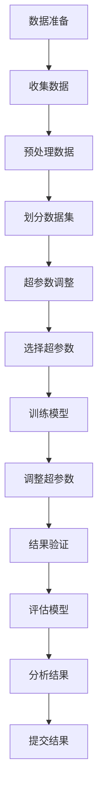

# 贡献指南

<cite>
**本文档引用的文件**   
- [README.md](file://README.md)
- [CODE_OF_CONDUCT.md](file://CODE_OF_CONDUCT.md)
- [requirements.txt](file://requirements.txt)
- [run-cosyvoice.sh](file://run-cosyvoice.sh)
- [cosyvoice/bin/train.py](file://cosyvoice/bin/train.py)
- [cosyvoice/utils/train_utils.py](file://cosyvoice/utils/train_utils.py)
- [cosyvoice/utils/common.py](file://cosyvoice/utils/common.py)
- [cosyvoice/dataset/dataset.py](file://cosyvoice/dataset/dataset.py)
- [cosyvoice/dataset/processor.py](file://cosyvoice/dataset/processor.py)
- [cosyvoice/cli/cosyvoice.py](file://cosyvoice/cli/cosyvoice.py)
- [cosyvoice/cli/model.py](file://cosyvoice/cli/model.py)
- [cosyvoice/cli/frontend.py](file://cosyvoice/cli/frontend.py)
- [example.py](file://example.py)
- [webui.py](file://webui.py)
</cite>

## 目录
1. [简介](#简介)
2. [行为准则](#行为准则)
3. [开发环境配置](#开发环境配置)
4. [代码风格规范](#代码风格规范)
5. [分支管理策略](#分支管理策略)
6. [提交流程](#提交流程)
7. [测试要求](#测试要求)
8. [添加新功能](#添加新功能)
9. [优化现有模型](#优化现有模型)
10. [改进文档](#改进文档)
11. [模型训练贡献流程](#模型训练贡献流程)
12. [结论](#结论)

## 简介
CosyVoice是一个先进的文本到语音（TTS）系统，基于大型语言模型（LLM），在内容一致性、说话人相似性和韵律自然性方面表现出色。本贡献指南旨在为外部贡献者提供详细的指导，帮助他们参与项目改进。本文档涵盖了代码风格规范、提交流程、分支管理策略和测试要求，并详细说明了如何添加新功能、优化现有模型或改进文档。此外，还特别介绍了模型训练贡献流程，包括数据准备、超参数调整和结果验证。

**本文档引用的文件**
- [README.md](file://README.md)

## 行为准则
在CosyVoice项目中，我们致力于营造一个开放和包容的环境。作为贡献者和维护者，我们承诺让每个人都能在没有骚扰的情况下参与我们的项目和社区，无论其年龄、体型、残疾、民族、性别特征、性别认同和表达、经验水平、教育背景、社会经济地位、国籍、外貌、种族、宗教或性取向。

### 我们的承诺
我们承诺通过以下方式创造一个积极的环境：
- 使用欢迎和包容的语言
- 尊重不同的观点和经验
- 欣然接受建设性的批评
- 专注于对社区最有利的事情
- 对其他社区成员表现出同理心

### 不可接受的行为
参与者不可接受的行为包括：
- 使用性化语言或图像以及不受欢迎的性关注或进展
- 网络骚扰、侮辱/贬损性评论以及人身或政治攻击
- 公开或私下骚扰
- 未经明确许可发布他人的私人信息，如物理或电子地址
- 其他在专业场合下可能被视为不适当的行为

### 我们的责任
项目维护者有责任澄清可接受行为的标准，并在出现不可接受行为时采取适当和公正的纠正措施。维护者有权删除、编辑或拒绝不符合本行为准则的评论、提交、代码、维基编辑、问题和其他贡献，或暂时或永久禁止任何他们认为不适当、威胁、冒犯或有害的行为的贡献者。

### 范围
本行为准则适用于项目空间和公共空间，当个人代表项目或其社区时。代表项目或社区的例子包括使用官方项目电子邮件地址、通过官方社交媒体账户发布或作为指定代表在线或离线活动中行事。

### 执行
滥用、骚扰或以其他方式不可接受的行为实例可以通过联系项目团队在mikelei@mobvoi.com进行报告。所有投诉都将被审查和调查，并根据情况采取必要的适当措施。项目团队有义务对事件报告者保持保密。

**本文档引用的文件**
- [CODE_OF_CONDUCT.md](file://CODE_OF_CONDUCT.md)

## 开发环境配置
为了开始贡献，您需要配置开发环境。以下是详细的步骤：

1. **克隆仓库**
   ```sh
   git clone --recursive https://github.com/FunAudioLLM/CosyVoice.git
   # 如果由于网络问题未能克隆子模块，请运行以下命令直到成功
   cd CosyVoice
   git submodule update --init --recursive
   ```

2. **安装Conda**
   请参阅 https://docs.conda.io/en/latest/miniconda.html

3. **创建Conda环境**
   ```sh
   conda create -n cosyvoice -y python=3.10
   conda activate cosyvoice
   pip install -r requirements.txt -i https://mirrors.aliyun.com/pypi/simple/ --trusted-host=mirrors.aliyun.com

   # 如果遇到sox兼容性问题
   # ubuntu
   sudo apt-get install sox libsox-dev
   # centos
   sudo yum install sox sox-devel
   ```

4. **下载模型**
   ```python
   # modelscope SDK模型下载
   from modelscope import snapshot_download
   snapshot_download('FunAudioLLM/Fun-CosyVoice3-0.5B-2512', local_dir='pretrained_models/Fun-CosyVoice3-0.5B')
   snapshot_download('iic/CosyVoice2-0.5B', local_dir='pretrained_models/CosyVoice2-0.5B')
   snapshot_download('iic/CosyVoice-300M', local_dir='pretrained_models/CosyVoice-300M')
   snapshot_download('iic/CosyVoice-300M-SFT', local_dir='pretrained_models/CosyVoice-300M-SFT')
   snapshot_download('iic/CosyVoice-300M-Instruct', local_dir='pretrained_models/CosyVoice-300M-Instruct')
   snapshot_download('iic/CosyVoice-ttsfrd', local_dir='pretrained_models/CosyVoice-ttsfrd')

   # 对于海外用户，huggingface SDK模型下载
   from huggingface_hub import snapshot_download
   snapshot_download('FunAudioLLM/Fun-CosyVoice3-0.5B-2512', local_dir='pretrained_models/Fun-CosyVoice3-0.5B')
   snapshot_download('FunAudioLLM/CosyVoice2-0.5B', local_dir='pretrained_models/CosyVoice2-0.5B')
   snapshot_download('FunAudioLLM/CosyVoice-300M', local_dir='pretrained_models/CosyVoice-300M')
   snapshot_download('FunAudioLLM/CosyVoice-300M-SFT', local_dir='pretrained_models/CosyVoice-300M-SFT')
   snapshot_download('FunAudioLLM/CosyVoice-300M-Instruct', local_dir='pretrained_models/CosyVoice-300M-Instruct')
   snapshot_download('FunAudioLLM/CosyVoice-ttsfrd', local_dir='pretrained_models/CosyVoice-ttsfrd')
   ```

5. **可选：安装ttsfrd包**
   ```sh
   cd pretrained_models/CosyVoice-ttsfrd/
   unzip resource.zip -d .
   pip install ttsfrd_dependency-0.1-py3-none-any.whl
   pip install ttsfrd-0.4.2-cp310-cp310-linux_x86_64.whl
   ```

**本文档引用的文件**
- [README.md](file://README.md)
- [requirements.txt](file://requirements.txt)

## 代码风格规范
CosyVoice项目遵循Python的PEP 8代码风格规范。以下是主要的代码风格要求：

1. **缩进**：使用4个空格进行缩进。
2. **行长度**：每行代码不应超过79个字符。
3. **空行**：在顶级函数和类定义之间使用两个空行，在方法定义之间使用一个空行。
4. **导入**：导入应该按以下顺序分组，每组之间用一个空行分隔：
   - 标准库导入
   - 相关第三方库导入
   - 本地应用/库特定导入
5. **命名约定**：
   - 函数和变量名使用小写字母和下划线（snake_case）。
   - 类名使用驼峰命名法（CamelCase）。
   - 常量名使用大写字母和下划线（UPPER_CASE）。
6. **注释**：代码应包含清晰的注释，解释复杂逻辑或算法。注释应与代码保持同步。
7. **文档字符串**：所有公共模块、函数、类和方法都应包含文档字符串，遵循PEP 257规范。

**本文档引用的文件**
- [cosyvoice/bin/train.py](file://cosyvoice/bin/train.py)
- [cosyvoice/utils/train_utils.py](file://cosyvoice/utils/train_utils.py)
- [cosyvoice/utils/common.py](file://cosyvoice/utils/common.py)

## 分支管理策略
CosyVoice项目采用Git Flow分支管理策略。以下是主要的分支管理规则：

1. **主分支（main）**：主分支包含最新的稳定版本代码。只有经过充分测试和审查的代码才能合并到主分支。
2. **开发分支（develop）**：开发分支是所有新功能和改进的集成分支。所有功能分支都应从开发分支创建，并在完成后合并回开发分支。
3. **功能分支（feature/*）**：每个新功能或改进都应在独立的功能分支中开发。功能分支的命名应清晰描述其目的，例如`feature/add-new-model`。
4. **修复分支（hotfix/*）**：紧急修复应在独立的修复分支中进行。修复分支应从主分支创建，并在完成后合并回主分支和开发分支。
5. **发布分支（release/*）**：发布分支用于准备新版本的发布。发布分支应从开发分支创建，并在发布完成后合并回主分支和开发分支。

**本文档引用的文件**
- [README.md](file://README.md)

## 提交流程
为了确保代码质量和一致性，CosyVoice项目遵循以下提交流程：

1. **创建分支**：从开发分支创建一个新的功能分支。
   ```sh
   git checkout -b feature/your-feature-name develop
   ```

2. **编写代码**：在功能分支上编写代码，确保遵循代码风格规范。

3. **编写测试**：为新功能或改进编写单元测试和集成测试。

4. **提交更改**：将更改提交到功能分支。
   ```sh
   git add .
   git commit -m "描述您的更改"
   ```

5. **推送分支**：将功能分支推送到远程仓库。
   ```sh
   git push origin feature/your-feature-name
   ```

6. **创建拉取请求**：在GitHub上创建一个拉取请求，将功能分支合并到开发分支。在拉取请求中提供详细的描述，说明更改的目的和影响。

7. **代码审查**：项目维护者将审查您的代码，并可能提出修改建议。请根据反馈进行修改。

8. **合并代码**：一旦代码通过审查，项目维护者将合并您的拉取请求。

**本文档引用的文件**
- [README.md](file://README.md)

## 测试要求
CosyVoice项目要求所有新功能和改进都必须通过相应的测试。以下是测试要求：

1. **单元测试**：每个新功能或改进都应包含单元测试，确保代码的正确性和稳定性。单元测试应覆盖所有主要功能和边界情况。

2. **集成测试**：对于涉及多个组件的更改，应编写集成测试，确保各组件之间的交互正常。

3. **性能测试**：对于可能影响性能的更改，应进行性能测试，确保性能没有显著下降。

4. **测试覆盖率**：项目要求测试覆盖率不低于80%。您可以使用`coverage.py`工具来检查测试覆盖率。

5. **持续集成**：所有拉取请求都必须通过持续集成（CI）系统的测试。CI系统将自动运行所有测试，并检查代码风格。

**本文档引用的文件**
- [example.py](file://example.py)
- [webui.py](file://webui.py)

## 添加新功能
添加新功能是贡献项目的重要方式。以下是添加新功能的步骤：

1. **提出想法**：在GitHub Issues中提出您的新功能想法，与社区讨论其可行性和需求。

2. **创建分支**：从开发分支创建一个新的功能分支。
   ```sh
   git checkout -b feature/your-feature-name develop
   ```

3. **实现功能**：在功能分支上实现新功能，确保遵循代码风格规范。

4. **编写测试**：为新功能编写单元测试和集成测试。

5. **更新文档**：更新相关文档，包括README和API文档，确保用户了解新功能。

6. **提交更改**：将更改提交到功能分支，并推送到远程仓库。

7. **创建拉取请求**：在GitHub上创建一个拉取请求，将功能分支合并到开发分支。

**本文档引用的文件**
- [cosyvoice/cli/cosyvoice.py](file://cosyvoice/cli/cosyvoice.py)
- [cosyvoice/cli/model.py](file://cosyvoice/cli/model.py)
- [cosyvoice/cli/frontend.py](file://cosyvoice/cli/frontend.py)

## 优化现有模型
优化现有模型是提高项目性能的关键。以下是优化现有模型的步骤：

1. **识别瓶颈**：使用性能分析工具（如`cProfile`）识别模型的性能瓶颈。

2. **提出优化方案**：在GitHub Issues中提出您的优化方案，与社区讨论其可行性和预期效果。

3. **实现优化**：在功能分支上实现优化，确保遵循代码风格规范。

4. **编写测试**：为优化编写性能测试，确保性能有所提升。

5. **更新文档**：更新相关文档，说明优化的内容和效果。

6. **提交更改**：将更改提交到功能分支，并推送到远程仓库。

7. **创建拉取请求**：在GitHub上创建一个拉取请求，将功能分支合并到开发分支。

**本文档引用的文件**
- [cosyvoice/bin/train.py](file://cosyvoice/bin/train.py)
- [cosyvoice/utils/train_utils.py](file://cosyvoice/utils/train_utils.py)
- [cosyvoice/utils/common.py](file://cosyvoice/utils/common.py)

## 改进文档
改进文档是帮助用户更好地理解和使用项目的重要方式。以下是改进文档的步骤：

1. **识别问题**：在GitHub Issues中提出文档中的问题或改进建议。

2. **创建分支**：从开发分支创建一个新的文档分支。
   ```sh
   git checkout -b doc/improve-documentation develop
   ```

3. **修改文档**：在文档分支上修改相关文档，确保内容准确、清晰。

4. **提交更改**：将更改提交到文档分支，并推送到远程仓库。

5. **创建拉取请求**：在GitHub上创建一个拉取请求，将文档分支合并到开发分支。

**本文档引用的文件**
- [README.md](file://README.md)
- [example.py](file://example.py)
- [webui.py](file://webui.py)

## 模型训练贡献流程
贡献模型训练是提高项目性能的重要方式。以下是模型训练贡献流程：

### 数据准备
1. **收集数据**：收集高质量的语音数据，确保数据的多样性和代表性。
2. **预处理数据**：使用`cosyvoice/dataset/processor.py`中的预处理函数对数据进行预处理，包括重采样、截断和特征提取。
3. **划分数据集**：将数据集划分为训练集和验证集。

### 超参数调整
1. **选择超参数**：根据任务需求选择合适的超参数，如学习率、批量大小和优化器。
2. **训练模型**：使用`cosyvoice/bin/train.py`脚本训练模型，监控训练过程中的损失和性能指标。
3. **调整超参数**：根据训练结果调整超参数，优化模型性能。

### 结果验证
1. **评估模型**：使用验证集评估模型的性能，计算相关指标如CER、WER和说话人相似性。
2. **分析结果**：分析评估结果，识别模型的优缺点。
3. **提交结果**：将训练结果和模型权重提交到项目仓库，供社区使用和验证。



**图表来源**
- [cosyvoice/dataset/processor.py](file://cosyvoice/dataset/processor.py)
- [cosyvoice/bin/train.py](file://cosyvoice/bin/train.py)

**本文档引用的文件**
- [cosyvoice/dataset/dataset.py](file://cosyvoice/dataset/dataset.py)
- [cosyvoice/dataset/processor.py](file://cosyvoice/dataset/processor.py)
- [cosyvoice/bin/train.py](file://cosyvoice/bin/train.py)
- [cosyvoice/utils/train_utils.py](file://cosyvoice/utils/train_utils.py)

## 结论
通过遵循本贡献指南，您可以有效地参与CosyVoice项目的改进。我们鼓励所有贡献者遵守行为准则，遵循代码风格规范，使用正确的分支管理策略，并通过详细的提交流程和测试要求确保代码质量。无论是添加新功能、优化现有模型还是改进文档，您的贡献都将帮助项目不断进步。感谢您对CosyVoice项目的贡献！

**本文档引用的文件**
- [README.md](file://README.md)
- [CODE_OF_CONDUCT.md](file://CODE_OF_CONDUCT.md)