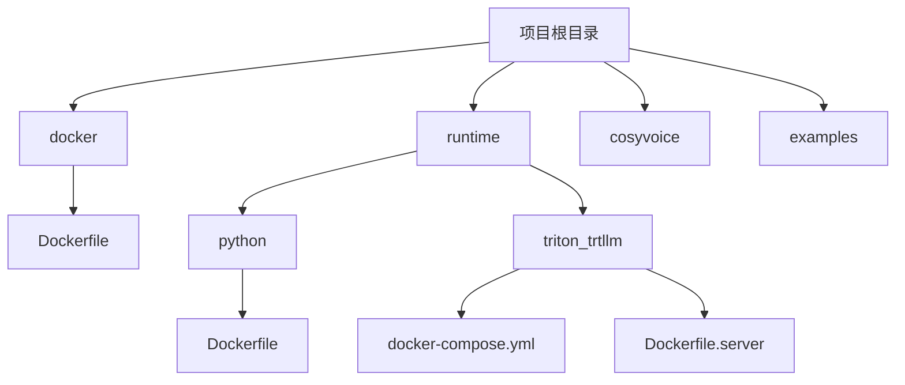
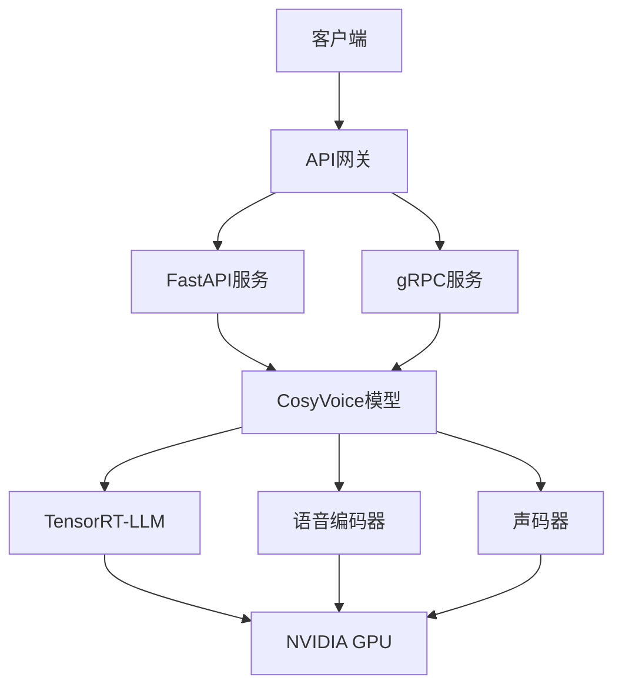
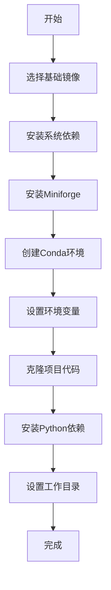
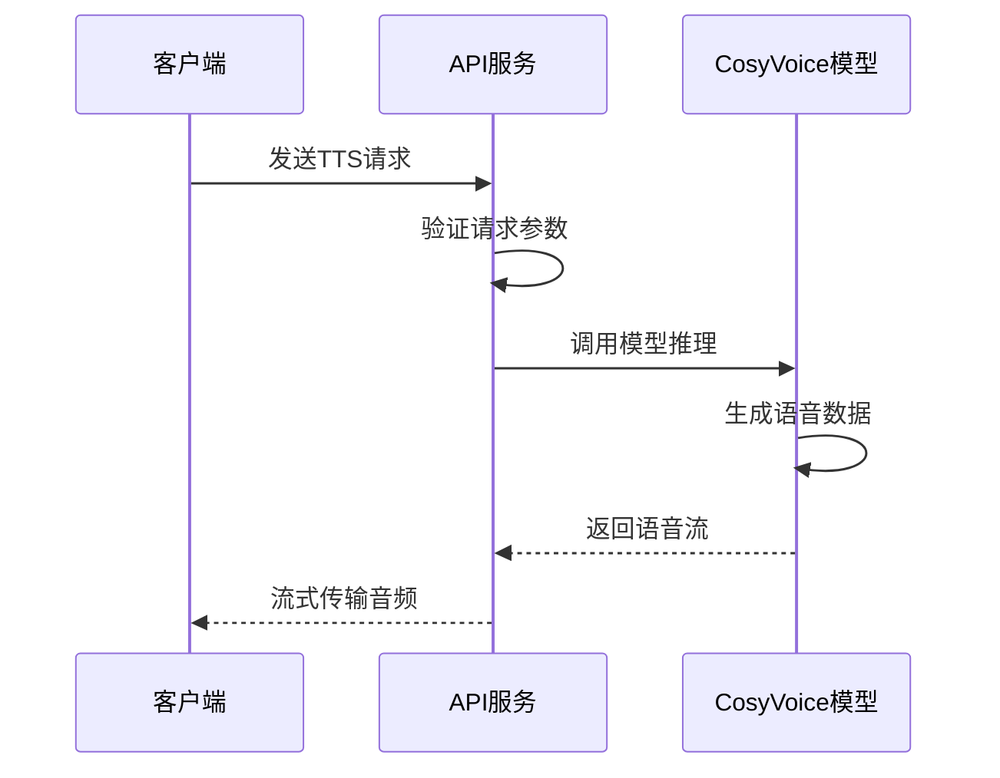
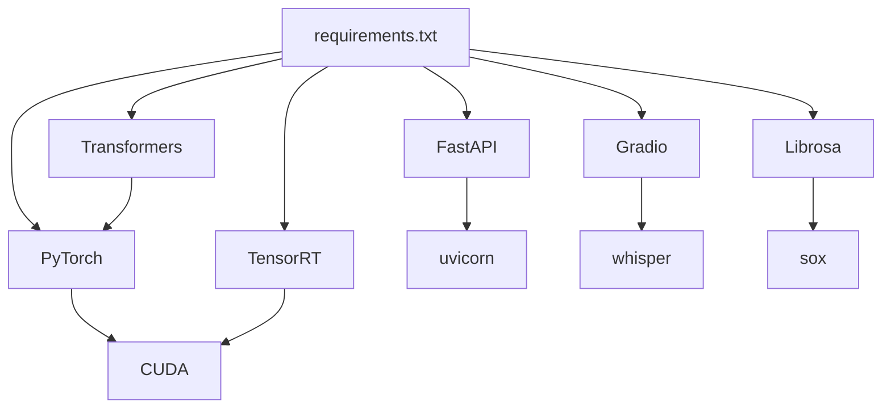

# Docker容器化部署

<cite>
**本文档引用的文件**
- [Dockerfile](file://docker/Dockerfile)
- [requirements.txt](file://requirements.txt)
- [api.py](file://api.py)
- [webui.py](file://webui.py)
- [runtime/python/Dockerfile](file://runtime/python/Dockerfile)
- [runtime/triton_trtllm/docker-compose.yml](file://runtime/triton_trtllm/docker-compose.yml)
- [runtime/triton_trtllm/Dockerfile.server](file://runtime/triton_trtllm/Dockerfile.server)
- [runtime/python/fastapi/server.py](file://runtime/python/fastapi/server.py)
</cite>

## 目录
1. [简介](#简介)
2. [项目结构](#项目结构)
3. [核心组件](#核心组件)
4. [架构概述](#架构概述)
5. [详细组件分析](#详细组件分析)
6. [依赖分析](#依赖分析)
7. [性能考虑](#性能考虑)
8. [故障排除指南](#故障排除指南)
9. [结论](#结论)

## 简介
CosyVoice是一个基于大型语言模型的可扩展多语言零样本文本到语音（TTS）合成器，支持流式语音合成、语音克隆和自然语言控制等功能。本指南详细介绍了如何使用Docker容器化部署CosyVoice，涵盖从镜像构建到容器运行的完整流程，包括基础镜像选择、依赖安装、工作目录设置、环境变量配置以及常见问题的排查方法。

## 项目结构
CosyVoice项目的目录结构清晰，主要包含核心代码、Docker配置、示例和运行时脚本。Docker相关文件位于`docker/`和`runtime/`目录下，其中`docker/Dockerfile`是主要的构建文件，`runtime/python/Dockerfile`用于Python运行时环境，`runtime/triton_trtllm/`目录包含使用NVIDIA Triton和TensorRT-LLM的部署配置。

**图示来源**
- [docker/Dockerfile](file://docker/Dockerfile)
- [runtime/python/Dockerfile](file://runtime/python/Dockerfile)
- [runtime/triton_trtllm/docker-compose.yml](file://runtime/triton_trtllm/docker-compose.yml)

**本节来源**
- [docker/Dockerfile](file://docker/Dockerfile)
- [runtime/python/Dockerfile](file://runtime/python/Dockerfile)
- [runtime/triton_trtllm/docker-compose.yml](file://runtime/triton_trtllm/docker-compose.yml)

## 核心组件
CosyVoice的核心组件包括语音合成模型、前端处理模块、流式推理引擎和API服务。`api.py`文件实现了基于FastAPI的RESTful API服务，支持预训练音色合成、零样本语音克隆、跨语种复刻和自然语言控制等多种推理模式。`webui.py`提供了基于Gradio的Web界面，方便用户进行交互式语音合成。

**本节来源**
- [api.py](file://api.py)
- [webui.py](file://webui.py)

## 架构概述
CosyVoice的架构分为模型层、服务层和接口层。模型层包含预训练的语音合成模型和大型语言模型；服务层通过FastAPI或gRPC提供HTTP和RPC接口；接口层支持Web UI、命令行工具和第三方应用集成。使用NVIDIA Triton和TensorRT-LLM可以实现高性能的流式语音合成服务。

**图示来源**
- [api.py](file://api.py)
- [runtime/python/fastapi/server.py](file://runtime/python/fastapi/server.py)
- [runtime/triton_trtllm/Dockerfile.server](file://runtime/triton_trtllm/Dockerfile.server)

## 详细组件分析

### Docker镜像构建分析
CosyVoice提供了多个Dockerfile用于不同场景的部署。主Dockerfile使用`nvidia/cuda:12.4.1-cudnn-devel-ubuntu22.04`作为基础镜像，确保了对CUDA和cuDNN的完整支持。构建过程包括安装系统依赖、配置Conda环境、安装Python依赖和克隆项目代码。

#### Dockerfile构建流程

**图示来源**
- [docker/Dockerfile](file://docker/Dockerfile)

**本节来源**
- [docker/Dockerfile](file://docker/Dockerfile)

### API服务组件分析
API服务基于FastAPI框架实现，支持同步和流式语音合成。`api.py`文件定义了多种请求模型，包括预训练音色合成、零样本语音克隆、跨语种复刻和自然语言控制。服务通过`uvicorn`运行，支持CORS跨域请求。

#### API请求处理流程

**图示来源**
- [api.py](file://api.py)
- [runtime/python/fastapi/server.py](file://runtime/python/fastapi/server.py)

**本节来源**
- [api.py](file://api.py)
- [runtime/python/fastapi/server.py](file://runtime/python/fastapi/server.py)

## 依赖分析
CosyVoice的依赖管理通过`requirements.txt`文件进行，包含了深度学习框架、语音处理库和Web服务组件。主要依赖包括PyTorch、Transformers、FastAPI、Gradio等。Docker构建过程中通过阿里云镜像源加速Python包的下载。

**图示来源**
- [requirements.txt](file://requirements.txt)

**本节来源**
- [requirements.txt](file://requirements.txt)

## 性能考虑
CosyVoice的性能优化主要体现在以下几个方面：使用TensorRT-LLM加速大型语言模型推理，支持流式语音合成以降低延迟，通过FP16精度计算提高GPU利用率。在部署时，建议使用高性能GPU并合理配置批处理大小和并发数。

## 故障排除指南
在Docker构建和运行过程中可能遇到以下常见问题：

1. **依赖下载失败**：由于网络问题导致Python包下载失败，建议使用国内镜像源或配置代理。
2. **权限问题**：在挂载卷时可能出现权限不足，建议使用`--user`参数指定用户或调整文件权限。
3. **CUDA版本不匹配**：确保基础镜像的CUDA版本与宿主机驱动兼容。
4. **内存不足**：大型模型推理需要足够的GPU内存，建议监控资源使用情况。

**本节来源**
- [docker/Dockerfile](file://docker/Dockerfile)
- [runtime/triton_trtllm/docker-compose.yml](file://runtime/triton_trtllm/docker-compose.yml)
- [api.py](file://api.py)

## 结论
CosyVoice提供了完整的Docker容器化部署方案，支持从开发到生产的全流程。通过合理的Docker配置和性能优化，可以在多种环境中高效部署语音合成服务。建议根据实际需求选择合适的部署模式，并持续监控服务性能和资源使用情况。