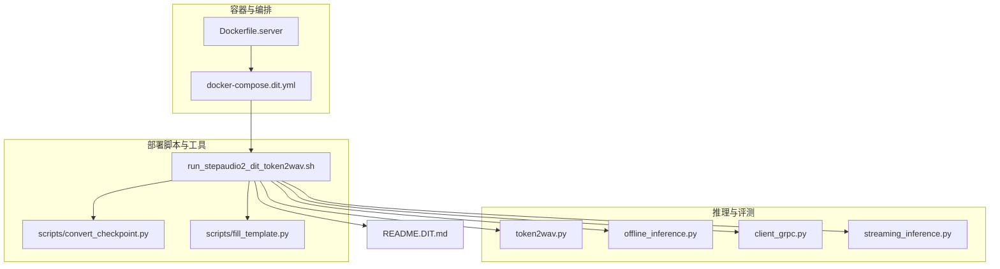
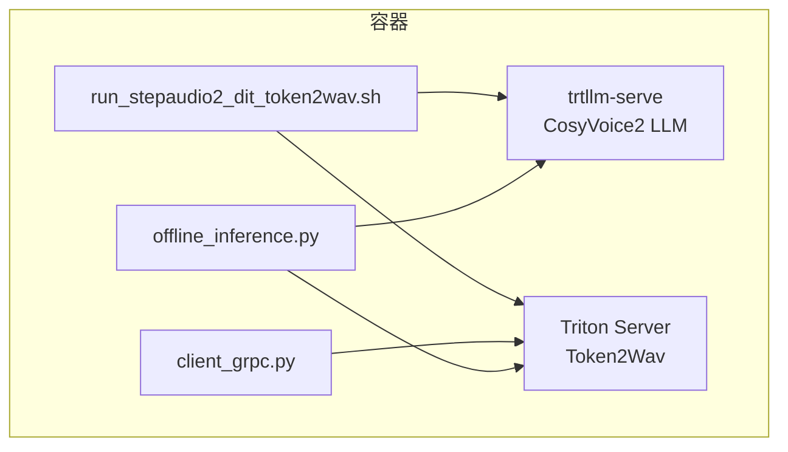
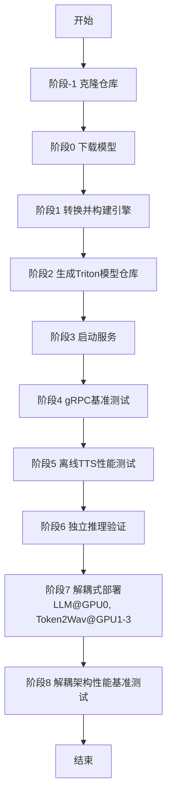
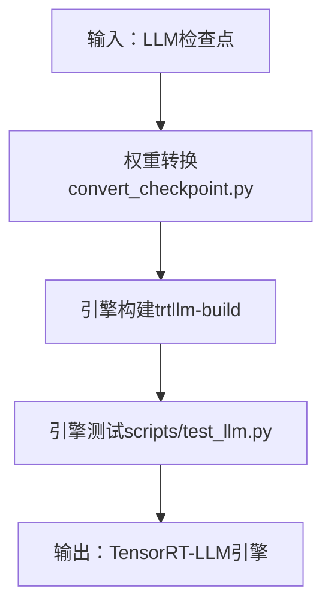
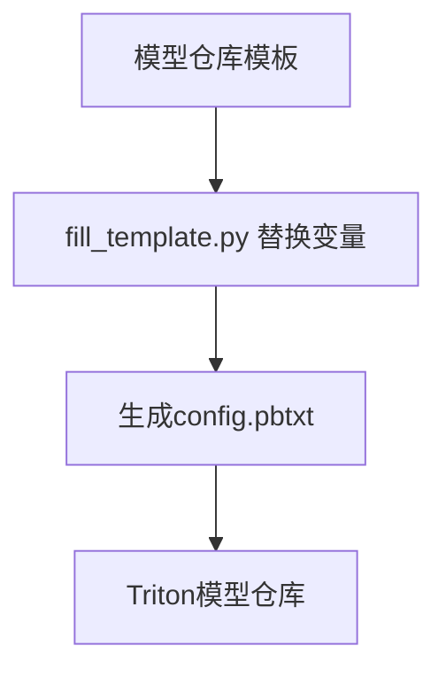
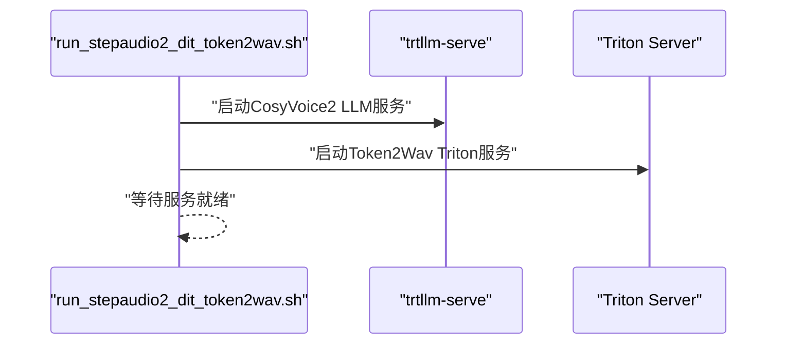
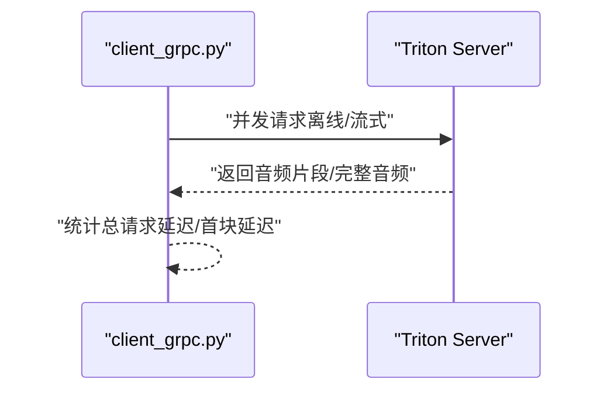
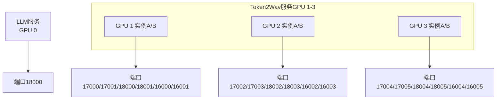
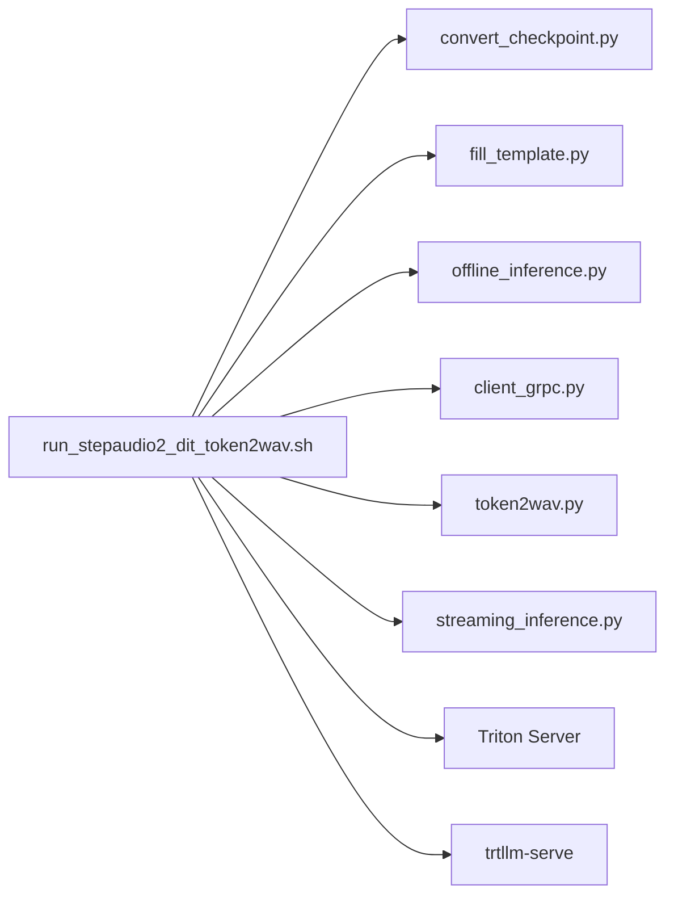

# DiT增强型部署流程

<cite>
**本文引用的文件**
- [docker-compose.dit.yml](file://runtime/triton_trtllm/docker-compose.dit.yml)
- [run_stepaudio2_dit_token2wav.sh](file://runtime/triton_trtllm/run_stepaudio2_dit_token2wav.sh)
- [README.DIT.md](file://runtime/triton_trtllm/README.DIT.md)
- [token2wav.py](file://runtime/triton_trtllm/token2wav.py)
- [offline_inference.py](file://runtime/triton_trtllm/offline_inference.py)
- [client_grpc.py](file://runtime/triton_trtllm/client_grpc.py)
- [streaming_inference.py](file://runtime/triton_trtllm/streaming_inference.py)
- [convert_checkpoint.py](file://runtime/triton_trtllm/scripts/convert_checkpoint.py)
- [fill_template.py](file://runtime/triton_trtllm/scripts/fill_template.py)
- [Dockerfile.server](file://runtime/triton_trtllm/Dockerfile.server)
</cite>

## 目录
1. [简介](#简介)
2. [项目结构](#项目结构)
3. [核心组件](#核心组件)
4. [架构总览](#架构总览)
5. [详细组件分析](#详细组件分析)
6. [依赖关系分析](#依赖关系分析)
7. [性能考量](#性能考量)
8. [故障排查指南](#故障排查指南)
9. [结论](#结论)
10. [附录](#附录)

## 简介
本指南面向使用Step-Audio2 DiT架构的CosyVoice增强型Token2Wav部署场景，围绕runtime/triton_trtllm子模块展开，系统性说明如何通过docker-compose.dit.yml启动服务以及与标准部署的差异；深入解析run_stepaudio2_dit_token2wav.sh脚本的九个阶段，涵盖从仓库克隆、模型下载、TensorRT-LLM引擎构建、Triton模型仓库生成、LLM与Token2Wav服务启动、gRPC基准测试、离线TTS性能测试、Step-Audio2-mini DiT独立推理验证，到解耦式部署（LLM与Token2Wav分别部署于不同GPU）及性能基准测试。同时结合README.DIT.md中的性能数据，分析不同并发任务数下总请求延迟与首块延迟表现，重点阐述解耦部署的优势：通过将LLM与Token2Wav组件分离到不同GPU，避免资源竞争，利用in-flight batching提升LLM吞吐，并给出concurrent_task_per_gpu计算公式以指导资源规划。

## 项目结构
该子模块位于runtime/triton_trtllm目录，包含：
- 容器编排与镜像：docker-compose.dit.yml、Dockerfile.server
- 部署脚本与工具：run_stepaudio2_dit_token2wav.sh、scripts/convert_checkpoint.py、scripts/fill_template.py
- 推理与评测：token2wav.py、offline_inference.py、client_grpc.py、streaming_inference.py
- 文档：README.DIT.md



图表来源
- [docker-compose.dit.yml](file://runtime/triton_trtllm/docker-compose.dit.yml#L1-L20)
- [Dockerfile.server](file://runtime/triton_trtllm/Dockerfile.server#L1-L8)
- [run_stepaudio2_dit_token2wav.sh](file://runtime/triton_trtllm/run_stepaudio2_dit_token2wav.sh#L1-L225)
- [README.DIT.md](file://runtime/triton_trtllm/README.DIT.md#L1-L142)

章节来源
- [docker-compose.dit.yml](file://runtime/triton_trtllm/docker-compose.dit.yml#L1-L20)
- [Dockerfile.server](file://runtime/triton_trtllm/Dockerfile.server#L1-L8)
- [README.DIT.md](file://runtime/triton_trtllm/README.DIT.md#L1-L142)

## 核心组件
- Docker Compose编排：定义服务、端口映射、环境变量、GPU设备绑定与入口命令，用于一键启动Triton+LLM+Token2Wav服务栈。
- 部署脚本：统一编排九个阶段，完成模型准备、引擎构建、Triton模型仓库生成、服务启动与性能评测。
- Token2Wav推理：支持TensorRT优化的流式与非流式推理，负责将语义token转为音频波形。
- 离线TTS流水线：封装LLM后端（HF/TensorRT-LLM/VLLM/trtllm-serve）与Token2Wav，输出音频并统计时延指标。
- gRPC基准客户端：并发向Triton服务发起请求，采集总请求延迟、首块延迟等统计。
- 模板填充工具：根据运行参数动态生成Triton模型配置文件。
- 检查点转换工具：将HuggingFace权重转换为TensorRT-LLM可加载的检查点与引擎。

章节来源
- [run_stepaudio2_dit_token2wav.sh](file://runtime/triton_trtllm/run_stepaudio2_dit_token2wav.sh#L1-L225)
- [token2wav.py](file://runtime/triton_trtllm/token2wav.py#L1-L336)
- [offline_inference.py](file://runtime/triton_trtllm/offline_inference.py#L1-L653)
- [client_grpc.py](file://runtime/triton_trtllm/client_grpc.py#L1-L923)
- [fill_template.py](file://runtime/triton_trtllm/scripts/fill_template.py#L1-L70)
- [convert_checkpoint.py](file://runtime/triton_trtllm/scripts/convert_checkpoint.py#L1-L331)

## 架构总览
下图展示增强型部署的整体架构：容器内运行部署脚本，拉取Step-Audio2与CosyVoice仓库，下载模型，构建TensorRT-LLM引擎，生成Triton模型仓库，随后分别启动LLM服务（trtllm-serve）与Token2Wav服务（Triton），并通过gRPC或离线脚本进行性能评测。



图表来源
- [run_stepaudio2_dit_token2wav.sh](file://runtime/triton_trtllm/run_stepaudio2_dit_token2wav.sh#L101-L121)
- [client_grpc.py](file://runtime/triton_trtllm/client_grpc.py#L686-L800)
- [offline_inference.py](file://runtime/triton_trtllm/offline_inference.py#L325-L653)

## 详细组件分析

### 阶段划分与流程概览
- 阶段-1：克隆Step-Audio2与CosyVoice代码仓库
- 阶段0：下载cosyvoice2_llm、CosyVoice2-0.5B与Step-Audio-2-mini模型，并预下载Token2Wav所需的ONNX
- 阶段1：将LLM检查点转换为TensorRT-LLM权重并构建引擎
- 阶段2：创建包含cosyvoice2_dit、token2wav_dit、audio_tokenizer、speaker_embedding的Triton模型仓库，并用模板填充配置
- 阶段3：启动LLM服务（trtllm-serve）与Token2Wav服务（Triton），并等待
- 阶段4：并发gRPC基准测试，采集总请求延迟与首块延迟
- 阶段5：离线TTS性能测试，统计LLM与Token2Wav各阶段耗时
- 阶段6：独立推理验证Step-Audio2-mini DiT模型（流式与非流式）
- 阶段7：解耦式部署，LLM部署在GPU 0，Token2Wav服务部署在GPU 1-3
- 阶段8：对解耦架构进行性能基准测试，多GPU多实例并发



图表来源
- [run_stepaudio2_dit_token2wav.sh](file://runtime/triton_trtllm/run_stepaudio2_dit_token2wav.sh#L25-L225)
- [README.DIT.md](file://runtime/triton_trtllm/README.DIT.md#L27-L66)

章节来源
- [run_stepaudio2_dit_token2wav.sh](file://runtime/triton_trtllm/run_stepaudio2_dit_token2wav.sh#L25-L225)
- [README.DIT.md](file://runtime/triton_trtllm/README.DIT.md#L27-L66)

### 阶段-1：克隆Step-Audio2与CosyVoice仓库
- 功能：在容器内克隆Step-Audio2与CosyVoice仓库，并初始化子模块
- 关键点：设置工作路径与Python路径，确保后续脚本可用

章节来源
- [run_stepaudio2_dit_token2wav.sh](file://runtime/triton_trtllm/run_stepaudio2_dit_token2wav.sh#L25-L35)

### 阶段0：下载模型与ONNX
- 功能：下载cosyvoice2_llm、CosyVoice2-0.5B与Step-Audio-2-mini；在Step-Audio-2-mini的token2wav目录中下载Flow匹配ONNX
- 关键点：使用本地目录缓存模型，便于离线部署与加速

章节来源
- [run_stepaudio2_dit_token2wav.sh](file://runtime/triton_trtllm/run_stepaudio2_dit_token2wav.sh#L37-L49)

### 阶段1：TensorRT-LLM引擎构建
- 功能：将HuggingFace LLM检查点转换为TensorRT-LLM权重，再构建引擎；随后进行引擎测试
- 工具：convert_checkpoint.py负责权重转换；trtllm-build负责引擎构建
- 关键点：指定最大batch与token数、GEMM插件类型、bfloat16精度



图表来源
- [run_stepaudio2_dit_token2wav.sh](file://runtime/triton_trtllm/run_stepaudio2_dit_token2wav.sh#L52-L69)
- [convert_checkpoint.py](file://runtime/triton_trtllm/scripts/convert_checkpoint.py#L1-L331)

章节来源
- [run_stepaudio2_dit_token2wav.sh](file://runtime/triton_trtllm/run_stepaudio2_dit_token2wav.sh#L52-L69)
- [convert_checkpoint.py](file://runtime/triton_trtllm/scripts/convert_checkpoint.py#L1-L331)

### 阶段2：Triton模型仓库生成与配置填充
- 功能：复制cosyvoice2_dit、token2wav_dit、audio_tokenizer、speaker_embedding至模型仓库；使用fill_template.py按运行参数替换模板变量
- 关键点：max_queue_delay_microseconds、triton_max_batch_size、BLS实例数、解耦模式开关等



图表来源
- [run_stepaudio2_dit_token2wav.sh](file://runtime/triton_trtllm/run_stepaudio2_dit_token2wav.sh#L72-L99)
- [fill_template.py](file://runtime/triton_trtllm/scripts/fill_template.py#L1-L70)

章节来源
- [run_stepaudio2_dit_token2wav.sh](file://runtime/triton_trtllm/run_stepaudio2_dit_token2wav.sh#L72-L99)
- [fill_template.py](file://runtime/triton_trtllm/scripts/fill_template.py#L1-L70)

### 阶段3：服务启动（LLM + Token2Wav）
- 功能：启动trtllm-serve作为CosyVoice2 LLM服务，同时启动Triton Server承载Token2Wav与相关组件
- 关键点：mpirun并行启动LLM服务；Triton监听HTTP/GRPC端口；等待



图表来源
- [run_stepaudio2_dit_token2wav.sh](file://runtime/triton_trtllm/run_stepaudio2_dit_token2wav.sh#L101-L106)

章节来源
- [run_stepaudio2_dit_token2wav.sh](file://runtime/triton_trtllm/run_stepaudio2_dit_token2wav.sh#L101-L106)

### 阶段4：gRPC基准测试
- 功能：并发向Triton服务发送请求，采集总请求延迟与首块延迟统计
- 关键点：client_grpc.py支持离线与流式两种模式，按并发任务数拆分数据集



图表来源
- [client_grpc.py](file://runtime/triton_trtllm/client_grpc.py#L686-L800)
- [run_stepaudio2_dit_token2wav.sh](file://runtime/triton_trtllm/run_stepaudio2_dit_token2wav.sh#L123-L138)

章节来源
- [client_grpc.py](file://runtime/triton_trtllm/client_grpc.py#L1-L923)
- [run_stepaudio2_dit_token2wav.sh](file://runtime/triton_trtllm/run_stepaudio2_dit_token2wav.sh#L123-L138)

### 阶段5：离线TTS性能测试
- 功能：offline_inference.py封装LLM后端（HF/TensorRT-LLM/VLLM/trtllm-serve）与Token2Wav，输出音频并统计各阶段耗时
- 关键点：支持多种后端切换，按批大小与Token2Wav批大小组合测试

```mermaid
sequenceDiagram
participant OFF as "offline_inference.py"
participant LLM as "LLM后端"
participant T2W as "Token2Wav"
OFF->>LLM : "生成语义token"
LLM-->>OFF : "返回token序列"
OFF->>T2W : "将token转为音频"
T2W-->>OFF : "返回音频波形"
OFF-->>OFF : "统计LLM/Token2Wav/总耗时"
```

图表来源
- [offline_inference.py](file://runtime/triton_trtllm/offline_inference.py#L325-L653)
- [run_stepaudio2_dit_token2wav.sh](file://runtime/triton_trtllm/run_stepaudio2_dit_token2wav.sh#L140-L163)

章节来源
- [offline_inference.py](file://runtime/triton_trtllm/offline_inference.py#L1-L653)
- [run_stepaudio2_dit_token2wav.sh](file://runtime/triton_trtllm/run_stepaudio2_dit_token2wav.sh#L140-L163)

### 阶段6：Step-Audio2-mini DiT独立推理验证
- 功能：streaming_inference.py与token2wav.py配合，对Step-Audio2-mini DiT进行流式与非流式推理验证
- 关键点：支持等分与指数增长的分块策略，记录流式forward调用次数

章节来源
- [streaming_inference.py](file://runtime/triton_trtllm/streaming_inference.py#L1-L123)
- [token2wav.py](file://runtime/triton_trtllm/token2wav.py#L1-L336)
- [run_stepaudio2_dit_token2wav.sh](file://runtime/triton_trtllm/run_stepaudio2_dit_token2wav.sh#L165-L172)

### 阶段7：解耦式部署（LLM@GPU0，Token2Wav@GPU1-3）
- 功能：在同一主机上分别启动LLM服务（GPU 0）与多个Token2Wav服务（GPU 1-3），每个GPU启动两个实例
- 关键点：为每台Token2Wav服务分配不同的HTTP/GRPC/Metrics端口，避免冲突



图表来源
- [run_stepaudio2_dit_token2wav.sh](file://runtime/triton_trtllm/run_stepaudio2_dit_token2wav.sh#L175-L198)

章节来源
- [run_stepaudio2_dit_token2wav.sh](file://runtime/triton_trtllm/run_stepaudio2_dit_token2wav.sh#L175-L198)

### 阶段8：解耦架构性能基准测试
- 功能：针对不同GPU数量（1~3）与每GPU实例数（每GPU2实例），在不同并发任务数下运行gRPC基准测试
- 关键点：动态计算并发任务数，使用不同端口并行压测

章节来源
- [run_stepaudio2_dit_token2wav.sh](file://runtime/triton_trtllm/run_stepaudio2_dit_token2wav.sh#L200-L225)

## 依赖关系分析
- 运行时依赖
  - Triton Inference Server：承载Token2Wav与相关组件
  - TensorRT-LLM：提供高性能LLM推理
  - ONNXRuntime：Token2Wav中的说话人嵌入与部分推理
  - CUDA/TensorRT：Token2Wav的TensorRT上下文池与执行
- 组件耦合
  - offline_inference.py与Token2Wav模块强耦合，需根据模型路径选择不同实现
  - run_stepaudio2_dit_token2wav.sh与scripts工具紧密耦合，共同完成模型仓库生成与服务启动
- 外部集成
  - Docker Compose通过NVIDIA设备绑定与端口映射，将服务暴露给外部



图表来源
- [run_stepaudio2_dit_token2wav.sh](file://runtime/triton_trtllm/run_stepaudio2_dit_token2wav.sh#L1-L225)
- [offline_inference.py](file://runtime/triton_trtllm/offline_inference.py#L1-L653)
- [client_grpc.py](file://runtime/triton_trtllm/client_grpc.py#L1-L923)
- [token2wav.py](file://runtime/triton_trtllm/token2wav.py#L1-L336)
- [streaming_inference.py](file://runtime/triton_trtllm/streaming_inference.py#L1-L123)

## 性能考量
- 单机单GPU（Stage 3）：LLM与Token2Wav共享GPU，存在资源竞争，吞吐受限
- 解耦式部署（Stage 7/8）：LLM独占GPU 0，Token2Wav分布在GPU 1-3，避免KV缓存与算子竞争，利用in-flight batching提升LLM吞吐
- 并发任务规划：concurrent_task_per_gpu = concurrent_task_per_instance × num_token2wav_instance_per_gpu × token2wav_gpus / (token2wav_gpus + llm_gpus)
- 数据来源：README.DIT.md提供了不同并发任务数下的总请求延迟与首块延迟统计，可用于评估与调优

章节来源
- [README.DIT.md](file://runtime/triton_trtllm/README.DIT.md#L104-L142)
- [run_stepaudio2_dit_token2wav.sh](file://runtime/triton_trtllm/run_stepaudio2_dit_token2wav.sh#L175-L225)

## 故障排查指南
- 模型下载失败
  - 检查网络连通性与本地磁盘空间；确认下载目录权限
  - 参考：阶段0的模型下载逻辑
- 引擎构建失败
  - 检查TensorRT版本与CUDA驱动兼容性；确认trtllm-build参数正确
  - 参考：convert_checkpoint.py与trtllm-build命令
- Triton模型仓库配置错误
  - 使用fill_template.py替换变量时，确认所有占位符均被替换
  - 参考：阶段2的配置生成逻辑
- 服务启动异常
  - 查看容器日志与端口占用情况；确认NVIDIA设备绑定与端口未冲突
  - 参考：Stage 3与Stage 7的服务启动命令
- 基准测试无响应
  - 检查client_grpc.py目标地址与端口；确认服务已就绪
  - 参考：Stage 4与Stage 8的压测命令

章节来源
- [run_stepaudio2_dit_token2wav.sh](file://runtime/triton_trtllm/run_stepaudio2_dit_token2wav.sh#L52-L106)
- [fill_template.py](file://runtime/triton_trtllm/scripts/fill_template.py#L1-L70)
- [client_grpc.py](file://runtime/triton_trtllm/client_grpc.py#L686-L800)

## 结论
通过增强型DiT部署流程，可在单机多GPU环境下实现LLM与Token2Wav的解耦部署，有效缓解资源竞争，提升整体吞吐与延迟表现。结合README.DIT.md的性能数据与concurrent_task_per_gpu公式，可指导在不同硬件配置下进行合理的并发与实例规划，从而获得更优的端到端推理性能。

## 附录
- Docker Compose与镜像
  - docker-compose.dit.yml定义了服务、端口映射、GPU绑定与入口命令
  - Dockerfile.server基于NVIDIA Triton Inference Server镜像，安装必要依赖
- 快速启动
  - 在容器内执行run_stepaudio2_dit_token2wav.sh 0 3即可完成模型准备与服务启动
- 性能数据参考
  - README.DIT.md提供了单GPU与解耦式部署下的总请求延迟与首块延迟统计，便于对比与优化

章节来源
- [docker-compose.dit.yml](file://runtime/triton_trtllm/docker-compose.dit.yml#L1-L20)
- [Dockerfile.server](file://runtime/triton_trtllm/Dockerfile.server#L1-L8)
- [README.DIT.md](file://runtime/triton_trtllm/README.DIT.md#L1-L142)