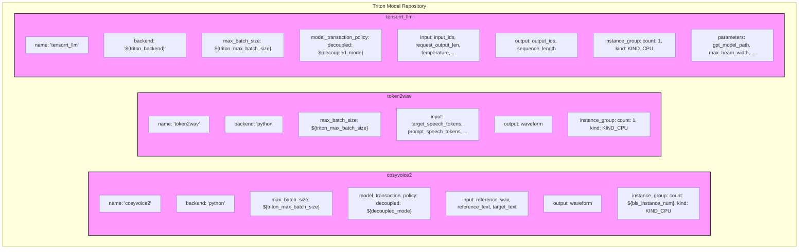

# 标准Token2Wav部署流程

<cite>
**本文档引用的文件**   
- [Dockerfile.server](file://runtime/triton_trtllm/Dockerfile.server)
- [docker-compose.yml](file://runtime/triton_trtllm/docker-compose.yml)
- [run.sh](file://runtime/triton_trtllm/run.sh)
- [token2wav.py](file://runtime/triton_trtllm/token2wav.py)
- [offline_inference.py](file://runtime/triton_trtllm/offline_inference.py)
- [client_http.py](file://runtime/triton_trtllm/client_http.py)
- [client_grpc.py](file://runtime/triton_trtllm/client_grpc.py)
- [convert_checkpoint.py](file://runtime/triton_trtllm/scripts/convert_checkpoint.py)
- [fill_template.py](file://runtime/triton_trtllm/scripts/fill_template.py)
- [requirements.txt](file://runtime/triton_trtllm/requirements.txt)
- [README.md](file://runtime/triton_trtllm/README.md)
- [config.pbtxt](file://runtime/triton_trtllm/model_repo/cosyvoice2/config.pbtxt)
- [config.pbtxt](file://runtime/triton_trtllm/model_repo/token2wav/config.pbtxt)
- [config.pbtxt](file://runtime/triton_trtllm/model_repo/tensorrt_llm/config.pbtxt)
</cite>

## 目录
1. [简介](#简介)
2. [Docker镜像构建](#docker镜像构建)
3. [Docker Compose服务编排](#docker-compose服务编排)
4. [run.sh脚本核心阶段解析](#runsh脚本核心阶段解析)
5. [Triton模型仓库配置](#triton模型仓库配置)
6. [OpenAI兼容API桥接](#openai兼容api桥接)
7. [性能分析与调优](#性能分析与调优)
8. [结论](#结论)

## 简介
本文档详细阐述了基于NVIDIA Triton Inference Server和TensorRT-LLM的标准Token2Wav部署流程。该流程旨在高效地部署CosyVoice-2 0.5B模型，实现从文本到语音的快速、高质量合成。文档深入解析了`Dockerfile.server`的构建过程、`docker-compose.yml`的服务编排设计、`run.sh`脚本的六个核心执行阶段，并结合性能数据提供了资源需求建议和性能调优策略。

## Docker镜像构建
`Dockerfile.server`文件定义了用于部署Triton推理服务的基础镜像和依赖安装过程。

**Section sources**
- [Dockerfile.server](file://runtime/triton_trtllm/Dockerfile.server#L1-L8)

### 基础镜像选择
该Dockerfile采用NVIDIA官方提供的`nvcr.io/nvidia/tritonserver:25.06-trtllm-python-py3`作为基础镜像。此镜像已预装了Triton Inference Server、TensorRT-LLM运行时环境以及Python 3，为部署提供了稳定且优化的运行基础。

### 依赖安装与环境配置
在基础镜像之上，Dockerfile执行了以下关键操作：
1.  **系统更新与工具安装**：通过`apt-get`更新包列表并安装`cmake`，为后续的源码编译提供必要的构建工具。
2.  **特定版本torchaudio安装**：从GitHub克隆`pytorch/audio`仓库，并检出`c670ad8`提交，然后使用`python3 setup.py develop`命令进行开发模式安装。这确保了使用与项目兼容的特定版本torchaudio，避免了版本冲突问题。
3.  **Python依赖安装**：将项目根目录下的`requirements.txt`文件复制到镜像中，并使用`pip install -r`命令安装所有Python依赖项，确保运行环境的完整性。

## Docker Compose服务编排
`docker-compose.yml`文件定义了Triton推理服务的容器化部署配置。

**Section sources**
- [docker-compose.yml](file://runtime/triton_trtllm/docker-compose.yml#L1-L20)

### 网络模式与端口映射
服务配置使用了`ports`指令将容器内的8000、8001、8002端口分别映射到宿主机的相同端口。这些端口分别用于HTTP推理、gRPC推理和Triton的管理API，确保了外部客户端能够通过标准端口访问服务。

### GPU设备挂载
通过`deploy.resources.reservations.devices`配置，服务明确声明了对NVIDIA GPU设备的资源预留。配置指定了使用`nvidia`驱动，设备ID为`'0'`，并要求`gpu`能力。这使得Docker容器能够直接访问宿主机的GPU硬件，为模型推理提供强大的算力支持。

### 共享内存设置
`shm_size: '1gb'`指令将容器的共享内存大小设置为1GB。这对于Triton Inference Server至关重要，因为共享内存是服务器内部不同组件（如模型实例）之间高效传递大量数据（如音频波形）的主要通道。充足的共享内存可以显著提升高并发场景下的推理性能。

## run.sh脚本核心阶段解析
`run.sh`脚本是整个部署流程的自动化核心，它通过一系列有序的阶段来完成模型的下载、转换、部署和测试。

**Section sources**
- [run.sh](file://runtime/triton_trtllm/run.sh#L1-L143)

### 阶段0：模型下载
此阶段从HuggingFace和ModelScope平台下载`cosyvoice-2 0.5B`模型。脚本使用`huggingface-cli download`和`modelscope download`命令，将模型分别保存到本地目录`./cosyvoice2_llm`和`./CosyVoice2-0.5B`。同时，还会下载一个预计算的`spk2info.pt`文件，用于缓存说话人的语音特征，以加速后续推理。

### 阶段1：模型转换与引擎构建
此阶段将HuggingFace格式的检查点转换为TensorRT-LLM格式，并构建推理引擎。
1.  **检查点转换**：调用`scripts/convert_checkpoint.py`脚本，将HuggingFace模型转换为TensorRT-LLM的权重格式。
2.  **引擎构建**：使用`trtllm-build`命令，基于转换后的权重构建优化的TensorRT推理引擎。构建时指定了最大批处理大小（16）、最大令牌数（32768）以及GEMM插件，以优化性能。
3.  **引擎测试**：通过`scripts/test_llm.py`脚本发送一个测试请求，验证构建的引擎能够正确生成语音。

### 阶段2：创建Triton模型仓库
此阶段创建Triton所需的模型仓库结构，并根据模式配置模型。
1.  **仓库初始化**：复制预定义的模型配置模板（`cosyvoice2`, `tensorrt_llm`, `token2wav`等）到新的模型仓库目录。
2.  **配置参数化**：使用`scripts/fill_template.py`脚本，将`config.pbtxt`文件中的占位符（如`model_dir`, `triton_max_batch_size`）替换为实际值。
3.  **流式与离线模式配置**：
    *   **流式模式 (Decoupled=True)**：当`DECOUPLED_MODE=True`时，配置为流式TTS。此模式下，模型可以分块生成音频，实现低延迟的实时语音合成。
    *   **离线模式 (Decoupled=False)**：当`DECOUPLED_MODE=False`时，配置为离线TTS。此模式下，模型一次性生成完整的音频，适用于对延迟要求不高但追求最高音质的场景。

### 阶段3：启动Triton推理服务
此阶段通过执行`tritonserver --model-repository $model_repo`命令来启动Triton Inference Server。服务器会加载在阶段2中创建的模型仓库，并开始监听8000-8002端口，准备接收推理请求。

### 阶段4：执行HTTP单句测试客户端
此阶段运行`client_http.py`脚本，向Triton服务器发送一个HTTP推理请求，用于测试离线TTS模式的功能。
1.  **请求准备**：脚本准备参考音频、参考文本和目标文本，并将其序列化为符合Triton HTTP API规范的JSON数据。
2.  **发送请求**：使用`requests.post`向`http://localhost:8000/v2/models/cosyvoice2/infer`端点发送POST请求。
3.  **结果处理**：接收服务器返回的音频数据，并将其保存为WAV文件。

### 阶段5：运行gRPC性能基准测试
此阶段运行`client_grpc.py`脚本，通过gRPC协议对Triton服务器进行性能基准测试。
1.  **并发测试**：脚本支持多任务并发（`num_task`参数），模拟高并发场景下的服务性能。
2.  **流式与离线测试**：通过`mode`参数指定`streaming`或`offline`模式，分别测试流式和离线TTS的性能。
3.  **性能指标收集**：客户端会记录每个请求的延迟（如首块延迟、总延迟）和音频时长，并计算RTF（Real-Time Factor）等关键性能指标。

### 阶段6：进行离线推理性能测试
此阶段运行`offline_inference.py`脚本，进行更全面的离线推理性能测试。
1.  **多后端对比**：脚本支持`hf`（HuggingFace）、`trtllm`（TensorRT-LLM）等多种后端，可以对比不同推理引擎的性能差异。
2.  **批量测试**：脚本会遍历不同的批处理大小（如16, 8, 4, 2, 1），测试不同负载下的性能表现。
3.  **详细性能分析**：除了总耗时，脚本还会记录LLM生成时间、Token2Wav转换时间等细分耗时，为性能调优提供精确的数据支持。

## Triton模型仓库配置
Triton模型仓库的`config.pbtxt`文件定义了模型的接口、参数和运行时行为。

**Diagram sources**
- [config.pbtxt](file://runtime/triton_trtllm/model_repo/cosyvoice2/config.pbtxt#L1-L73)
- [config.pbtxt](file://runtime/triton_trtllm/model_repo/token2wav/config.pbtxt#L1-L80)
- [config.pbtxt](file://runtime/triton_trtllm/model_repo/tensorrt_llm/config.pbtxt#L1-L800)

**Diagram sources**
- [config.pbtxt](file://runtime/triton_trtllm/model_repo/cosyvoice2/config.pbtxt#L1-L73)
- [config.pbtxt](file://runtime/triton_trtllm/model_repo/token2wav/config.pbtxt#L1-L80)
- [config.pbtxt](file://runtime/triton_trtllm/model_repo/tensorrt_llm/config.pbtxt#L1-L800)

## OpenAI兼容API桥接
为了与现有生态系统集成，可以通过`tts_server.py`将Triton后端暴露为OpenAI风格的API接口。

**Section sources**
- [README.md](file://runtime/triton_trtllm/README.md#L126-L141)

### 配置方法
1.  **克隆并安装桥接服务**：首先克隆`Triton-OpenAI-Speech`仓库，并安装其依赖。
2.  **启动桥接服务**：在Triton服务运行后，执行`tts_server.py`脚本，指定Triton的URL、参考音频目录、端口等参数。
3.  **接口调用**：客户端可以通过标准的OpenAI API调用方式（如`/v1/audio/speech`）来请求语音合成。

### 模式限制
当前的桥接方案**仅支持离线模式**（即`Decoupled=False`）。这是因为OpenAI的API设计通常是一次性请求并返回完整结果，与流式传输的协议不完全匹配。

## 性能分析与调优
根据`README.md`中的性能数据，可以对系统进行深入分析和调优。

**Section sources**
- [README.md](file://runtime/triton_trtllm/README.md#L91-L125)

### 性能数据解读
1.  **流式TTS性能**：在L20 GPU上，流式TTS的首块延迟（First Chunk Latency）在1并发时约为220ms。启用`use_spk2info_cache`后，延迟可降低至190ms左右，RTF（实时因子）也有所提升。
2.  **离线TTS性能**：离线TTS的完整句子延迟在1并发时约为758ms。随着并发数增加，延迟上升，但RTF会下降。
3.  **后端性能对比**：在离线推理模式下，TensorRT-LLM后端的`llm_time_seconds`显著低于HuggingFace后端。例如，批处理大小为16时，TRTLLM的LLM耗时仅为2.01秒，而HF后端为8.42秒，性能提升超过4倍。

### 资源需求与调优策略
1.  **资源需求**：性能测试基于单块L20 GPU完成。L20拥有48GB显存，足以容纳0.5B参数的模型。对于更大模型或更高并发，可能需要更多显存或使用多GPU。
2.  **性能调优策略**：
    *   **启用缓存**：对于固定说话人，务必设置`use_spk2info_cache=True`，可有效降低推理延迟。
    *   **选择合适后端**：在需要高性能的场景下，优先使用TensorRT-LLM后端而非HuggingFace后端。
    *   **调整批处理大小**：根据实际应用场景（低延迟 vs. 高吞吐）调整批处理大小。高并发时，较小的批处理大小可能更有利于降低延迟。

## 结论
本文档详细介绍了基于NVIDIA Triton Inference Server和TensorRT-LLM的Token2Wav标准部署流程。通过Docker容器化、自动化脚本和Triton的强大功能，实现了CosyVoice-2 0.5B模型的高效部署。性能测试表明，该方案在L20 GPU上能够提供低延迟、高吞吐的语音合成服务，且通过`use_spk2info_cache`等机制可进一步优化性能。未来可探索对OpenAI API的流式支持，以满足更多实时交互场景的需求。