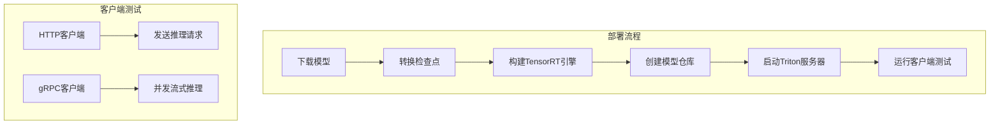
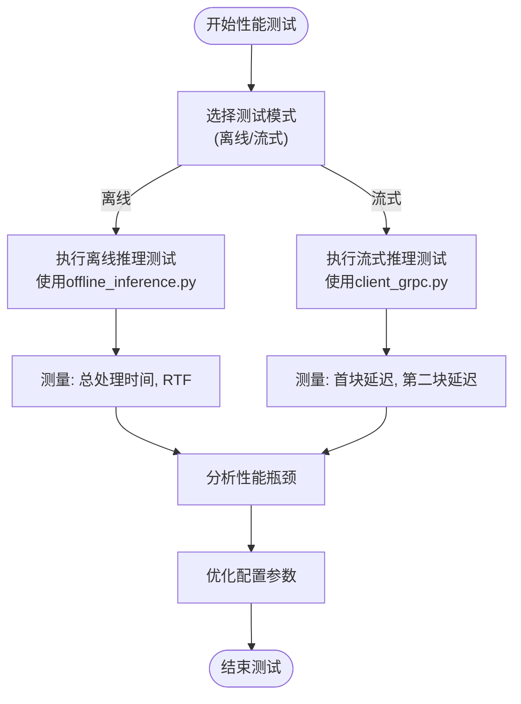

# 部署指南

<cite>
**本文档中引用的文件**   
- [Dockerfile](file://docker/Dockerfile)
- [Dockerfile](file://runtime/python/Dockerfile)
- [docker-compose.yml](file://runtime/triton_trtllm/docker-compose.yml)
- [client_http.py](file://runtime/triton_trtllm/client_http.py)
- [client_grpc.py](file://runtime/triton_trtllm/client_grpc.py)
- [run.sh](file://runtime/triton_trtllm/run.sh)
- [requirements.txt](file://runtime/triton_trtllm/requirements.txt)
- [offline_inference.py](file://runtime/triton_trtllm/offline_inference.py)
- [streaming_inference.py](file://runtime/triton_trtllm/streaming_inference.py)
- [token2wav.py](file://runtime/triton_trtllm/token2wav.py)
- [convert_checkpoint.py](file://runtime/triton_trtllm/scripts/convert_checkpoint.py)
- [fill_template.py](file://runtime/triton_trtllm/scripts/fill_template.py)
- [test_llm.py](file://runtime/triton_trtllm/scripts/test_llm.py)
</cite>

## 目录
1. [简介](#简介)
2. [Docker容器化部署方案](#docker容器化部署方案)
3. [Triton+TensorRT-LLM高性能推理部署方案](#triton+tensorrt-llm高性能推理部署方案)
4. [资源需求评估](#资源需求评估)
5. [性能基准测试方法](#性能基准测试方法)
6. [水平扩展建议](#水平扩展建议)
7. [故障排查指南](#故障排查指南)

## 简介
CosyVoice是一个基于大语言模型的可扩展多语言零样本文本到语音合成系统，支持流式语音合成和高质量语音生成。本部署指南详细介绍了两种主要的部署方案：Docker容器化部署和Triton+TensorRT-LLM高性能推理部署。Docker部署方案提供了简单易用的容器化环境，适合快速部署和测试；Triton+TensorRT-LLM方案则针对高性能推理场景，通过TensorRT-LLM加速大语言模型推理，显著提升推理速度和效率。两种方案均支持通过HTTP和gRPC接口进行测试和调用，满足不同应用场景的需求。

## Docker容器化部署方案

CosyVoice项目提供了两种Docker部署方案：基于`docker/Dockerfile`的基础部署和基于`runtime/python/Dockerfile`的Python运行时部署。基础Dockerfile使用`nvidia/cuda:12.4.1-cudnn-devel-ubuntu22.04`作为基础镜像，通过Miniforge安装conda环境，并创建名为`cosyvoice`的虚拟环境。构建过程中会自动克隆CosyVoice代码库并安装所有依赖项，包括从阿里云镜像源安装Python包以提高下载速度。Python运行时Dockerfile则基于`pytorch/pytorch:2.0.1-cuda11.7-cudnn8-runtime`镜像，简化了环境配置，直接使用系统包管理器安装依赖。

部署时，首先需要构建Docker镜像，然后通过`docker run`命令启动容器。镜像构建命令为`docker build -t cosyvoice:v1.0 .`，启动命令需要映射端口以访问服务，例如`-p 50000:50000`将容器内的50000端口映射到主机。对于gRPC服务，可以使用`docker run -d --runtime=nvidia -p 50000:50000 cosyvoice:v1.0 /bin/bash -c "cd /opt/CosyVoice/CosyVoice/runtime/python/grpc && python3 server.py --port 50000 --max_conc 4 --model_dir iic/CosyVoice-300M && sleep infinity"`命令启动。对于FastAPI服务，使用类似命令但指向`fastapi`目录。部署完成后，可以通过相应的客户端脚本进行测试。

**Section sources**
- [Dockerfile](file://docker/Dockerfile#L1-L52)
- [Dockerfile](file://runtime/python/Dockerfile#L1-L13)

## Triton+TensorRT-LLM高性能推理部署方案

Triton+TensorRT-LLM部署方案通过`docker-compose.yml`文件编排服务，实现高性能推理。该方案使用预构建的`soar97/triton-cosyvoice:25.06`镜像，该镜像已包含Triton Inference Server和必要的依赖。`docker-compose.yml`文件定义了`tts`服务，映射了8000、8001和8002三个端口，分别用于HTTP、gRPC和模型管理。服务配置了1GB的共享内存（shm_size），并使用NVIDIA Docker运行时确保GPU访问。

模型仓库配置通过`run.sh`脚本自动化完成。该脚本首先下载CosyVoice2-0.5B模型，然后使用`convert_checkpoint.py`脚本将HuggingFace格式的检查点转换为TensorRT-LLM权重，再通过`trtllm-build`工具构建TensorRT引擎。模型仓库目录结构包含多个子模型，如`cosyvoice2`、`tensorrt_llm`、`token2wav`等，每个子模型都有独立的`config.pbtxt`配置文件。`fill_template.py`脚本用于动态填充这些配置文件中的变量，如模型路径、批处理大小等。

部署完成后，可以通过`client_http.py`和`client_grpc.py`脚本进行测试。`client_http.py`脚本通过HTTP POST请求向Triton服务器发送推理请求，包含参考音频、参考文本和目标文本，服务器返回生成的音频。`client_grpc.py`脚本则使用gRPC协议，支持并发任务和流式推理模式，可以更精确地测量延迟和吞吐量。测试命令通常包含服务器地址、模型名称、任务数量等参数，例如`python3 client_grpc.py --server-addr localhost --model-name cosyvoice2 --num-tasks 4 --mode streaming`。

**Diagram sources **
- [docker-compose.yml](file://runtime/triton_trtllm/docker-compose.yml#L1-L20)
- [run.sh](file://runtime/triton_trtllm/run.sh#L1-L143)
- [client_http.py](file://runtime/triton_trtllm/client_http.py#L1-L173)
- [client_grpc.py](file://runtime/triton_trtllm/client_grpc.py#L1-L923)

**Section sources**
- [docker-compose.yml](file://runtime/triton_trtllm/docker-compose.yml#L1-L20)
- [run.sh](file://runtime/triton_trtllm/run.sh#L1-L143)
- [client_http.py](file://runtime/triton_trtllm/client_http.py#L1-L173)
- [client_grpc.py](file://runtime/triton_trtllm/client_grpc.py#L1-L923)

## 资源需求评估

CosyVoice的资源需求主要取决于部署方案和模型大小。对于Docker容器化部署，最低配置需要8GB GPU显存和16GB系统内存，推荐配置为16GB GPU显存和32GB系统内存，以确保流畅运行。Triton+TensorRT-LLM方案对资源要求更高，特别是显存需求。运行CosyVoice2-0.5B模型需要至少24GB GPU显存，推荐使用A100或L20等高端GPU。系统内存建议32GB以上，以支持大模型加载和数据处理。

在显存使用方面，Triton服务器需要为模型权重、KV缓存和中间激活分配显存。通过`run.sh`脚本中的`kv_cache_free_gpu_mem_fraction`参数可以控制KV缓存占用的显存比例，默认为0.6，即60%的可用显存用于KV缓存。对于流式推理，显存需求会动态变化，首块延迟和后续块延迟对显存的使用模式不同。CPU资源主要用于数据预处理、音频编解码和网络通信，建议使用多核CPU（8核以上）以提高并发处理能力。存储方面，模型文件较大，CosyVoice2-0.5B模型约10GB，建议使用SSD以提高加载速度。

**Section sources**
- [run.sh](file://runtime/triton_trtllm/run.sh#L1-L143)
- [offline_inference.py](file://runtime/triton_trtllm/offline_inference.py#L1-L653)

## 性能基准测试方法

性能基准测试是评估CosyVoice部署效果的关键环节。项目提供了`offline_inference.py`和`streaming_inference.py`两个脚本用于性能测试。离线推理测试通过`offline_inference.py`脚本执行，支持多种后端（HuggingFace、TensorRT-LLM、vLLM），可以比较不同后端的推理速度和质量。测试时需要指定输出目录、批处理大小、LLM模型路径等参数，脚本会自动加载数据集并记录各项性能指标，包括LLM推理时间、Token2Wav时间、总处理时间等。

流式推理测试通过`client_grpc.py`脚本的流式模式执行，可以测量首块延迟（First Chunk Latency）和第二块延迟（Second Chunk Latency），这是评估流式TTS系统响应速度的关键指标。测试时使用`--mode streaming`参数，并设置`--num-tasks`以模拟并发请求。性能指标还包括RTF（Real-Time Factor），即生成音频时长与处理时间的比率，RTF小于1表示系统处理速度快于实时。测试结果会生成详细的日志文件，包含各项时间统计和性能分析。

**Diagram sources **
- [offline_inference.py](file://runtime/triton_trtllm/offline_inference.py#L1-L653)
- [streaming_inference.py](file://runtime/triton_trtllm/streaming_inference.py#L1-L123)
- [client_grpc.py](file://runtime/triton_trtllm/client_grpc.py#L1-L923)

**Section sources**
- [offline_inference.py](file://runtime/triton_trtllm/offline_inference.py#L1-L653)
- [streaming_inference.py](file://runtime/triton_trtllm/streaming_inference.py#L1-L123)

## 水平扩展建议

为了提高CosyVoice系统的吞吐量和可用性，建议采用水平扩展策略。对于Docker部署，可以通过Docker Compose或Kubernetes部署多个服务实例，并使用负载均衡器（如Nginx）分发请求。每个实例可以绑定不同的GPU，实现GPU资源的充分利用。在Triton部署中，可以通过增加`BLS_INSTANCE_NUM`（BLS实例数量）来扩展后端处理能力，`run.sh`脚本中默认设置为4。

在模型层面，可以使用Tensor Parallelism（TP）和Pipeline Parallelism（PP）来扩展大模型推理。`convert_checkpoint.py`脚本支持`--tp_size`和`--pp_size`参数，可以将模型分割到多个GPU上。对于高并发场景，建议使用Redis等缓存系统缓存常用的语音特征和嵌入，通过`use_spk2info_cache`参数启用缓存功能，可以显著减少重复计算。此外，可以部署多个Triton服务器实例，每个实例负责不同的模型或服务，通过API网关统一管理。

**Section sources**
- [run.sh](file://runtime/triton_trtllm/run.sh#L1-L143)
- [convert_checkpoint.py](file://runtime/triton_trtllm/scripts/convert_checkpoint.py#L1-L331)

## 故障排查指南

在部署和运行CosyVoice时可能遇到各种问题，以下是一些常见故障的排查方法。如果Docker容器无法启动，首先检查Docker和NVIDIA Docker运行时是否正确安装，使用`docker run --rm --gpus all nvidia/cuda:12.4.1-base-ubuntu22.04 nvidia-smi`命令测试GPU访问。如果出现显存不足错误，尝试减少批处理大小或使用更小的模型。对于Triton部署，如果模型加载失败，检查模型仓库路径和`config.pbtxt`文件的配置是否正确。

网络连接问题通常表现为客户端无法连接到服务器，检查端口映射是否正确，使用`netstat -an | grep 8000`确认端口监听状态。对于gRPC连接问题，确保客户端和服务器版本兼容。性能问题可能源于CPU或GPU瓶颈，使用`nvidia-smi`监控GPU利用率，使用`top`命令监控CPU使用率。如果推理速度慢，检查是否启用了TensorRT-LLM加速，确认`enable_trt`参数已设置。日志文件是排查问题的重要工具，Triton服务器和客户端脚本都会生成详细的日志，通过分析日志可以定位具体错误。

**Section sources**
- [client_http.py](file://runtime/triton_trtllm/client_http.py#L1-L173)
- [client_grpc.py](file://runtime/triton_trtllm/client_grpc.py#L1-L923)
- [run.sh](file://runtime/triton_trtllm/run.sh#L1-L143)