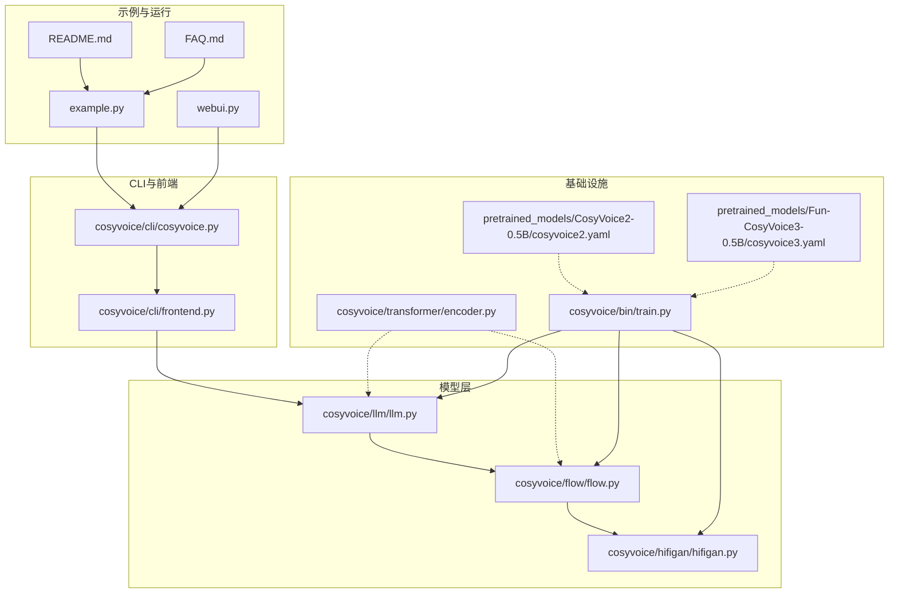
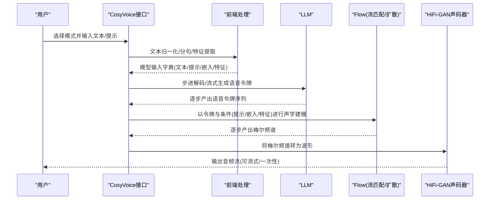
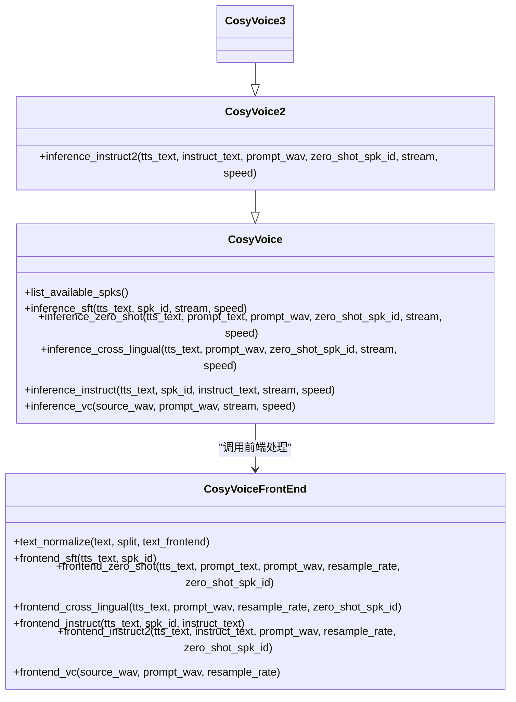
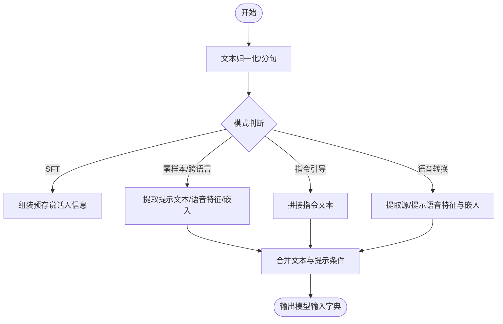
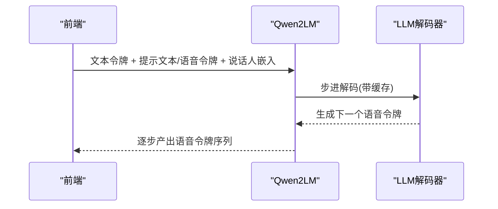
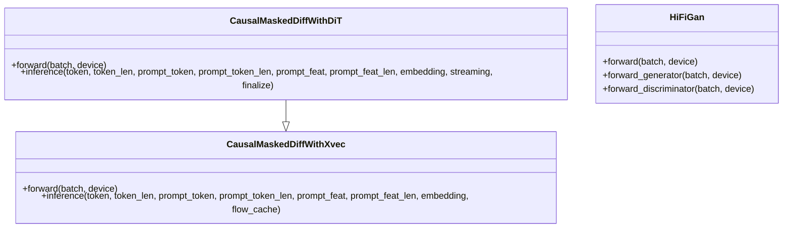
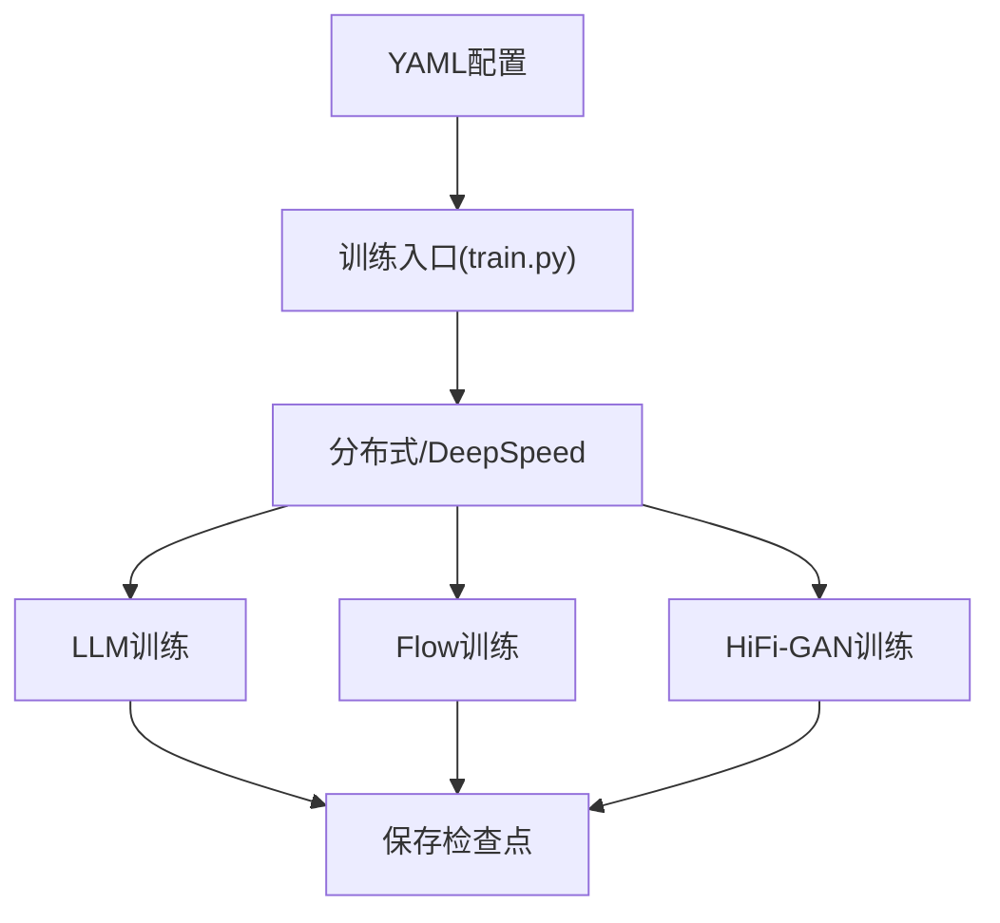
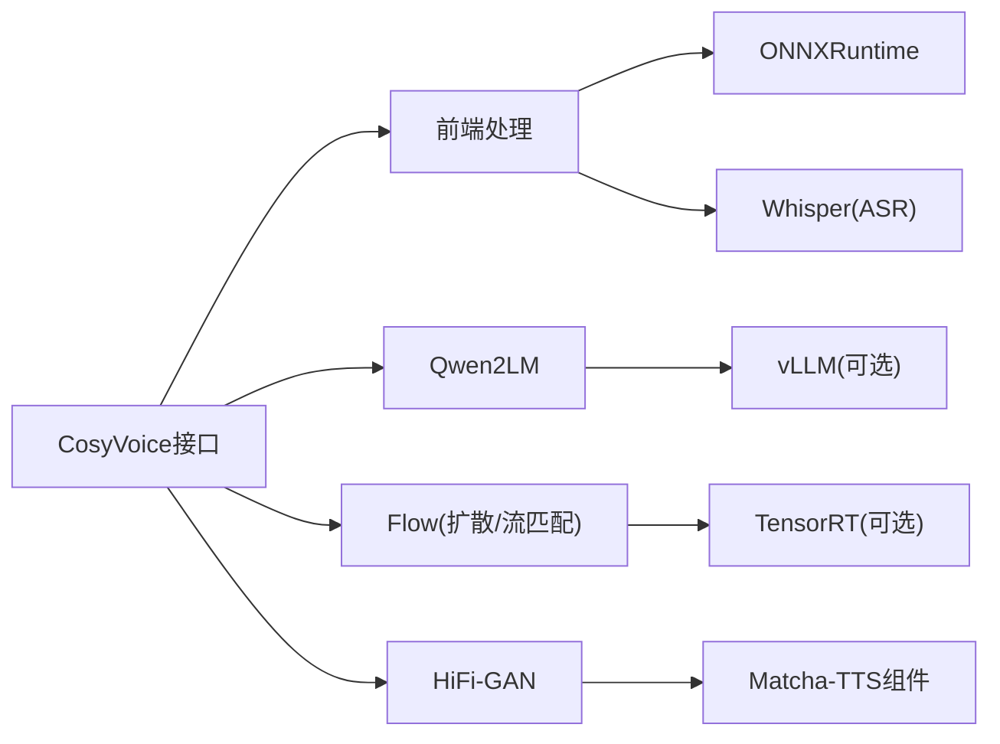

# 项目概述

<cite>
**本文引用的文件**
- [README.md](file://README.md)
- [FAQ.md](file://FAQ.md)
- [example.py](file://example.py)
- [webui.py](file://webui.py)
- [cosyvoice/cli/cosyvoice.py](file://cosyvoice/cli/cosyvoice.py)
- [cosyvoice/cli/frontend.py](file://cosyvoice/cli/frontend.py)
- [cosyvoice/llm/llm.py](file://cosyvoice/llm/llm.py)
- [cosyvoice/flow/flow.py](file://cosyvoice/flow/flow.py)
- [cosyvoice/hifigan/hifigan.py](file://cosyvoice/hifigan/hifigan.py)
- [pretrained_models/CosyVoice2-0.5B/cosyvoice2.yaml](file://pretrained_models/CosyVoice2-0.5B/cosyvoice2.yaml)
- [pretrained_models/Fun-CosyVoice3-0.5B/cosyvoice3.yaml](file://pretrained_models/Fun-CosyVoice3-0.5B/cosyvoice3.yaml)
- [cosyvoice/bin/train.py](file://cosyvoice/bin/train.py)
- [cosyvoice/transformer/encoder.py](file://cosyvoice/transformer/encoder.py)
</cite>

## 目录
1. [引言](#引言)
2. [项目结构](#项目结构)
3. [核心组件](#核心组件)
4. [架构总览](#架构总览)
5. [详细组件分析](#详细组件分析)
6. [依赖分析](#依赖分析)
7. [性能考虑](#性能考虑)
8. [故障排查指南](#故障排查指南)
9. [结论](#结论)
10. [附录](#附录)

## 引言
CosyVoice 是一个面向真实世界场景的多语言零样本文本到语音（TTS）合成系统，基于大语言模型（LLM）构建，支持零样本、跨语言、指令引导等多种语音合成模式。它覆盖多语种与方言，具备高一致性、高相似度与自然韵律表现，并提供流式推理、低延迟、可控性与易部署能力。本文档旨在帮助初学者快速理解系统定位与使用方式，同时为高级用户提供架构与实现细节参考。

## 项目结构
仓库采用模块化分层组织，围绕“前端处理-大语言模型-流匹配/扩散-声码器”的流水线展开，同时提供训练脚本、运行时服务与Web界面示例。

- 核心包
  - cosyvoice/cli：对外接口与前端处理
  - cosyvoice/llm：基于Qwen2的语音令牌语言模型
  - cosyvoice/flow：基于流匹配/扩散的声学建模
  - cosyvoice/hifigan：HiFi-GAN家族声码器与判别器
  - cosyvoice/transformer：编码器/解码器等基础模块
  - cosyvoice/bin：训练入口与工具
  - examples/runtime：部署与推理示例
  - third_party/Matcha-TTS：第三方声学/声码器组件
- 示例与运行
  - example.py：基本用法示例
  - webui.py：Gradio可视化界面
  - FAQ.md：常见问题与环境修复建议
  - README.md：安装、使用与演示链接

图表来源
- [cosyvoice/cli/cosyvoice.py](file://cosyvoice/cli/cosyvoice.py#L1-L391)
- [cosyvoice/cli/frontend.py](file://cosyvoice/cli/frontend.py#L1-L396)
- [cosyvoice/llm/llm.py](file://cosyvoice/llm/llm.py#L1-L740)
- [cosyvoice/flow/flow.py](file://cosyvoice/flow/flow.py#L1-L433)
- [cosyvoice/hifigan/hifigan.py](file://cosyvoice/hifigan/hifigan.py#L1-L68)
- [cosyvoice/transformer/encoder.py](file://cosyvoice/transformer/encoder.py#L1-L200)
- [cosyvoice/bin/train.py](file://cosyvoice/bin/train.py#L1-L196)
- [pretrained_models/CosyVoice2-0.5B/cosyvoice2.yaml](file://pretrained_models/CosyVoice2-0.5B/cosyvoice2.yaml#L1-L234)
- [pretrained_models/Fun-CosyVoice3-0.5B/cosyvoice3.yaml](file://pretrained_models/Fun-CosyVoice3-0.5B/cosyvoice3.yaml#L1-L224)
- [example.py](file://example.py#L1-L107)
- [webui.py](file://webui.py#L1-L259)
- [README.md](file://README.md#L1-L261)
- [FAQ.md](file://FAQ.md#L1-L17)

章节来源
- [README.md](file://README.md#L1-L261)
- [FAQ.md](file://FAQ.md#L1-L17)
- [example.py](file://example.py#L1-L107)
- [webui.py](file://webui.py#L1-L259)

## 核心组件
- 推理接口与模式
  - CosyVoice/CosyVoice2/CosyVoice3：统一的自动模型工厂与多模式推理接口，支持SFT、零样本、跨语言、指令引导、语音转换等。
  - 模式要点
    - SFT：使用预训练说话人音色
    - 零样本：用3秒提示语音快速克隆音色
    - 跨语言：以一种语言提示合成另一种语言文本
    - 指令引导：通过自然语言控制情感、风格、语速等
    - 语音转换：将源语音转换为提示音色
- 前端处理
  - 文本归一化、分句、SSML/控制符号解析、语音特征抽取、说话人嵌入提取、语音令牌抽取等。
- LLM（Qwen2）
  - 文本令牌编码、说话人嵌入投影、提示拼接、步进解码、流式/批式推理、vLLM加速。
- 流匹配/扩散（Flow）
  - 条件流匹配/扩散，支持因果窗口、预前瞻、DiT估计器、长度调节等。
- 声码器（HiFi-GAN家族）
  - 生成器/判别器、多尺度谱损失、特征匹配损失、TPR损失、F0一致性损失等。

章节来源
- [cosyvoice/cli/cosyvoice.py](file://cosyvoice/cli/cosyvoice.py#L1-L391)
- [cosyvoice/cli/frontend.py](file://cosyvoice/cli/frontend.py#L1-L396)
- [cosyvoice/llm/llm.py](file://cosyvoice/llm/llm.py#L1-L740)
- [cosyvoice/flow/flow.py](file://cosyvoice/flow/flow.py#L1-L433)
- [cosyvoice/hifigan/hifigan.py](file://cosyvoice/hifigan/hifigan.py#L1-L68)

## 架构总览
系统采用“前端-LLM-Flow-HiFi-GAN”的端到端流水线，支持离线与流式两种推理路径；训练阶段通过超参配置文件驱动，分别训练LLM/Flow与HiFi-GAN两阶段。

图表来源
- [cosyvoice/cli/cosyvoice.py](file://cosyvoice/cli/cosyvoice.py#L121-L256)
- [cosyvoice/cli/frontend.py](file://cosyvoice/cli/frontend.py#L190-L396)
- [cosyvoice/llm/llm.py](file://cosyvoice/llm/llm.py#L166-L229)
- [cosyvoice/flow/flow.py](file://cosyvoice/flow/flow.py#L101-L146)
- [cosyvoice/hifigan/hifigan.py](file://cosyvoice/hifigan/hifigan.py#L22-L68)

## 详细组件分析

### 组件A：推理接口与模式（CosyVoice/CosyVoice2/CosyVoice3）
- 自动模型工厂根据配置文件类型选择对应模型类，加载LLM/Flow/HiFi-GAN权重，并支持JIT/TensorRT/vLLM加速。
- 模式方法
  - SFT：传入预训练说话人ID，直接合成
  - 零样本：传入提示文本与提示语音，前端抽取嵌入与特征，支持保存/复用克隆音色
  - 跨语言：移除LLM中的提示文本，仅保留提示语音条件
  - 指令引导：在SFT基础上加入指令文本，或在CosyVoice2/3中结合提示语音与指令
  - 语音转换：以源语音与提示语音为条件，输出目标音色的语音
- 流式与批式
  - 支持按段落/文本生成，逐步yield音频片段，便于低延迟播放

图表来源
- [cosyvoice/cli/cosyvoice.py](file://cosyvoice/cli/cosyvoice.py#L121-L391)
- [cosyvoice/cli/frontend.py](file://cosyvoice/cli/frontend.py#L238-L396)

章节来源
- [cosyvoice/cli/cosyvoice.py](file://cosyvoice/cli/cosyvoice.py#L1-L391)
- [cosyvoice/cli/frontend.py](file://cosyvoice/cli/frontend.py#L1-L396)

### 组件B：前端处理（文本归一化、特征与嵌入）
- 文本归一化：支持中文/英文规范化、数字读法、标点处理、段落切分；可选外部文本前端（ttsfrd/wetext）。
- 语音特征：Mel频谱、F0、说话人嵌入（CampPlus）；语音令牌（Speech Tokenizer）抽取。
- 模式适配：根据不同模式组装输入字典，如SFT直接复用预存说话人信息，零样本/跨语言拼接提示条件。

图表来源
- [cosyvoice/cli/frontend.py](file://cosyvoice/cli/frontend.py#L190-L396)

章节来源
- [cosyvoice/cli/frontend.py](file://cosyvoice/cli/frontend.py#L1-L396)

### 组件C：LLM（Qwen2）与流式解码
- 编码器：文本令牌经Qwen2编码，投影到LLM输入维度。
- 解码器：以SOS/任务ID/提示语音令牌拼接为输入，逐步解码语音令牌；支持最小/最大长度约束、停止符策略。
- 流式：按步产出语音令牌，支持vLLM加速与KV缓存。
- CosyVoice3：扩展了指令令牌空间与停止符集合，增强控制能力。

图表来源
- [cosyvoice/llm/llm.py](file://cosyvoice/llm/llm.py#L166-L229)
- [cosyvoice/llm/llm.py](file://cosyvoice/llm/llm.py#L435-L518)
- [cosyvoice/llm/llm.py](file://cosyvoice/llm/llm.py#L620-L740)

章节来源
- [cosyvoice/llm/llm.py](file://cosyvoice/llm/llm.py#L1-L740)

### 组件D：流匹配/扩散（Flow）与声码器（HiFi-GAN）
- Flow
  - 条件流匹配/扩散，支持因果窗口、预前瞻、长度调节、DiT估计器等。
  - 推理时将提示梅尔与目标文本编码拼接，逐步生成目标梅尔频谱。
- HiFi-GAN
  - 生成器/判别器、多尺度谱损失、特征匹配损失、TPR损失、F0一致性损失，提升音质与稳定性。

图表来源
- [cosyvoice/flow/flow.py](file://cosyvoice/flow/flow.py#L148-L404)
- [cosyvoice/hifigan/hifigan.py](file://cosyvoice/hifigan/hifigan.py#L1-L68)

章节来源
- [cosyvoice/flow/flow.py](file://cosyvoice/flow/flow.py#L1-L433)
- [cosyvoice/hifigan/hifigan.py](file://cosyvoice/hifigan/hifigan.py#L1-L68)

### 组件E：训练与配置
- 训练入口：支持torch_ddp/deepspeed，按模型类型切换训练流程（GAN单独流程）。
- 配置文件：通过YAML声明LLM/Flow/HiFi-GAN结构、采样率、块大小、混合比率等参数。
- 数据管线：读取、分词、过滤、重采样、特征计算、打乱/排序/批处理、填充等。

图表来源
- [cosyvoice/bin/train.py](file://cosyvoice/bin/train.py#L1-L196)
- [pretrained_models/CosyVoice2-0.5B/cosyvoice2.yaml](file://pretrained_models/CosyVoice2-0.5B/cosyvoice2.yaml#L1-L234)
- [pretrained_models/Fun-CosyVoice3-0.5B/cosyvoice3.yaml](file://pretrained_models/Fun-CosyVoice3-0.5B/cosyvoice3.yaml#L1-L224)

章节来源
- [cosyvoice/bin/train.py](file://cosyvoice/bin/train.py#L1-L196)
- [pretrained_models/CosyVoice2-0.5B/cosyvoice2.yaml](file://pretrained_models/CosyVoice2-0.5B/cosyvoice2.yaml#L1-L234)
- [pretrained_models/Fun-CosyVoice3-0.5B/cosyvoice3.yaml](file://pretrained_models/Fun-CosyVoice3-0.5B/cosyvoice3.yaml#L1-L224)

## 依赖分析
- 模块耦合
  - CosyVoice接口依赖前端处理与模型组合；前端处理依赖ONNX会话与外部文本前端；LLM/Flow/HiFi-GAN彼此独立但共享输入/输出格式。
- 外部依赖
  - Transformers（Qwen2）、Matcha-TTS（HiFi-GAN相关组件）、Whisper（ASR转录）、vLLM（加速推理）等。
- 运行时优化
  - JIT/TensorRT加速Flow解码；vLLM加速LLM解码；ONNXRuntime加速特征抽取与说话人嵌入。

图表来源
- [cosyvoice/cli/cosyvoice.py](file://cosyvoice/cli/cosyvoice.py#L1-L120)
- [cosyvoice/cli/frontend.py](file://cosyvoice/cli/frontend.py#L1-L120)
- [cosyvoice/llm/llm.py](file://cosyvoice/llm/llm.py#L472-L518)
- [cosyvoice/flow/flow.py](file://cosyvoice/flow/flow.py#L1-L120)
- [cosyvoice/hifigan/hifigan.py](file://cosyvoice/hifigan/hifigan.py#L1-L30)

章节来源
- [cosyvoice/cli/cosyvoice.py](file://cosyvoice/cli/cosyvoice.py#L1-L120)
- [cosyvoice/cli/frontend.py](file://cosyvoice/cli/frontend.py#L1-L120)
- [cosyvoice/llm/llm.py](file://cosyvoice/llm/llm.py#L472-L518)
- [cosyvoice/flow/flow.py](file://cosyvoice/flow/flow.py#L1-L120)
- [cosyvoice/hifigan/hifigan.py](file://cosyvoice/hifigan/hifigan.py#L1-L30)

## 性能考虑
- 流式推理
  - LLM与Flow均支持因果窗口与预前瞻，降低延迟并保证实时性。
- 加速策略
  - vLLM：显著提升LLM解码吞吐。
  - TensorRT：加速Flow解码器。
  - FP16与设备选择：在GPU可用时启用以提升速度。
- 数据管线
  - 动态批处理、排序与裁剪，减少无效计算，提高训练/推理效率。

[本节为通用指导，无需列出具体文件来源]

## 故障排查指南
- 第三方模块缺失
  - Matcha-TTS子模块未初始化：执行子模块初始化命令；设置PYTHONPATH后导入。
- 资源文件无法解压
  - 安装git-lfs并重新下载资源压缩包，再解压安装依赖。
- 环境兼容性
  - 若遇到sox兼容问题，按README指引安装系统依赖。
- vLLM版本要求
  - CosyVoice2对vLLM版本有严格要求，建议新建环境避免冲突。

章节来源
- [FAQ.md](file://FAQ.md#L1-L17)
- [README.md](file://README.md#L84-L145)
- [README.md](file://README.md#L146-L208)

## 结论
CosyVoice以“LLM+流匹配/扩散+HiFi-GAN”为核心架构，提供多语言、多模式、低延迟、高可控性的TTS解决方案。通过统一的推理接口与灵活的前端处理，既满足快速上手的入门需求，也为高级用户提供可扩展的训练与部署能力。配合Web界面与示例脚本，用户可快速完成从安装到推理的全流程体验。

[本节为总结性内容，无需列出具体文件来源]

## 附录
- 快速开始
  - 下载预训练模型与资源，按README安装依赖，运行示例脚本或Web界面。
- 常见用法
  - SFT/零样本/跨语言/指令引导/语音转换等模式均可在示例脚本与Web界面中体验。
- 部署与加速
  - 支持Docker容器化运行时、gRPC/FastAPI服务、TensorRT/vLLM加速等。

章节来源
- [README.md](file://README.md#L146-L208)
- [example.py](file://example.py#L1-L107)
- [webui.py](file://webui.py#L1-L259)