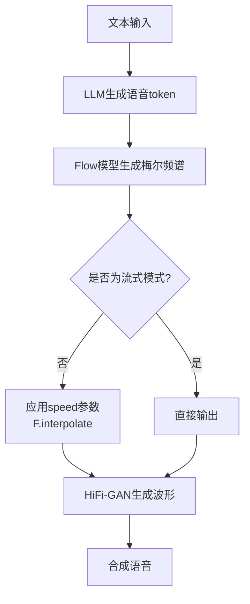
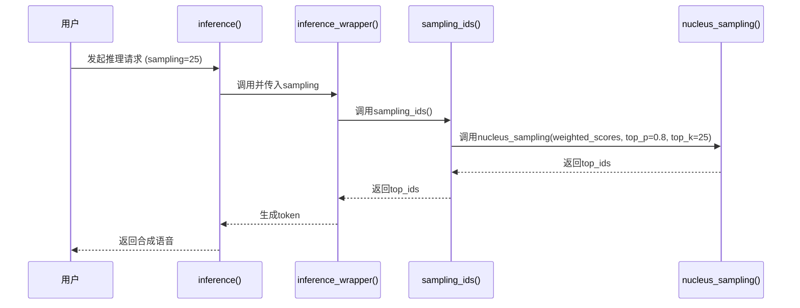
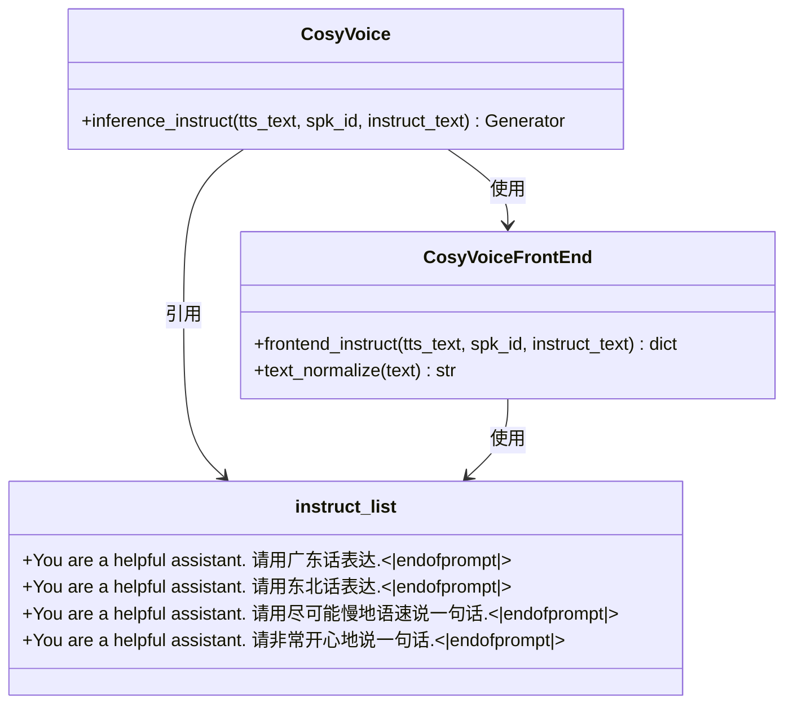

# 参数控制

<cite>
**本文档引用的文件**   
- [common.py](file://cosyvoice/utils/common.py)
- [cosyvoice.py](file://cosyvoice/cli/cosyvoice.py)
- [model.py](file://cosyvoice/cli/model.py)
- [llm.py](file://cosyvoice/llm/llm.py)
- [frontend.py](file://cosyvoice/cli/frontend.py)
</cite>

## 目录
1. [引言](#引言)
2. [速度参数调节](#速度参数调节)
3. [采样策略与随机性控制](#采样策略与随机性控制)
4. [指令控制与情感风格调节](#指令控制与情感风格调节)
5. [结果可重现性](#结果可重现性)
6. [参数组合对合成质量的影响](#参数组合对合成质量的影响)

## 引言
CosyVoice 是一个先进的语音合成系统，支持多种推理模式和丰富的参数调节功能。本文档深入解析其参数调节机制，重点分析 `speed` 参数在各种推理模式中的应用，探讨 `ras_sampling`、`nucleus_sampling` 等采样策略如何影响语音的自然度和多样性，解释 `instruct_list` 预设指令如何与 `inference_instruct` 方法配合实现情感和风格控制，并详细说明 `set_all_random_seed` 函数在保证结果可重现性方面的作用。

## 速度参数调节
`speed` 参数是控制合成语音语速的核心参数，其值直接影响最终音频的播放速度。该参数在 `CosyVoiceModel` 类的 `tts` 方法中被传递，并在 `token2wav` 方法中被最终应用。

在非流式推理模式下，`speed` 参数通过线性插值（`F.interpolate`）直接作用于梅尔频谱（mel-spectrogram）。当 `speed` 大于 1.0 时，表示加速，梅尔频谱的长度会被压缩；当 `speed` 小于 1.0 时，表示减速，梅尔频谱的长度会被拉伸。这种处理方式改变了声学特征的时间轴，从而实现了语速的调节。



**Diagram sources**
- [model.py](file://cosyvoice/cli/model.py#L244-L366)

**Section sources**
- [model.py](file://cosyvoice/cli/model.py#L244-L366)
- [cosyvoice.py](file://cosyvoice/cli/cosyvoice.py#L121-L254)

## 采样策略与随机性控制
CosyVoice 的语音多样性主要由 LLM（大语言模型）在推理时的采样策略决定。系统通过 `sampling` 参数来控制采样过程，该参数在 `inference` 方法中被接收，并传递给底层的采样函数。

系统实现了多种采样策略，包括 `nucleus_sampling`（核心采样）和 `ras_sampling`（重复感知采样）。`nucleus_sampling` 通过设置 `top_p` 和 `top_k` 参数来限制采样范围，只从累积概率超过 `top_p` 且数量不超过 `top_k` 的词汇中进行采样，这有助于在保持多样性的同时避免生成低质量的输出。

`ras_sampling` 是一种更高级的策略，它在 `nucleus_sampling` 的基础上增加了对重复的感知。它会检查最近生成的 `win_size` 个 token 中，有多少个与候选 token 相同。如果重复数量超过阈值 `tau_r`，则切换到 `random_sampling` 模式，以打破重复循环，提高语音的自然度。



**Diagram sources**
- [common.py](file://cosyvoice/utils/common.py#L137-L166)
- [llm.py](file://cosyvoice/llm/llm.py#L435-L503)

**Section sources**
- [common.py](file://cosyvoice/utils/common.py#L137-L166)
- [llm.py](file://cosyvoice/llm/llm.py#L435-L503)

## 指令控制与情感风格调节
CosyVoice 支持通过自然语言指令来控制合成语音的情感和风格，这一功能主要通过 `inference_instruct` 模式实现。系统预定义了一系列指令，存储在 `instruct_list` 变量中，涵盖了方言、音量、语速和情感等多个维度。

当用户调用 `inference_instruct` 方法时，系统会将用户的指令文本（`instruct_text`）与待合成的文本（`tts_text`）一起传递给前端处理模块 `frontend_instruct`。该模块会将指令文本编码为模型可以理解的输入格式，并将其作为提示（prompt）传递给 LLM。LLM 在生成语音 token 时，会将这些指令信息作为上下文，从而生成符合指令要求的语音。



**Diagram sources**
- [common.py](file://cosyvoice/utils/common.py#L28-L53)
- [frontend.py](file://cosyvoice/cli/frontend.py#L332-L350)
- [cosyvoice.py](file://cosyvoice/cli/cosyvoice.py#L204-L231)

**Section sources**
- [common.py](file://cosyvoice/utils/common.py#L28-L53)
- [frontend.py](file://cosyvoice/cli/frontend.py#L332-L350)
- [cosyvoice.py](file://cosyvoice/cli/cosyvoice.py#L204-L231)

## 结果可重现性
为了确保实验和调试过程中的结果可重现，CosyVoice 提供了 `set_all_random_seed` 函数。该函数通过设置 Python、NumPy 和 PyTorch 的随机种子，确保了从数据处理到模型推理的整个流程在相同输入下产生完全一致的输出。

`set_all_random_seed` 函数设置了四个关键的随机种子：
- `random.seed(seed)`：设置 Python 内置随机数生成器的种子。
- `np.random.seed(seed)`：设置 NumPy 随机数生成器的种子。
- `torch.manual_seed(seed)`：设置 PyTorch CPU 随机数生成器的种子。
- `torch.cuda.manual_seed_all(seed)`：设置 PyTorch 所有 GPU 设备的随机数生成器的种子。

通过调用此函数，开发者可以消除随机性带来的影响，这对于模型的调试、性能对比和科学实验至关重要。

```mermaid
flowchart LR
A[调用set_all_random_seed(seed)] --> B[设置Python随机种子]
A --> C[设置NumPy随机种子]
A --> D[设置PyTorch CPU种子]
A --> E[设置PyTorch GPU种子]
B --> F[确保所有随机操作可重现]
C --> F
D --> F
E --> F
```

**Diagram sources**
- [common.py](file://cosyvoice/utils/common.py#L179-L183)

**Section sources**
- [common.py](file://cosyvoice/utils/common.py#L179-L183)

## 参数组合对合成质量的影响
不同的参数组合会对最终的合成质量产生显著影响。例如，`speed` 参数与 `sampling` 参数的组合需要谨慎选择。在非流式模式下，使用 `speed` 参数调节语速是安全的。然而，在流式模式下，由于存在缓存机制，`speed` 参数被禁用，强行使用会导致断言错误。

`sampling` 参数的值直接影响语音的多样性和稳定性。较小的 `sampling` 值（如 5）会使输出更加确定和稳定，但可能导致语音单调；较大的 `sampling` 值（如 50）会增加语音的多样性，但也可能引入不自然或错误的发音。结合 `ras_sampling` 策略可以有效缓解因高 `sampling` 值导致的重复问题。

在指令模式下，`instruct_text` 的选择直接决定了语音的风格。选择一个明确的指令（如“请用四川话表达”）通常比模糊的指令效果更好。同时，`spk_id` 的选择也会影响最终效果，不同的预训练说话人具有不同的音色基础，指令会在此基础上进行风格迁移。