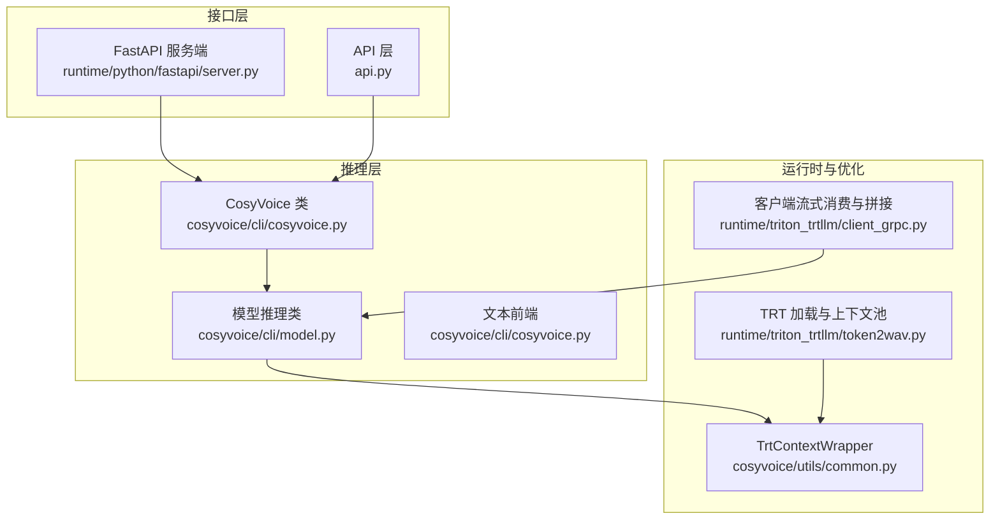
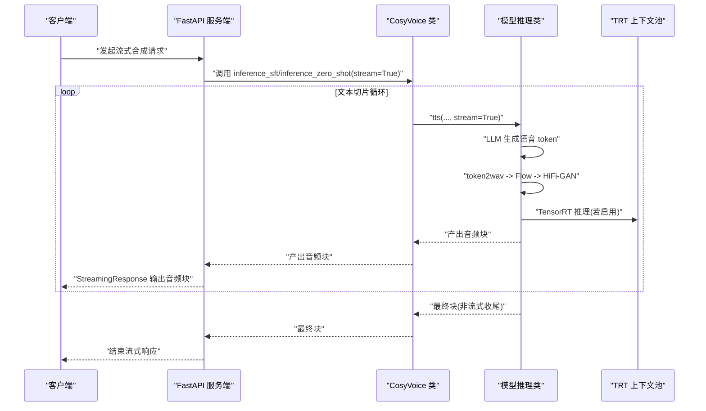
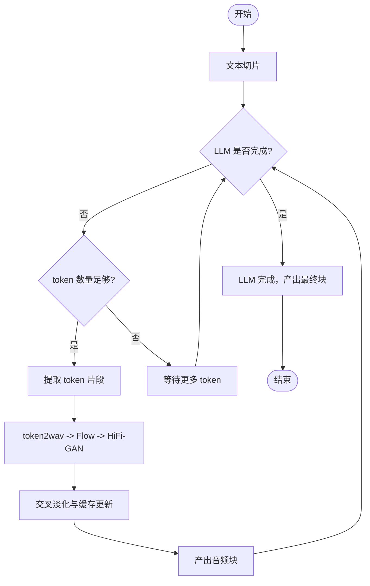
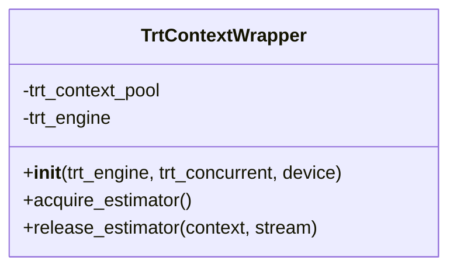
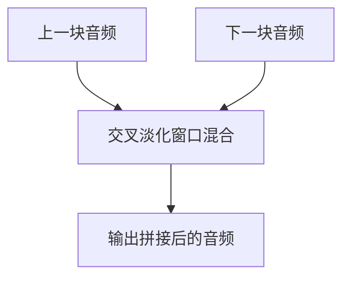
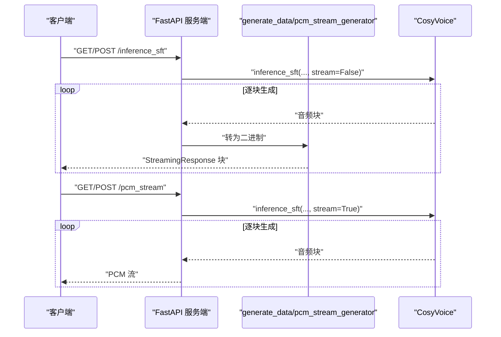
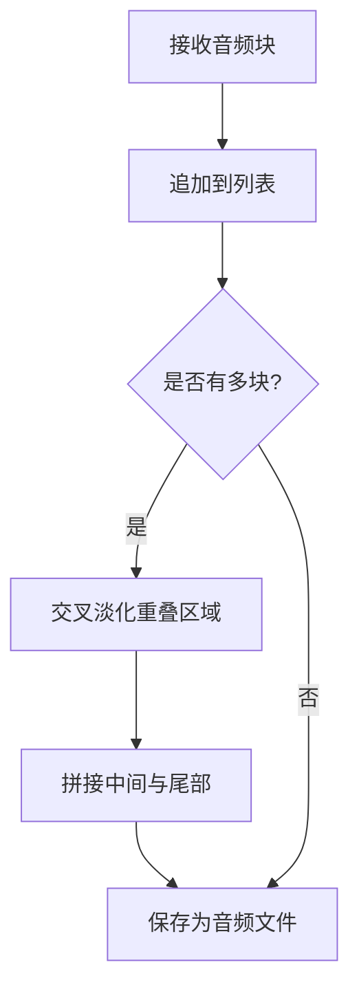
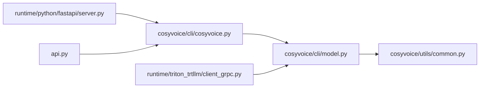

# 流式合成

<cite>
**本文引用的文件**
- [cosyvoice/cli/cosyvoice.py](file://cosyvoice/cli/cosyvoice.py)
- [cosyvoice/cli/model.py](file://cosyvoice/cli/model.py)
- [cosyvoice/utils/common.py](file://cosyvoice/utils/common.py)
- [runtime/python/fastapi/server.py](file://runtime/python/fastapi/server.py)
- [api.py](file://api.py)
- [runtime/triton_trtllm/client_grpc.py](file://runtime/triton_trtllm/client_grpc.py)
- [runtime/triton_trtllm/token2wav.py](file://runtime/triton_trtllm/token2wav.py)
</cite>

## 目录
1. [简介](#简介)
2. [项目结构](#项目结构)
3. [核心组件](#核心组件)
4. [架构总览](#架构总览)
5. [详细组件分析](#详细组件分析)
6. [依赖关系分析](#依赖关系分析)
7. [性能考量](#性能考量)
8. [故障排查指南](#故障排查指南)
9. [结论](#结论)
10. [附录](#附录)

## 简介
本章节系统性介绍 CosyVoice 的流式语音合成功能，重点围绕以下目标展开：
- 如何通过 inference_sft、inference_zero_shot 等方法的 stream=True 参数实现低延迟音频生成；
- 结合 cosyvoice.py 中的生成器模式，说明数据流如何分块处理与实时输出；
- 解释 TrtContextWrapper 在流式推理中的资源管理作用；
- 通过 fade_in_out 函数实现音频块的平滑拼接；
- 提供基于 FastAPI 的服务端流式响应实现示例，展示如何将生成器输出转换为 SSE 或 WebSocket 流；
- 给出性能优化建议，包括缓冲区大小调整与并发流管理。

## 项目结构
CosyVoice 的流式合成涉及三层：
- 接口层：FastAPI 服务端与 API 层，负责接收请求、驱动推理与流式输出；
- 推理层：CosyVoice CLI 推理类与模型推理类，负责文本前端、token 生成、声学特征与波形合成，并实现流式分块输出；
- 运行时与优化层：TRT 上下文池化、交叉淡化、客户端流式消费与重拼接。

图表来源
- [runtime/python/fastapi/server.py](file://runtime/python/fastapi/server.py#L60-L187)
- [api.py](file://api.py#L76-L100)
- [cosyvoice/cli/cosyvoice.py](file://cosyvoice/cli/cosyvoice.py#L121-L176)
- [cosyvoice/cli/model.py](file://cosyvoice/cli/model.py#L245-L368)
- [cosyvoice/utils/common.py](file://cosyvoice/utils/common.py#L198-L214)
- [runtime/triton_trtllm/token2wav.py](file://runtime/triton_trtllm/token2wav.py#L173-L191)
- [runtime/triton_trtllm/client_grpc.py](file://runtime/triton_trtllm/client_grpc.py#L411-L497)

章节来源
- [runtime/python/fastapi/server.py](file://runtime/python/fastapi/server.py#L60-L187)
- [cosyvoice/cli/cosyvoice.py](file://cosyvoice/cli/cosyvoice.py#L121-L176)
- [cosyvoice/cli/model.py](file://cosyvoice/cli/model.py#L245-L368)
- [cosyvoice/utils/common.py](file://cosyvoice/utils/common.py#L198-L214)
- [runtime/triton_trtllm/token2wav.py](file://runtime/triton_trtllm/token2wav.py#L173-L191)
- [runtime/triton_trtllm/client_grpc.py](file://runtime/triton_trtllm/client_grpc.py#L411-L497)

## 核心组件
- CosyVoice 类：对外暴露 inference_sft、inference_zero_shot 等方法，内部将文本切片、调用前端与模型推理，并以生成器形式逐块产出音频。
- CosyVoiceModel/CosyVoice2Model/CosyVoice3Model：实现 tts 主流程，支持流式与非流式两种模式，内部通过 token2wav 将 token 转换为声学特征与波形，并进行缓存与交叉淡化。
- TrtContextWrapper：为 TensorRT 解码器提供上下文池化与 CUDA Stream 管理，保障多并发下的稳定执行。
- fade_in_out：对相邻音频块进行窗函数交叉淡化，消除拼接处的突变。
- FastAPI 服务端：将 CosyVoice 生成器输出转换为流式响应，支持 SSE/WS 场景。

章节来源
- [cosyvoice/cli/cosyvoice.py](file://cosyvoice/cli/cosyvoice.py#L121-L176)
- [cosyvoice/cli/model.py](file://cosyvoice/cli/model.py#L245-L368)
- [cosyvoice/utils/common.py](file://cosyvoice/utils/common.py#L198-L214)
- [runtime/python/fastapi/server.py](file://runtime/python/fastapi/server.py#L60-L187)

## 架构总览
下面的时序图展示了从客户端请求到流式音频输出的关键步骤，涵盖文本切片、token 生成、声学特征与波形合成、交叉淡化与缓存、以及服务端流式响应。

图表来源
- [runtime/python/fastapi/server.py](file://runtime/python/fastapi/server.py#L60-L187)
- [cosyvoice/cli/cosyvoice.py](file://cosyvoice/cli/cosyvoice.py#L121-L176)
- [cosyvoice/cli/model.py](file://cosyvoice/cli/model.py#L245-L368)
- [cosyvoice/utils/common.py](file://cosyvoice/utils/common.py#L198-L214)

## 详细组件分析

### 1) 生成器模式与分块输出
- CosyVoice.inference_sft/inference_zero_shot 等方法对输入文本进行切片，逐段调用模型的 tts(..., stream=True)，并在每轮迭代中产出音频块。
- 模型侧 CosyVoiceModel.tts 实现了流式逻辑：维护 token 队列与缓存，按“跳跃长度”逐步提取 token，调用 token2wav 生成音频块，再进行交叉淡化与缓存更新，最后在 LLm 完成后产出最终块。

图表来源
- [cosyvoice/cli/cosyvoice.py](file://cosyvoice/cli/cosyvoice.py#L121-L176)
- [cosyvoice/cli/model.py](file://cosyvoice/cli/model.py#L245-L368)

章节来源
- [cosyvoice/cli/cosyvoice.py](file://cosyvoice/cli/cosyvoice.py#L121-L176)
- [cosyvoice/cli/model.py](file://cosyvoice/cli/model.py#L245-L368)

### 2) TrtContextWrapper 资源管理
- TrtContextWrapper 通过队列池化 TensorRT 执行上下文与 CUDA Stream，支持并发执行与异步调度，避免频繁创建销毁带来的开销。
- 在流式场景中，当模型侧调用 TRT 推理时，会从池中获取上下文与流，执行完毕后再归还，保证多并发下的稳定性与吞吐。

图表来源
- [cosyvoice/utils/common.py](file://cosyvoice/utils/common.py#L198-L214)
- [runtime/triton_trtllm/token2wav.py](file://runtime/triton_trtllm/token2wav.py#L173-L191)

章节来源
- [cosyvoice/utils/common.py](file://cosyvoice/utils/common.py#L198-L214)
- [runtime/triton_trtllm/token2wav.py](file://runtime/triton_trtllm/token2wav.py#L173-L191)

### 3) fade_in_out 平滑拼接
- 在 token2wav 中，相邻音频块通过 fade_in_out 对重叠区域进行窗函数加权混合，消除拼接处的突变，提升听感自然度。
- 模型侧同时维护 mel 与 speech 的缓存，分别在不同粒度上进行交叉淡化与缓存更新。

图表来源
- [cosyvoice/cli/model.py](file://cosyvoice/cli/model.py#L216-L237)
- [cosyvoice/utils/common.py](file://cosyvoice/utils/common.py#L169-L177)

章节来源
- [cosyvoice/cli/model.py](file://cosyvoice/cli/model.py#L216-L237)
- [cosyvoice/utils/common.py](file://cosyvoice/utils/common.py#L169-L177)

### 4) FastAPI 服务端流式响应
- FastAPI 服务端将 CosyVoice 生成器输出转换为 StreamingResponse，逐块发送音频数据。
- API 层也提供了直接返回 PCM 数据的流式接口，便于 WebSocket 或自定义协议传输。

图表来源
- [runtime/python/fastapi/server.py](file://runtime/python/fastapi/server.py#L60-L187)
- [api.py](file://api.py#L144-L384)

章节来源
- [runtime/python/fastapi/server.py](file://runtime/python/fastapi/server.py#L60-L187)
- [api.py](file://api.py#L144-L384)

### 5) 客户端流式消费与重拼接
- 客户端在流式消费时，将收到的音频块按时间顺序拼接，并对相邻块进行交叉淡化，以进一步提升听感。
- 该流程在 Triton 流式客户端中有完整实现，包括首包延迟统计与重拼接写盘。

图表来源
- [runtime/triton_trtllm/client_grpc.py](file://runtime/triton_trtllm/client_grpc.py#L411-L497)

章节来源
- [runtime/triton_trtllm/client_grpc.py](file://runtime/triton_trtllm/client_grpc.py#L411-L497)

## 依赖关系分析
- CosyVoice 类依赖前端与模型推理类，负责文本切片与调用模型推理；
- 模型推理类依赖 TRT 上下文池化以进行高效解码；
- 服务端依赖 CosyVoice 生成器，将生成器输出转换为流式响应；
- 客户端依赖服务端流式响应，进行拼接与重播。

图表来源
- [cosyvoice/cli/cosyvoice.py](file://cosyvoice/cli/cosyvoice.py#L121-L176)
- [cosyvoice/cli/model.py](file://cosyvoice/cli/model.py#L245-L368)
- [cosyvoice/utils/common.py](file://cosyvoice/utils/common.py#L198-L214)
- [runtime/python/fastapi/server.py](file://runtime/python/fastapi/server.py#L60-L187)
- [api.py](file://api.py#L144-L384)
- [runtime/triton_trtllm/client_grpc.py](file://runtime/triton_trtllm/client_grpc.py#L411-L497)

章节来源
- [cosyvoice/cli/cosyvoice.py](file://cosyvoice/cli/cosyvoice.py#L121-L176)
- [cosyvoice/cli/model.py](file://cosyvoice/cli/model.py#L245-L368)
- [cosyvoice/utils/common.py](file://cosyvoice/utils/common.py#L198-L214)
- [runtime/python/fastapi/server.py](file://runtime/python/fastapi/server.py#L60-L187)
- [api.py](file://api.py#L144-L384)
- [runtime/triton_trtllm/client_grpc.py](file://runtime/triton_trtllm/client_grpc.py#L411-L497)

## 性能考量
- 缓冲区与跳跃长度
  - 流式推理通过“token 跳跃长度”控制每次处理的 token 数量，动态增大以提升质量，同时避免过长导致延迟。
  - 参考路径：[cosyvoice/cli/model.py](file://cosyvoice/cli/model.py#L288-L321)
- 交叉淡化窗口
  - mel 与 speech 的重叠长度与窗函数影响拼接自然度，需与采样率、帧率匹配。
  - 参考路径：[cosyvoice/cli/model.py](file://cosyvoice/cli/model.py#L56-L70)
- TRT 并发与上下文池
  - 通过 TrtContextWrapper 的并发数控制 GPU 资源占用与吞吐，避免 OOM。
  - 参考路径：[cosyvoice/utils/common.py](file://cosyvoice/utils/common.py#L198-L214)、[runtime/triton_trtllm/token2wav.py](file://runtime/triton_trtllm/token2wav.py#L173-L191)
- 服务端流式响应
  - 使用 StreamingResponse 逐块发送，降低首包延迟；注意客户端断连检测与资源回收。
  - 参考路径：[runtime/python/fastapi/server.py](file://runtime/python/fastapi/server.py#L60-L187)、[api.py](file://api.py#L144-L384)
- 客户端拼接与重播
  - 对相邻音频块进行交叉淡化，减少拼接噪声；统计首包延迟与整体延迟，指导参数调优。
  - 参考路径：[runtime/triton_trtllm/client_grpc.py](file://runtime/triton_trtllm/client_grpc.py#L411-L497)

章节来源
- [cosyvoice/cli/model.py](file://cosyvoice/cli/model.py#L56-L70)
- [cosyvoice/cli/model.py](file://cosyvoice/cli/model.py#L288-L321)
- [cosyvoice/utils/common.py](file://cosyvoice/utils/common.py#L198-L214)
- [runtime/triton_trtllm/token2wav.py](file://runtime/triton_trtllm/token2wav.py#L173-L191)
- [runtime/python/fastapi/server.py](file://runtime/python/fastapi/server.py#L60-L187)
- [api.py](file://api.py#L144-L384)
- [runtime/triton_trtllm/client_grpc.py](file://runtime/triton_trtllm/client_grpc.py#L411-L497)

## 故障排查指南
- TRT 上下文池耗尽或内存不足
  - 现象：无法创建 TRT 上下文或报错。
  - 处理：降低 trt_concurrent，或释放显存后重试。
  - 参考路径：[cosyvoice/utils/common.py](file://cosyvoice/utils/common.py#L200-L207)
- 客户端断连
  - 现象：服务端持续生成但客户端已断开。
  - 处理：在生成器中定期检查 is_disconnected 并及时退出。
  - 参考路径：[api.py](file://api.py#L167-L186)
- 音频拼接噪声
  - 现象：相邻音频块之间存在突变。
  - 处理：检查交叉淡化窗口与重叠长度设置，确保与采样率、帧率匹配。
  - 参考路径：[cosyvoice/cli/model.py](file://cosyvoice/cli/model.py#L216-L237)、[cosyvoice/utils/common.py](file://cosyvoice/utils/common.py#L169-L177)
- 首包延迟高
  - 现象：首个音频块到达较晚。
  - 处理：减小 token 跳跃长度初值、提升并发、优化 TRT 引擎；统计首包延迟并调参。
  - 参考路径：[cosyvoice/cli/model.py](file://cosyvoice/cli/model.py#L288-L321)、[runtime/triton_trtllm/client_grpc.py](file://runtime/triton_trtllm/client_grpc.py#L411-L497)

章节来源
- [cosyvoice/utils/common.py](file://cosyvoice/utils/common.py#L200-L207)
- [api.py](file://api.py#L167-L186)
- [cosyvoice/cli/model.py](file://cosyvoice/cli/model.py#L216-L237)
- [cosyvoice/utils/common.py](file://cosyvoice/utils/common.py#L169-L177)
- [cosyvoice/cli/model.py](file://cosyvoice/cli/model.py#L288-L321)
- [runtime/triton_trtllm/client_grpc.py](file://runtime/triton_trtllm/client_grpc.py#L411-L497)

## 结论
CosyVoice 的流式合成通过“文本切片 + 令牌生成 + 声学特征与波形合成 + 交叉淡化 + 缓存管理”的闭环，实现了低延迟、高质量的实时音频输出。配合 TRT 上下文池化与服务端流式响应，可在生产环境中获得稳定的吞吐与较低的首包延迟。通过合理设置缓冲区大小、并发数与交叉淡化参数，可进一步优化用户体验。

## 附录
- 请求体字段参考（SSE/WS 场景可复用）
  - SFT 请求：tts_text、spk_id、stream、speed、seed
  - Zero-shot 请求：tts_text、prompt_text、prompt_audio_base64、stream、speed、seed
  - 跨语言请求：tts_text、prompt_audio_base64、stream、speed、seed
  - 参考路径：[api.py](file://api.py#L76-L100)

章节来源
- [api.py](file://api.py#L76-L100)