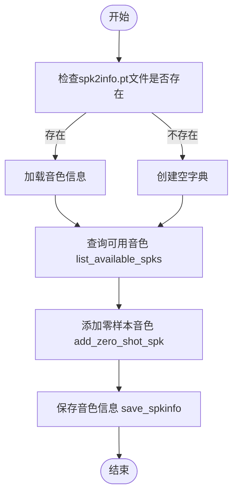

# 音色管理

<cite>
**本文档引用的文件**   
- [cosyvoice.py](file://cosyvoice/cli/cosyvoice.py)
- [frontend.py](file://cosyvoice/cli/frontend.py)
- [example.py](file://example.py)
- [api.py](file://api.py)
- [webui.py](file://webui.py)
- [spk2info.pt](file://pretrained_models/CosyVoice2-0.5B/spk2info.pt)
</cite>

## 目录
1. [简介](#简介)
2. [预训练音色与零样本音色](#预训练音色与零样本音色)
3. [查询可用音色](#查询可用音色)
4. [创建零样本音色](#创建零样本音色)
5. [音色信息存储](#音色信息存储)
6. [音色库管理最佳实践](#音色库管理最佳实践)
7. [音色管理流程图](#音色管理流程图)

## 简介
CosyVoice 是一个先进的文本转语音（TTS）系统，支持多种语音合成模式，包括预训练音色和零样本音色克隆。本指南将详细介绍如何使用 `list_available_spks` 方法查询可用音色，通过 `add_zero_shot_spk` 方法创建新的零样本音色，并利用 `save_spkinfo` 方法持久化存储自定义音色。此外，还将解释 `spk2info.pt` 文件的结构和作用，并提供管理音色库的最佳实践。

**Section sources**
- [cosyvoice.py](file://cosyvoice/cli/cosyvoice.py#L85-L114)
- [frontend.py](file://cosyvoice/cli/frontend.py#L31-L71)

## 预训练音色与零样本音色
CosyVoice 支持两种主要的音色类型：预训练音色和零样本音色。

- **预训练音色**：这些是模型自带的音色，通常在模型训练过程中学习得到。用户可以直接选择这些音色进行语音合成。
- **零样本音色**：用户可以通过提供一段提示音频和相应的文本，快速克隆一个新的音色。这种模式允许用户在没有额外训练的情况下，使用任何人的声音进行语音合成。

**Section sources**
- [cosyvoice.py](file://cosyvoice/cli/cosyvoice.py#L39-L50)
- [example.py](file://example.py#L19-L20)

## 查询可用音色
`list_available_spks` 方法用于查询当前可用的所有音色。这包括预训练音色和已通过 `add_zero_shot_spk` 方法添加的自定义音色。

```python
spk_ids = cosyvoice.list_available_spks()
```

该方法返回一个包含所有可用音色ID的列表。用户可以使用这些ID来选择特定的音色进行语音合成。

**Section sources**
- [cosyvoice.py](file://cosyvoice/cli/cosyvoice.py#L85-L94)
- [api.py](file://api.py#L312-L315)

## 创建零样本音色
`add_zero_shot_spk` 方法允许用户通过提供提示音频和文本，创建一个新的零样本音色。此方法需要三个参数：提示文本、提示音频文件路径和新音色的唯一ID。

```python
assert cosyvoice.add_zero_shot_spk('希望你以后能够做的比我还好呦。', './asset/zero_shot_prompt.wav', 'my_zero_shot_spk') is True
```

成功调用此方法后，新的音色将被添加到音色库中，并可以通过其ID进行重用。

**Section sources**
- [cosyvoice.py](file://cosyvoice/cli/cosyvoice.py#L95-L113)
- [example.py](file://example.py#L46-L47)

## 音色信息存储
`spk2info.pt` 文件用于存储音色信息，包括预训练音色和用户创建的零样本音色。该文件是一个PyTorch保存的字典，其中键是音色ID，值是音色的相关信息，如嵌入向量和语音特征。

`save_spkinfo` 方法用于将当前音色信息持久化存储到 `spk2info.pt` 文件中。每次添加新的零样本音色后，建议调用此方法以确保音色信息不会丢失。

```python
cosyvoice.save_spkinfo()
```

**Section sources**
- [cosyvoice.py](file://cosyvoice/cli/cosyvoice.py#L114-L120)
- [frontend.py](file://cosyvoice/cli/frontend.py#L67-L70)

## 音色库管理最佳实践
为了有效管理音色库，建议遵循以下最佳实践：

- **命名规范**：为音色ID选择有意义的名称，以便于识别和管理。
- **存储路径管理**：确保 `spk2info.pt` 文件存储在安全且易于访问的位置。
- **避免ID冲突**：在创建新的零样本音色时，确保使用的ID是唯一的，以避免覆盖现有音色。

**Section sources**
- [webui.py](file://webui.py#L140-L175)
- [api.py](file://api.py#L514-L555)

## 音色管理流程图


**Diagram sources**
- [cosyvoice.py](file://cosyvoice/cli/cosyvoice.py#L85-L120)
- [frontend.py](file://cosyvoice/cli/frontend.py#L67-L70)

**Section sources**
- [cosyvoice.py](file://cosyvoice/cli/cosyvoice.py#L85-L120)
- [frontend.py](file://cosyvoice/cli/frontend.py#L67-L70)