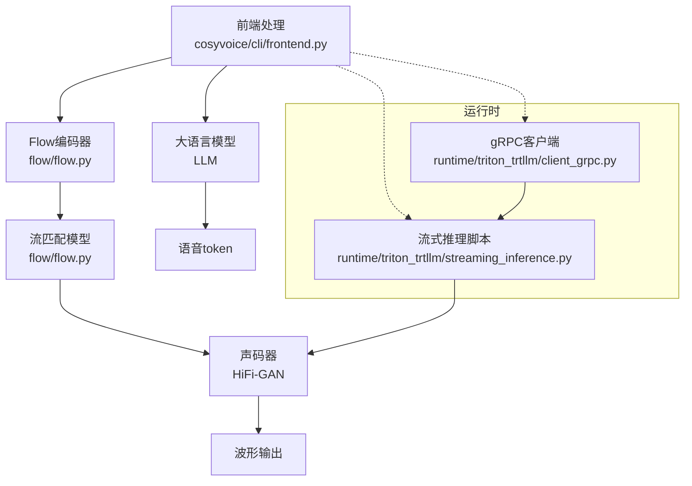
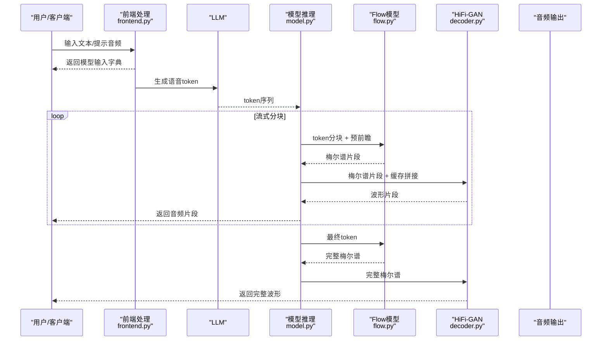
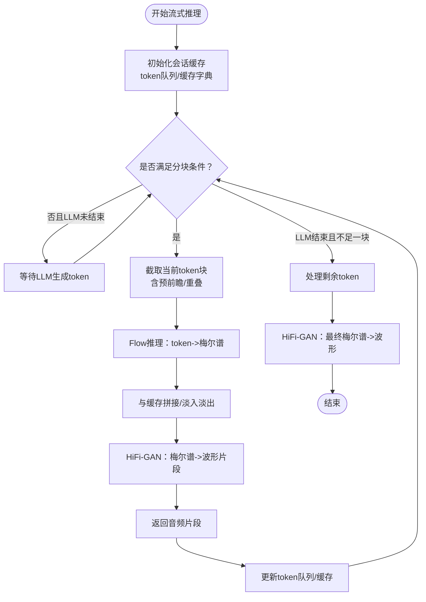
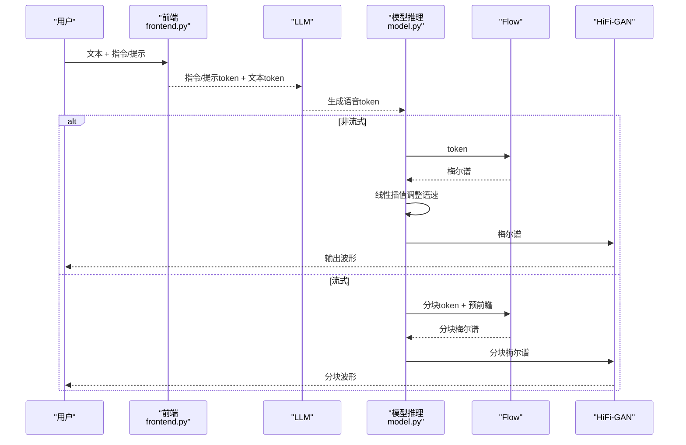
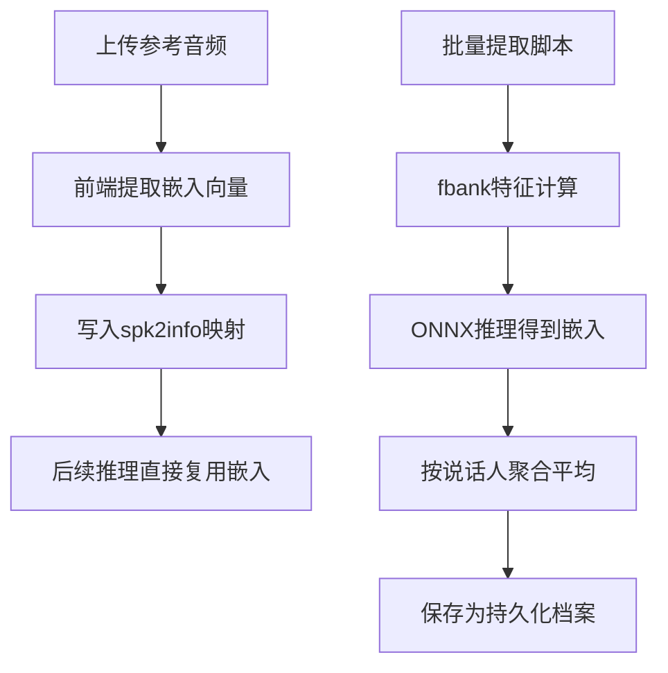
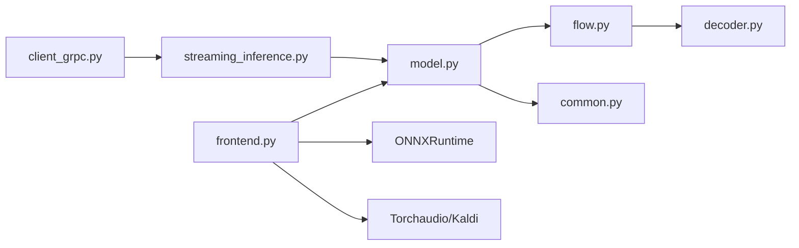

# 高级功能

<cite>
**本文引用的文件**
- [cosyvoice/utils/common.py](file://cosyvoice/utils/common.py)
- [cosyvoice/flow/flow.py](file://cosyvoice/flow/flow.py)
- [cosyvoice/flow/decoder.py](file://cosyvoice/flow/decoder.py)
- [cosyvoice/flow/length_regulator.py](file://cosyvoice/flow/length_regulator.py)
- [cosyvoice/cli/model.py](file://cosyvoice/cli/model.py)
- [cosyvoice/cli/frontend.py](file://cosyvoice/cli/frontend.py)
- [cosyvoice/utils/frontend_utils.py](file://cosyvoice/utils/frontend_utils.py)
- [tools/extract_embedding.py](file://tools/extract_embedding.py)
- [runtime/triton_trtllm/streaming_inference.py](file://runtime/triton_trtllm/streaming_inference.py)
- [runtime/triton_trtllm/client_grpc.py](file://runtime/triton_trtllm/client_grpc.py)
- [example.py](file://example.py)
</cite>

## 目录
1. [简介](#简介)
2. [项目结构](#项目结构)
3. [核心组件](#核心组件)
4. [架构总览](#架构总览)
5. [详细组件分析](#详细组件分析)
6. [依赖关系分析](#依赖关系分析)
7. [性能考量](#性能考量)
8. [故障排查指南](#故障排查指南)
9. [结论](#结论)
10. [附录](#附录)

## 简介
本文件聚焦于CosyVoice的高级特性，围绕以下能力展开：
- 流式语音合成：通过分块token逐步生成音频，降低首包延迟并提升交互实时性
- 语速调节：在非流式模式下通过线性插值调整梅尔谱长度，从而改变整体语速
- 细粒度韵律控制：借助指令文本与跨语言/零样本前端，实现情感、风格与呼吸等韵律细节的可控表达
- 自定义音色管理：通过嵌入向量提取与持久化，支持用户建立可复用的音色档案

同时，结合common.py中的工具函数，说明如何实现动态参数调整与会话状态维护，确保在多轮对话与长文本场景下的稳定与高效。

## 项目结构
CosyVoice采用“前端-大模型-流匹配-声码器”的分层架构。前端负责文本与语音特征的预处理与嵌入提取；大模型（LLM）生成离散语音token；流匹配（Flow）将token映射为声学特征；声码器（HiFi-GAN）将声学特征转为波形。运行时提供流式推理脚本与客户端，支持服务端与客户端的低延迟音频生成。

图表来源
- [cosyvoice/cli/frontend.py](file://cosyvoice/cli/frontend.py#L1-L396)
- [cosyvoice/flow/flow.py](file://cosyvoice/flow/flow.py#L1-L433)
- [cosyvoice/flow/decoder.py](file://cosyvoice/flow/decoder.py#L1-L495)
- [runtime/triton_trtllm/streaming_inference.py](file://runtime/triton_trtllm/streaming_inference.py#L1-L123)
- [runtime/triton_trtllm/client_grpc.py](file://runtime/triton_trtllm/client_grpc.py#L493-L630)

章节来源
- [cosyvoice/cli/frontend.py](file://cosyvoice/cli/frontend.py#L1-L396)
- [cosyvoice/flow/flow.py](file://cosyvoice/flow/flow.py#L1-L433)
- [runtime/triton_trtllm/streaming_inference.py](file://runtime/triton_trtllm/streaming_inference.py#L1-L123)

## 核心组件
- 前端处理（CosyVoiceFrontEnd）：负责文本归一化、分词、语音特征提取、说话人嵌入提取与前端模式切换（SFT/零样本/跨语言/指令）
- 模型推理（CosyVoiceModel/CosyVoice2Model/CosyVoice3Model）：统一调度LLM、Flow与HiFi-GAN，支持流式/非流式推理、速度调节、缓存与重叠处理
- 流匹配（CausalMaskedDiffWithXvec/CausalMaskedDiffWithDiT）：条件扩散/流匹配，支持因果窗口、预前瞻、流式解码器
- 解码器（ConditionalDecoder/CausalConditionalDecoder）：UNet1D条件解码器，支持因果卷积、分块注意力掩码与流式上下文
- 长度调节（InterpolateRegulator）：将文本表征按帧率插值到梅尔谱长度，支持推理时的分离点处理
- 工具函数（common.py）：填充、掩码偏置、随机/核采样、淡入淡出、TRT上下文池化等
- 运行时（streaming_inference.py、client_grpc.py）：批量流式推理与gRPC客户端回调

章节来源
- [cosyvoice/cli/model.py](file://cosyvoice/cli/model.py#L1-L626)
- [cosyvoice/flow/flow.py](file://cosyvoice/flow/flow.py#L1-L433)
- [cosyvoice/flow/decoder.py](file://cosyvoice/flow/decoder.py#L1-L495)
- [cosyvoice/flow/length_regulator.py](file://cosyvoice/flow/length_regulator.py#L1-L71)
- [cosyvoice/utils/common.py](file://cosyvoice/utils/common.py#L1-L214)
- [runtime/triton_trtllm/streaming_inference.py](file://runtime/triton_trtllm/streaming_inference.py#L1-L123)
- [runtime/triton_trtllm/client_grpc.py](file://runtime/triton_trtllm/client_grpc.py#L493-L630)

## 架构总览
下图展示了从文本到波形的关键调用链路，以及流式推理的分块策略与缓存机制。

图表来源
- [cosyvoice/cli/frontend.py](file://cosyvoice/cli/frontend.py#L1-L396)
- [cosyvoice/cli/model.py](file://cosyvoice/cli/model.py#L190-L354)
- [cosyvoice/flow/flow.py](file://cosyvoice/flow/flow.py#L148-L276)
- [cosyvoice/flow/decoder.py](file://cosyvoice/flow/decoder.py#L294-L495)

## 详细组件分析

### 流式语音合成与低延迟生成
- 分块策略与预前瞻
  - CosyVoice2/3的流式推理通过固定token步长与预前瞻长度，保证在滑动窗口内完成因果解码，避免回看带来的延迟
  - 在CosyVoiceModel中，使用最小/最大token跳跃长度与重叠长度，配合动态扩大步长，平衡延迟与质量
- 缓存与重叠处理
  - 梅尔谱与声码器源缓存用于跨块平滑拼接，避免边界突变
  - 淡入淡出窗口用于频谱与波形的重叠区域平滑
- 运行时脚本
  - streaming_inference.py演示了等步长或指数增长的分块策略，并通过forward_streaming接口进行流式token2wav
  - gRPC客户端支持异步流式回调，统计首包/次包延迟与RTF

图表来源
- [cosyvoice/cli/model.py](file://cosyvoice/cli/model.py#L245-L354)
- [cosyvoice/flow/flow.py](file://cosyvoice/flow/flow.py#L278-L404)
- [cosyvoice/flow/decoder.py](file://cosyvoice/flow/decoder.py#L294-L495)
- [cosyvoice/utils/common.py](file://cosyvoice/utils/common.py#L169-L178)
- [runtime/triton_trtllm/streaming_inference.py](file://runtime/triton_trtllm/streaming_inference.py#L52-L103)

章节来源
- [cosyvoice/cli/model.py](file://cosyvoice/cli/model.py#L190-L354)
- [runtime/triton_trtllm/streaming_inference.py](file://runtime/triton_trtllm/streaming_inference.py#L1-L123)
- [runtime/triton_trtllm/client_grpc.py](file://runtime/triton_trtllm/client_grpc.py#L493-L630)

### 语速调节与细粒度韵律控制
- 语速调节
  - 非流式模式下，通过线性插值缩短/拉伸梅尔谱长度实现整体语速变化
  - 流式模式下禁止速度变更，确保缓存与拼接稳定性
- 细粒度韵律控制
  - 指令模式（instruct）：通过自然语言指令控制情感、风格、语速等，前端将指令文本注入模型输入
  - 跨语言/零样本：利用提示文本与提示音频，实现风格迁移与韵律适配
  - 示例：在示例脚本中展示了通过特殊标记控制韵律（如呼吸标记），用于精细韵律表达

图表来源
- [cosyvoice/cli/frontend.py](file://cosyvoice/cli/frontend.py#L238-L351)
- [cosyvoice/cli/model.py](file://cosyvoice/cli/model.py#L245-L354)
- [example.py](file://example.py#L80-L83)

章节来源
- [cosyvoice/cli/model.py](file://cosyvoice/cli/model.py#L245-L354)
- [cosyvoice/cli/frontend.py](file://cosyvoice/cli/frontend.py#L238-L351)
- [example.py](file://example.py#L80-L83)

### 自定义音色管理与嵌入向量提取
- 嵌入向量提取
  - 前端使用ONNXRuntime加载说话人嵌入模型，从16kHz音频提取嵌入向量
  - 工具脚本支持批量提取并聚合说话人级别嵌入，便于持久化
- 音色档案
  - 前端支持spk2info映射，将说话人ID与预提取的嵌入、提示token等绑定，形成可复用的音色档案
  - 支持SFT/零样本/跨语言模式下的音色注入与复用

图表来源
- [cosyvoice/cli/frontend.py](file://cosyvoice/cli/frontend.py#L131-L173)
- [tools/extract_embedding.py](file://tools/extract_embedding.py#L1-L78)

章节来源
- [cosyvoice/cli/frontend.py](file://cosyvoice/cli/frontend.py#L131-L173)
- [tools/extract_embedding.py](file://tools/extract_embedding.py#L1-L78)

### 动态参数调整与会话状态维护（基于common.py工具）
- 动态参数
  - 流式模式下token跳跃长度按系数递增，平衡延迟与质量
  - 语速仅在非流式模式生效，避免缓存一致性问题
- 会话状态
  - 使用uuid隔离每条推理线程的状态，包括token队列、LLM结束标志、梅尔谱重叠缓存、Flow缓存、HiFi-GAN缓存
  - 使用锁保护共享状态，避免竞态
- 工具函数
  - 掩码偏置、淡入淡出、TRT上下文池化等，支撑推理稳定性与性能

章节来源
- [cosyvoice/cli/model.py](file://cosyvoice/cli/model.py#L1-L188)
- [cosyvoice/utils/common.py](file://cosyvoice/utils/common.py#L169-L214)

## 依赖关系分析
- 模块耦合
  - 前端与模型推理强耦合：前端负责构造输入，模型推理负责调度LLM/Flow/HiFi-GAN
  - Flow与解码器耦合：解码器在流式模式下依赖分块注意力掩码与静态块大小
  - 运行时与模型耦合：流式推理脚本与gRPC客户端依赖模型的流式接口
- 外部依赖
  - ONNXRuntime用于嵌入与语音分词器推理
  - Torchaudio/Kaldi用于音频与特征处理
  - Triton/ONNX用于部署与推理优化

图表来源
- [cosyvoice/cli/frontend.py](file://cosyvoice/cli/frontend.py#L1-L396)
- [cosyvoice/cli/model.py](file://cosyvoice/cli/model.py#L1-L626)
- [cosyvoice/flow/flow.py](file://cosyvoice/flow/flow.py#L1-L433)
- [cosyvoice/flow/decoder.py](file://cosyvoice/flow/decoder.py#L1-L495)
- [cosyvoice/utils/common.py](file://cosyvoice/utils/common.py#L1-L214)
- [runtime/triton_trtllm/streaming_inference.py](file://runtime/triton_trtllm/streaming_inference.py#L1-L123)
- [runtime/triton_trtllm/client_grpc.py](file://runtime/triton_trtllm/client_grpc.py#L493-L630)

## 性能考量
- 流式延迟优化
  - 固定步长与预前瞻减少回看需求；指数增长策略在保证质量前提下逐步降低首包延迟
  - 缓存与重叠拼接避免边界突变，减少重建开销
- 计算效率
  - TRT上下文池化与并发控制，提升解码器吞吐
  - 线性插值语速调节避免重复推理
- 内存管理
  - 会话结束后及时清理缓存与同步流，释放GPU显存

[本节为通用指导，无需列出具体文件来源]

## 故障排查指南
- 流式推理无输出
  - 检查LLM是否提前结束或token队列为空
  - 确认分块长度与预前瞻长度设置合理
- 音频断续或爆音
  - 检查重叠长度与淡入淡出窗口是否匹配
  - 确认缓存拼接逻辑未被外部修改
- 语速无效
  - 流式模式下语速参数会被忽略，需在非流式模式使用
- 嵌入提取失败
  - 确认ONNX模型路径正确、采样率与特征维度一致
  - 批量脚本需提供正确的wav.scp与utt2spk文件

章节来源
- [cosyvoice/cli/model.py](file://cosyvoice/cli/model.py#L245-L354)
- [cosyvoice/utils/common.py](file://cosyvoice/utils/common.py#L169-L178)
- [tools/extract_embedding.py](file://tools/extract_embedding.py#L1-L78)

## 结论
CosyVoice通过流式token分块、因果解码与缓存拼接，实现了低延迟音频生成；通过指令与跨语言/零样本前端，提供了细粒度韵律控制；通过嵌入向量提取与spk2info映射，支持用户自定义音色档案。结合common.py中的工具函数，系统在动态参数与会话状态管理方面具备良好的扩展性与稳定性。

[本节为总结性内容，无需列出具体文件来源]

## 附录
- 关键流程路径参考
  - 流式token2wav与缓存：[cosyvoice/cli/model.py](file://cosyvoice/cli/model.py#L190-L354)
  - CosyVoice2/3流式token2wav与缓存：[cosyvoice/cli/model.py](file://cosyvoice/cli/model.py#L438-L576)
  - Flow因果推理与预前瞻：[cosyvoice/flow/flow.py](file://cosyvoice/flow/flow.py#L148-L276)
  - 解码器流式注意力掩码：[cosyvoice/flow/decoder.py](file://cosyvoice/flow/decoder.py#L294-L495)
  - 长度调节与推理分离点：[cosyvoice/flow/length_regulator.py](file://cosyvoice/flow/length_regulator.py#L52-L71)
  - 嵌入提取与批量脚本：[cosyvoice/cli/frontend.py](file://cosyvoice/cli/frontend.py#L131-L173), [tools/extract_embedding.py](file://tools/extract_embedding.py#L1-L78)
  - 文本前端工具函数：[cosyvoice/utils/frontend_utils.py](file://cosyvoice/utils/frontend_utils.py#L1-L168)
  - 运行时流式脚本与客户端：[runtime/triton_trtllm/streaming_inference.py](file://runtime/triton_trtllm/streaming_inference.py#L1-L123), [runtime/triton_trtllm/client_grpc.py](file://runtime/triton_trtllm/client_grpc.py#L493-L630)